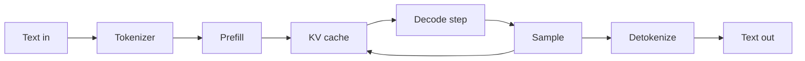
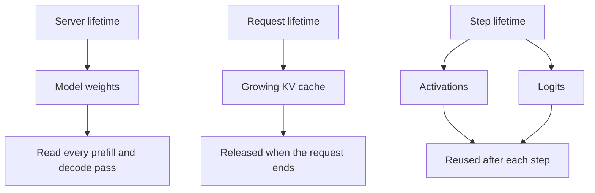

# 0. Your First Inference Request

You have a model and a GPU. What happens when you send it a prompt?

Before distributed systems, before scheduling theory, before any abstraction
layer, there is one request on one device. This chapter follows that request
from the moment text leaves a user's keyboard to the moment an answer finishes
streaming back. Every number comes from a concrete model on concrete hardware.
Every step will reappear, with complications, in later chapters — but here
it is just a loop, and the loop is short enough to hold in your head.

## Visual map

**One request through one GPU: the complete path.**



The arrow from sampling back into the KV cache is the defining feature of
autoregressive generation: each new token becomes input for the next step. The
loop runs until a stop condition fires. Everything before prefill is string
manipulation; everything after sampling is string manipulation. The GPU work
lives in the middle, and that middle is where time goes.

## The model on the wire

Assume the model used throughout this book's exercises: a dense decoder with
approximately 70 billion parameters, stored in BF16 (two bytes per parameter).
It has 80 transformer layers, 8 key-value heads per layer, and a head dimension
of 128. This is the "Atlas" model defined in Appendix G and used in every
worked example.

The weight footprint is direct arithmetic:

```text
70 billion parameters × 2 bytes = 140 GB
```

That 140 GB must sit in GPU memory before the model can answer anything. On a
single 80 GB accelerator, the weights do not fit; on a pair they do, but with
little room to spare. For now, assume the model is loaded and ready. Chapter 4
addresses the topology question — how many devices, connected how — and
Chapter 12 addresses the parallelism question — how to split the work across
them.

## Text to tokens

A model does not read text. It reads integers.

A tokenizer splits a string into subword pieces and maps each piece to an
integer ID from a fixed vocabulary. The mapping is deterministic for a given
tokenizer version: the same string always produces the same IDs.

```text
"The quick brown fox" → [464, 4996, 8516, 3143]
```

Four tokens. The vocabulary typically contains 32,000 to 128,000 entries,
covering common words, word fragments, punctuation, and whitespace. Rare words
are split into several tokens; common words are single tokens. The cost of
tokenization is measured in microseconds per token — negligible next to what
comes after.

A chat template may wrap the user's text with role markers, system instructions,
and formatting tokens before the tokenizer runs. The result is a sequence of
integer IDs, typically hundreds to tens of thousands of them, ready for the
model.

## What the model is, physically

The model is a stack of transformer layers. Each layer contains weight
matrices — large two-dimensional arrays of numbers — that define learned linear
transformations, plus normalization parameters and biases. The 80 layers are
applied in sequence: the output of layer 0 feeds into layer 1, layer 1 into
layer 2, and so on through layer 79. Before the first layer sits an embedding
table that converts token IDs to vectors. After the last layer sits a
projection that converts vectors back to vocabulary-sized scores.

All of these weights sit in GPU memory, occupying the 140 GB computed above.
They do not change during inference. The model reads them, repeatedly, every
time it processes a token.

## Prefill: processing the prompt

The first phase of inference is **prefill**. All input tokens are processed
together, in parallel, through every layer of the model. This is a large matrix
computation: the model reads its weights once and applies them to all input
positions simultaneously.

For a 1,000-token prompt, prefill performs roughly 1,000 positions' worth of
arithmetic while reading the 140 GB of weights once. The arithmetic intensity
is high — many operations per byte of weight data moved — so the GPU's compute
units stay busy. Prefill resembles a small training step in its computational
profile.

Using the service-time model that recurs throughout this book:

```text
prefill_ms(tokens) = 20 + 0.035 × tokens
```

The 20 ms is a fixed overhead — kernel launches, memory allocation, initial
data movement. The 0.035 ms per token is the incremental cost once the pipeline
is running. For a 1,000-token prompt:

```text
prefill_ms(1000) = 20 + 0.035 × 1000 = 20 + 35 = 55 ms
```

Fifty-five milliseconds from receiving the prompt to completing the first
phase. This is the dominant component of **time to first token** (TTFT) — the
delay the user perceives before the answer starts streaming.

### What prefill creates

Prefill does not just produce output. It creates persistent state.

Inside each transformer layer, the attention mechanism computes **keys** and
**values** for every input position. These key-value pairs encode what the
model has learned about the relationships between tokens in the prompt. They
must be kept in GPU memory because every future decode step will read them.

This persistent state is the **KV cache**. Its size per token, across all
layers, is:

```text
2 (keys and values) × 80 layers × 8 KV heads × 128 dimensions × 2 bytes
= 327,680 bytes
≈ 320 KiB per token
```

For the 1,000-token prompt, the total KV cache created during prefill is:

```text
1,000 tokens × 320 KiB = 320,000 KiB ≈ 312 MiB
```

Three hundred and twelve megabytes of state, created in 55 milliseconds,
that must remain resident in GPU memory for the entire duration of the
request. This state will grow by 320 KiB with every new token the model
generates.

## Decode: generating the answer

After prefill, the model enters the **decode** phase. It generates one new
token at a time. Each decode step:

1. Reads the model weights (140 GB).
2. Reads all accumulated KV cache entries.
3. Computes one new position's worth of arithmetic.
4. Writes one new KV entry per layer.
5. Produces a vector of logits — one score per vocabulary entry.

The critical difference from prefill: the model reads 140 GB of weights to
perform arithmetic for a single new position. The ratio of data moved to
useful computation is poor. Decode is **memory-bandwidth-bound**: the GPU's
arithmetic units are mostly idle, waiting for data to arrive from memory.

Each decode step takes approximately 45 ms at moderate batch size using the
Atlas cost model. Most of that time is spent streaming weights from GPU memory
through the compute units.

### Sampling: from scores to a token

The logits produced by the final layer are a vector of raw scores, one per
vocabulary entry. To select the next token:

1. Apply temperature scaling (divide logits by a temperature value, sharpening
   or flattening the distribution).
2. Convert to probabilities via softmax.
3. Apply any filters — top-k keeps only the k highest-probability tokens,
   top-p keeps the smallest set whose cumulative probability exceeds a
   threshold.
4. Sample from the filtered distribution, or take the argmax for greedy
   decoding.

The result is one integer: the ID of the next token. This step is
computationally trivial — microseconds — but it carries state. The random
number generator's position is part of the request and must be preserved
across steps for reproducibility.

### Detokenization: back to text

The selected token ID is converted back to text by the tokenizer's reverse
mapping. The text fragment is sent to the user immediately — this is
streaming. The user sees partial words assemble into sentences while the model
continues generating.

### The loop

The decode loop repeats: read weights, read KV cache, compute one position,
write one KV entry, sample, detokenize, stream. Each iteration takes roughly
45 ms and produces one token. A 200-token response takes about 200 steps,
roughly 9 seconds of decode time.

The loop ends when one of these conditions is met:

- The model emits a special end-of-sequence token.
- The response reaches a caller-specified maximum length.
- The user closes the connection.

The total time for a 1,000-token prompt with a 200-token response is
approximately:

```text
prefill:   55 ms
decode:   200 × 45 ms = 9,000 ms
total:    ~9.1 seconds
```

The user experiences 55 ms of waiting, then roughly 9 seconds of streaming
text at about 22 tokens per second. This is one request, served alone, on
hardware with nothing else to do.

## Following the bytes

**The request owns memory at three different lifetimes.**



A summary of where memory goes during this single request:

| Object | Size | Lifetime |
| --- | --- | --- |
| Model weights | 140 GB | loaded once, read every step |
| KV cache at end of prefill | 312 MiB | created during prefill, grows during decode |
| KV cache at end of decode | 312 MiB + 200 × 320 KiB ≈ 375 MiB | released when request finishes |
| Activations (per step) | tens of MiB | allocated and freed each step |
| Logits (per step) | vocabulary × 4 bytes ≈ 0.5 MiB | overwritten each step |

The weights dominate the memory budget. The KV cache is the only object that
grows during the request. Activations are temporary workspace. On hardware
with 80 GB of device memory per accelerator, even a single request's KV cache
is a small fraction of capacity — but this changes fast.

## Why one request is misleading

The single-request story above is clean. The GPU does useful work, the user
gets an answer, and memory is comfortable. Now consider what happens when load
increases.

### Ten concurrent requests

Ten users send prompts at approximately the same time, each with a 1,000-token
input. The model weights are still 140 GB — they are read, not copied, so ten
requests do not need ten copies. But the KV cache is per-request:

```text
10 requests × 312 MiB = 3.12 GiB after prefill
```

After each request generates 200 tokens of output:

```text
10 × 375 MiB ≈ 3.66 GiB of KV state
```

Still manageable on an 80 GB device. But a benefit appears: **batching**.
When the engine runs a decode step, it reads the 140 GB of weights once and
applies them to all ten sequences simultaneously. The same memory traffic
that served one request now serves ten. Each step takes longer — more KV cache
to read, more arithmetic — but the time grows sublinearly in the number of
requests. Ten requests do not take ten times as long per step.

This is the fundamental efficiency gain of batched inference: weight reads are
amortized across sequences.

### One hundred concurrent requests

Push further. One hundred concurrent requests with 1,000-token prompts:

```text
100 × 312 MiB = 30.5 GiB after prefill
```

On an 80 GB device holding 140 GB of weights across multiple accelerators (or
a quantized model on one), 30 GiB of KV state is a significant fraction of
remaining memory. After each generates 200 output tokens:

```text
100 × 375 MiB = 36.6 GiB
```

And this assumes 1,000-token prompts. A 4,000-token prompt produces 1.22 GiB
of KV state per request. One hundred such requests need 122 GiB — more than
the entire device. The model cannot even hold them all in memory simultaneously.

### The tension

More requests sharing a decode step means better utilization of the GPU's
arithmetic units — the weight read pays for more work. But more requests also
means more KV cache memory. The engine faces a direct trade-off:

- **Admit more requests**: better throughput, higher GPU utilization, but more
  memory pressure. Eventually something must be evicted or preempted.
- **Admit fewer requests**: lower utilization, wasted bandwidth on weight
  reads that serve too few sequences, but comfortable memory.

This tension — throughput against memory, utilization against latency — is the
reason the rest of this book exists. Every mechanism in every chapter is, at
bottom, a strategy for managing this exchange:

| Chapter | What it manages |
| --- | --- |
| 6. Scheduling | which requests share each step, and how many |
| 7. KV cache | how memory is allocated, paged, and reclaimed |
| 8. Kernels | how to make the weight read and attention faster |
| 10. Quantization | how to make weights and cache smaller |
| 11. Speculation | how to get more tokens per step |
| 12. Parallelism | how to spread work across devices |
| 14. Disaggregation | how to separate prefill from decode |
| 16. Routing | how to choose which replica serves a request |

Each entry in this table addresses a consequence of the single fact that
serving more concurrent requests is both necessary for efficiency and
expensive in state.

## The numbers, collected

For reference, the constants used above and throughout the book's exercises:

| Quantity | Value | Source |
| --- | --- | --- |
| Parameters | 70 billion | Atlas model definition |
| Weight precision | BF16 (2 bytes) | Atlas baseline |
| Weight footprint | 140 GB | 70B × 2 |
| Layers | 80 | Atlas model definition |
| KV heads per layer | 8 | Atlas model definition |
| Head dimension | 128 | Atlas model definition |
| KV bytes per token | 327,680 (≈ 320 KiB) | 2 × 80 × 8 × 128 × 2 |
| Prefill fixed overhead | 20 ms | service-time model |
| Prefill per-token cost | 0.035 ms | service-time model |
| TTFT for 1,000-token prompt | ≈ 55 ms | 20 + 0.035 × 1000 |
| Decode step time | ≈ 45 ms | at moderate batch size |
| KV for 1,000 tokens | ≈ 312 MiB | 1000 × 320 KiB |

These are planning estimates for a well-tuned system, not promises. Real
measurements on real hardware are always the final authority.

## Try it yourself

The mechanics described above are not hypothetical. You can observe them on
a smaller model with a single GPU.

### Start a server

Install vLLM and launch a server with an 8-billion-parameter instruction-tuned
model (small enough to fit on one consumer GPU with 24 GB of memory):

```bash
pip install vllm
vllm serve meta-llama/Llama-3.1-8B-Instruct --dtype auto
```

The `--dtype auto` flag lets vLLM choose the best precision for your hardware.
The server loads the model weights into GPU memory and begins listening for
requests on port 8000.

### Send a request

From another terminal, send a prompt and observe the response:

```bash
curl -s http://localhost:8000/v1/chat/completions \
  -H "Content-Type: application/json" \
  -d '{
    "model": "meta-llama/Llama-3.1-8B-Instruct",
    "messages": [
      {"role": "user", "content": "Explain what a KV cache is in three sentences."}
    ],
    "max_tokens": 128,
    "stream": true
  }' | head -20
```

With `"stream": true`, you will see server-sent events arrive one at a time,
each carrying a token or a small group of tokens. The gap before the first
event is TTFT — prefill plus any queue wait. The rhythm of subsequent events
is the decode cadence.

### What to observe

While the request runs, a few measurements connect to this chapter's content:

1. **GPU memory usage.** Run `nvidia-smi` in a third terminal. Note the memory
   consumed after model loading (weights plus runtime overhead) and watch
   whether it changes during generation (KV cache allocation).

2. **Time to first token.** The delay before the first streamed event includes
   tokenization, prefill, and one decode step. For a short prompt on an
   8B model, expect single-digit to low tens of milliseconds.

3. **Token generation speed.** Count the streamed events per second. This is
   the inverse of the per-step decode time. On a well-matched GPU, an 8B
   model in BF16 might produce 30 to 80 tokens per second for a single
   request — much faster than the 70B model's ~22 tokens per second, because
   the smaller model reads far fewer weight bytes per step.

4. **Concurrent requests.** Open several terminals and send requests
   simultaneously. Watch GPU memory climb (more KV cache) and per-request
   token rate decline (the same bandwidth now serves more sequences). This is
   the throughput-memory tension from the scaling section above, made visible.

The 8B model is not Atlas. Its KV cache is smaller, its decode steps are
faster, and it fits on one device. But the structure is identical: tokenize,
prefill, decode loop, sample, detokenize, stream. Everything observed here
scales, with the same tensions, to the 70B model and beyond.

## What comes next

This chapter traced one request through one GPU: text to tokens, tokens through
a stack of transformer layers, persistent state created during prefill, a
bandwidth-bound decode loop, sampling, and text back out. The numbers were
specific, the path was linear, and the model had a GPU to itself.

The rest of this book is about what happens when this simple loop must serve
thousands of users simultaneously, across many GPUs, under strict latency and
quality contracts. Chapter 1 introduces the three planes of decisions —
data, control, and management — and the five categories of state that the
service must protect. Chapter 2 defines what "fast" and "good enough" mean
precisely enough to measure. Chapter 3 returns to the model's execution in
full detail, including mixture-of-experts routing, encoder stages, and
diffusion. From there, every chapter zooms into one region of the system that
the single-request loop left simple.

The loop does not change. The engineering is in making it work under
contention.
