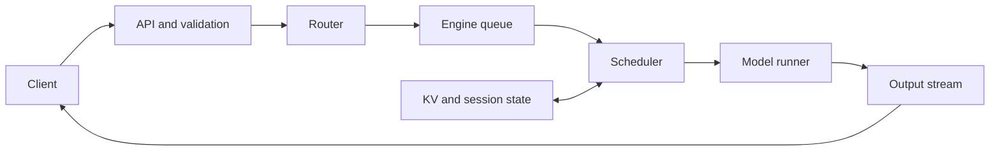
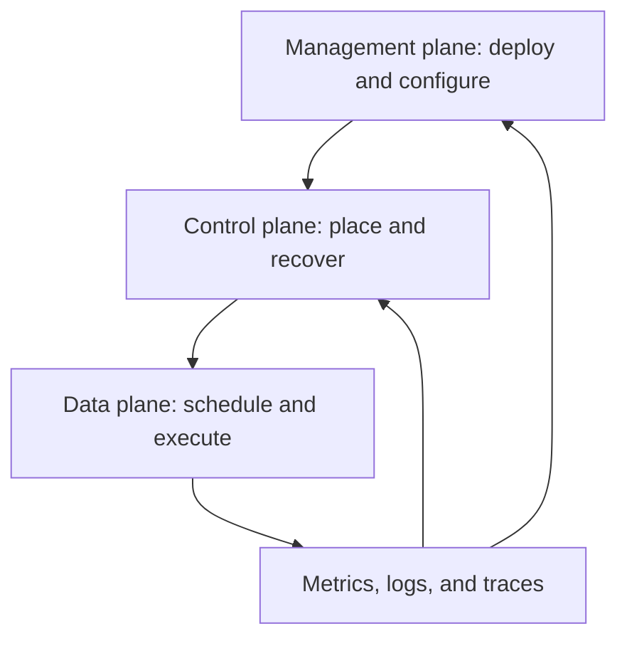

# 1. Serving Intelligence

Imagine that you send a question to a customer-support assistant. The answer
begins streaming half a second later and finishes a few seconds after that.
From the outside, one request went in and one answer came out.

Inside the service, much more happened. A web server checked the request and
applied a chat template. A tokenizer turned text into integers. A router chose
a model replica. A scheduler found room beside other requests already in
progress. The model read weights and conversation state from GPU memory one
step at a time. Another component converted new token IDs back into text and
sent them over the network.

Any one of those steps can become the reason the assistant feels slow or fails.
Inference engineering is the work of understanding the whole path.

## Visual map

**One request crosses several queues and state owners.**



**The three planes operate at different time scales but share evidence.**



| Plane | Typical decision | State consulted | Decision cadence |
| --- | --- | --- | --- |
| Data | next token batch | request and block tables | every engine step |
| Control | destination replica | queues, locality, health | every request or event |
| Management | release and capacity | versions, policy, demand | minutes to days |

## From model call to serving system

It is useful to begin with a simple request lifecycle:

```text
receive -> validate -> prepare -> wait -> execute -> stream -> finish
```

The first three stages turn the caller's request into something the model can
run. The waiting stage matters because production requests rarely get a GPU to
themselves. Execution may happen over hundreds of short model steps. Streaming
makes partial progress visible, and finishing releases request state or retains
some of it for future reuse.

The shape of the work also changes along the way. For a language model, the
initial prompt is processed as a group during **prefill**. New output tokens are
then produced one at a time during **decode**. Prefill and decode stress the
hardware differently, even though they use the same model weights. A
vision-language request adds image decoding and a vision encoder before the
language model. An image-generation request runs a denoising model many times
instead of producing tokens.

For this reason, a request is better understood as a small workflow than as one
model invocation.

## Three kinds of decisions

As the workflow runs, the service makes decisions at different speeds.

The **data plane** makes immediate decisions about current requests. It chooses
the next batch, allocates memory, launches model work, samples outputs, and
streams events. These decisions may happen many times per second.

The **control plane** decides where work should go. It routes requests between
replicas, tracks which prefixes are cached, changes membership when a worker
fails, and tells overloaded services to stop accepting more traffic. Its view is
broader than one model step, but it still reacts to live conditions.

The **management plane** changes the service itself. Deploying a new model,
rotating credentials, changing capacity, and rolling out a new engine version
belong here.

Separating these decisions prevents a common design mistake. A decode step
should not wait for a slow global database update. A model deployment, however,
must coordinate with caches and workers so that state created by old weights is
not reused with new weights. The time scales differ, but correctness connects
them.

## Follow the state

Component diagrams show where code runs. State tells you what the system must
protect.

Return to the support assistant. The model weights are long-lived and mostly
immutable. The request text, deadline, and generated tokens belong to one
request. Intermediate activations exist for only part of a model step. The
attention keys and values created from the conversation may live for the whole
request and remain useful for the next turn. Queues, worker health, and cache
locations describe the service as a whole.

These lifetimes suggest five broad categories:

| State | Examples | Typical lifetime |
| --- | --- | --- |
| Model | weights, tokenizer, compiled graphs | deployment or model version |
| Request | input, output, deadline, parser and random state | one request or session |
| Execution | activations, workspaces, collective buffers | part of a step |
| Reusable | KV blocks, encoder outputs, processed media | beyond one request |
| Service | queues, membership, routing and cache metadata | continuously changing |

For any important state object, ask who creates it, who may change it, how a
consumer recognizes the correct version, and what happens when the owner
fails. Those four questions uncover many bugs before code does.

Cancellation is a good example. Closing the network stream does not erase work
already scheduled on a GPU. The service must stop scheduling future steps,
decide what to do with work already in flight, release memory exactly once, and
send a final protocol event if the connection still exists. Cancellation is
therefore a state transition, not merely an HTTP feature.

## The execution plan

An inference service needs a plan for placing and advancing work. The plan
answers questions such as these:

- How many requests can share a step?
- Which devices hold each part of the model?
- How much memory is reserved for request state?
- Which input shapes use compiled graphs?
- When should state be reused, moved, or discarded?
- Which traffic receives priority during overload?

The best answers depend on the workload. A chat service with a long shared
system prompt benefits from prefix reuse. A batch summarization job may care
more about total completion time than first-token latency. A real-time voice
assistant values steady output and fast cancellation. There is no useful
configuration without a workload and a service objective.

Measurements complete the process. The service observes queues, latency,
throughput, cache use, failures, quality, and cost. Those observations show
whether the plan should change.

```text
workload and goals
       |
       v
model + hardware -> execution plan -> measured service behavior
                          ^                    |
                          +---- revise --------+
```

This feedback loop is the organizing idea for the rest of the book.

## Why faster parts can create a slower service

Suppose a team captures the model in a GPU execution graph and saves a small
amount of launch overhead on every decode step. The captured graph expects a
fixed batch shape, so the engine pads small batches to a much larger size. At
low traffic, the GPU now performs enough extra work that users wait longer.

Both statements are true: graph replay made each prepared operation cheaper,
and the service became slower.

The same tension appears in many forms. Cache-aware routing can overload the
replica with the best prefix. Large prefill chunks can improve GPU efficiency
while interrupting active decoders. Tensor parallelism can reduce arithmetic
per device while adding a network synchronization to every layer. A more
compressed weight format can save memory but use a slower kernel for the
shapes that actually arrive.

The lesson is not that local optimization is bad. It is that the unit of success
is the service objective under a realistic workload.

## Seeing the same duties in real engines

vLLM and SGLang organize their code differently, but both must perform the
request lifecycle described in this chapter.

At the source revisions used for this edition, vLLM separates an asynchronous
engine, an engine-core client, the engine core, a scheduler, executors, workers,
and model runners. SGLang exposes a tokenizer manager, scheduler,
tensor-parallel workers, model runner, memory pools, radix caches, and a
detokenizer manager.

The names matter less than the questions they let us answer. Where does the
authoritative request state live? Which component owns allocation? Can output
processing overlap the next GPU step? Which process notices a dead worker?

You can begin that investigation in vLLM's
[`engine/core.py`](https://github.com/vllm-project/vllm/blob/5cecfc01375052698823fc401e31518fb32a981e/vllm/v1/engine/core.py)
and SGLang's
[`managers/scheduler.py`](https://github.com/sgl-project/sglang/blob/e161bd1265a0082478b7f1c09f224a52d315dc71/python/sglang/srt/managers/scheduler.py).
These links point to the exact snapshots studied for this book. They are
examples of current design, not permanent APIs.

## Worked example: the cache hit that loses

Suppose a 6,000-token document question reaches a router. Replica A already has
4,000 tokens of the document cached but has 450 ms of queued prefill work.
Replica B is idle and can recompute those 4,000 tokens in 280 ms. A router that
sees only cache locality sends the request to A and adds at least 170 ms to the
user's wait.

The useful trace is not merely `router -> worker`. It records the router's
queue estimate, matched-token estimate, decision time, and the worker that
became authoritative. At the worker it separates admission wait, allocation,
prefill, decode, and output buffering. The request record and KV blocks have
different owners; cancellation must reach both without freeing blocks that a
GPU still uses.

This example gives the trace a purpose: explain why the apparently valuable
cache hit made the service slower. Chapter 2 will turn that observation into a
goodput and latency comparison.

## Practice: produce an ownership trace

Trace a 6,000-token document request with a 300-token output limit through edge
queue, validation, tokenization, routing, engine admission, prefix lookup,
prefill, decode, detokenization, and streaming. For every boundary, record the
queue, state owner, cancellation behavior, and one timestamp.

Then compare a replica with a 4,000-token match and 450 ms queue against an idle
replica that recomputes the prefix in 280 ms. State which replica you choose and
which two metrics would reveal a wrong choice in production. A worked answer is
in [Appendix G](../appendices/g-worked-solutions.md#1-request-trace).

In the next chapter, we will give those observations precise names and turn
“fast” into a service objective that can be measured.
