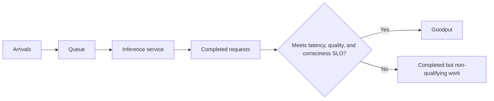
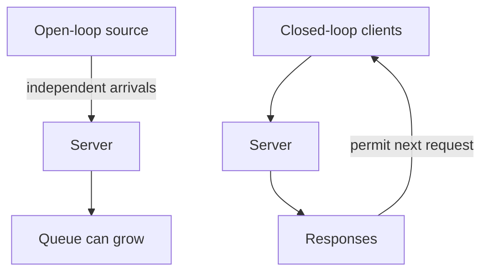

# 2. Workloads, SLOs, and Goodput

Two teams benchmark the same model on the same GPU. One reports 20,000 output
tokens per second. The other reports that 95 percent of users see a first token
within 400 milliseconds. Which system is faster?

The numbers answer different questions. The first describes how much work the
server completed. The second describes how the service felt to most users.
Neither is sufficient on its own.

Before tuning an inference system, you need a precise description of the work
that arrives and the promises the service must keep. Otherwise, a benchmark can
improve while the product gets worse.

## Visual map

**Goodput filters completed work through the product contract.**



**The load generator changes what overload looks like.**



| Measure | Unit of observation | What it can hide |
| --- | --- | --- |
| TTFT | request | later stream stalls |
| ITL | token gap | initial queue and prefill |
| throughput | completed work per second | SLO failures and queue growth |
| goodput | qualifying work per second | reasons individual requests failed |

## Decide what counts as work

A text-generation service handles several nested units. A session contains
turns. A turn may produce one request. A request can create several candidate
sequences, and every sequence contains input and output tokens.

Media systems use different units: images, frames, audio chunks, latent patches,
or generated samples. Reinforcement-learning systems also group generations by
prompt and policy version.

This is why “requests per second” and “tokens per second” need qualifiers. A
request containing 50 input tokens is not the same job as one containing
50,000. Token throughput may count input tokens, output tokens, or both. It may
even include padded positions or speculative tokens that were later rejected.

A useful metric always names its unit. For example:

> The service completed 320 successful requests per second, where requests had
> the production input and output length distribution.

That sentence is less impressive than a large unqualified number, but far more
useful.

## Latency is not one number

Consider a response that streams ten tokens. The first token appears after 600
milliseconds. Most later tokens arrive 40 milliseconds apart, but one gap lasts
half a second.

End-to-end latency tells you when the response finished. **Time to first token**
(TTFT) captures the initial wait. **Inter-token latency** (ITL) captures each gap
in the stream. **Time per output token** (TPOT) averages the time after the first
token across the remaining tokens:

```text
TPOT = (end-to-end latency - TTFT) / (output tokens - 1)
```

TPOT is compact, but it can hide the half-second pause. When output cadence
matters—as it does for chat, code completion, or speech—report ITL percentiles
or count stalls above a product threshold.

It also helps to break total latency into the stages a team can act on:

```text
network ingress
  + queueing
  + preprocessing
  + model execution and intermediate transfers
  + postprocessing
  + network egress
```

If a benchmark starts its timer after queueing and stops before streaming, it
does not measure the user's latency.

## Why percentiles matter

An average combines ordinary requests with rare slow ones. In production, those
slow requests may be the exact cases a customer remembers.

The 99th percentile, or p99, is the value below which 99 percent of observations
fall in a stated population and time window. The population matters. A global
p99 can hide a small tenant that is consistently slow. A per-token p99 is not a
per-request p99. A number calculated from successful requests says nothing
about timeouts that were removed from the sample.

When reporting a percentile, state:

- what was observed: request, token gap, or session;
- which traffic was included;
- the test or production window; and
- how errors and cancellations were handled.

Do not average percentiles produced by separate hosts. Combine the underlying
samples or merge compatible histograms, then calculate the percentile.

## Throughput is not capacity

Throughput measures completed work per unit time. Capacity is the arrival rate
the service can sustain while meeting its contract. The two diverge near
overload.

Imagine a server completing 100 requests per second while 120 arrive. Its
throughput looks stable, but the queue grows by 20 requests every second.
Latency will continue rising until callers time out or the system fails.

This leads to **goodput**: the rate of work that satisfies the service-level
objective, or SLO.

```text
request goodput = qualifying completed requests / test duration
```

A request might qualify only if it returns without error, begins within 500
milliseconds, maintains acceptable output cadence, and produces a valid result.
For a structured-output endpoint, malformed JSON does not count as goodput even
if it arrived quickly.

Goodput often changes the winner in an architecture comparison. A large batch
can maximize tokens per second but cause many requests to miss their latency
target. Separating prefill and decode may add transfer overhead while allowing
more requests to meet both TTFT and TPOT limits. The
[DistServe paper](https://arxiv.org/abs/2401.09670) uses this SLO-qualified view
to evaluate phase disaggregation.

## Describe the workload as a distribution

Suppose the support assistant receives mostly short questions. Ten percent of
users attach long documents, and half of all requests share one of a few system
prompts. Traffic is quiet overnight and arrives in bursts at the start of the
workday.

An average prompt length loses most of that information. A useful workload
record keeps the distributions of arrival time, input length, output length,
modality, media size, priority, tenant, and reusable prefix. It also preserves
correlations. Long documents may lead to long answers. Requests with the same
prefix may arrive together. Sampling each column independently creates a trace
that never existed.

Two load-generator styles answer different questions. An **open-loop**
generator sends work according to an external arrival process even when the
server slows. It exposes queue growth and overload. A **closed-loop** generator
waits for a response before sending the next request from a client. It models a
fixed client population, but it also reduces offered load automatically when
latency rises.

Neither style is universally correct. The mistake is failing to say which one
produced the result.

## Start from the product

Different products need different contracts.

An interactive assistant cares about TTFT, output cadence, cancellation, and
tail latency. An offline summarization job may accept high per-request latency
if a dataset finishes before a deadline. An embedding endpoint cares about
batch throughput and bounded completion time. A real-time media service has
frame or audio-chunk deadlines. A rollout service is coupled to a trainer and
may value policy freshness alongside generation speed.

Quality and correctness belong in every case. Quantization that meets the
latency target but damages an important task is not a successful optimization.
A tool call with the wrong schema is not useful output. A better service
balances several objectives rather than maximizing one:

```text
quality, correctness, availability, latency, goodput, cost, and energy
```

### Select the model with the system in view

Model selection is often presented as a leaderboard lookup. Inference
engineering turns it into a constrained product experiment.

Begin with an evaluation set drawn from actual product work: ordinary cases,
high-value cases, adversarial inputs, long contexts, required languages, tool
calls, and refusal behavior. Decide which failures are disqualifying before
comparing models. Then measure every viable candidate behind the serving stack
you could realistically operate.

A model with a higher offline quality score may be a worse product choice if it
misses the interaction deadline or requires a topology the team cannot keep
reliable. A smaller model may be preferable if retrieval supplies the missing
knowledge. Fine-tuning can change behavior without solving serving cost;
distillation can change both behavior and the execution envelope. Quantization
may let a candidate fit on fewer devices, but only an application evaluation
can determine whether its numerical changes are acceptable.

Write a one-page selection record for each serious candidate:

- the exact model, tokenizer, precision, context limit, and license;
- quality results on the product evaluation set;
- memory fit and required accelerator topology;
- latency and goodput under the target workload;
- operational dependencies and fallback behavior; and
- expected cost at ordinary and peak traffic.

The record prevents a common reversal: choosing a model in isolation and later
discovering that the service contract cannot afford it. Model and system
selection are one decision viewed at two levels.

## Worked example: throughput without goodput

One hundred requests arrive over 12.5 seconds. The server completes 96, so its
request throughput is 7.68 requests per second. Only 81 begin within 600 ms,
avoid token gaps above 150 ms, finish successfully, and return valid output.
Goodput is therefore 6.48 requests per second.

Removing the fifteen slow-but-completed requests from the latency sample would
make the percentile look better and destroy the meaning of the SLO. They must
remain completed work that failed to qualify. The four requests that errored or
timed out also remain in the workload accounting.

Now keep total tokens fixed but move arrivals into five bursts. Arithmetic work
is unchanged, yet queues and long-prefill interference can reduce goodput. This
is why the arrival process and length correlations belong in the workload
definition.

## Practice: construct comparable traces

Create three 100-request traces, each containing 100,000 input and 20,000 output
tokens: evenly spaced uniform requests, five bursts with mixed lengths, and ten
conversation groups sharing 8,000-token prefixes. Use an open-loop rate of 8
requests/s, then repeat closed-loop.

Report queue time, TTFT, worst per-request ITL, end-to-end latency, prefix
matches, errors, throughput, and the SLO-qualified goodput defined above.
Explain why equal token totals do not imply equal capacity. See the worked
construction in [Appendix G](../appendices/g-worked-solutions.md#2-workload-traces-and-goodput).

Now that the goals are clear, the next chapter looks inside the model to find
the computation and state that the server must schedule.
