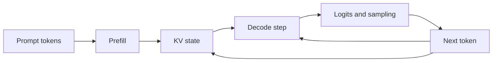
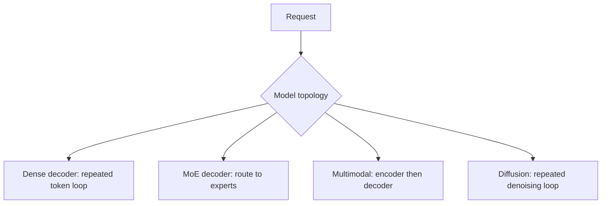

# 3. How Generative Models Execute

When a language model writes a sentence, it does not plan the whole sentence
and reveal it one word at a time. It repeatedly predicts what should come next.
That simple loop shapes almost every part of an LLM server.

An engine does not schedule an abstract “model.” It schedules operations with
particular tensor shapes, dependencies, and state. A scheduler that treats
every request as identical work will pack batches badly, reserve the wrong
memory, and pick graph shapes that never occur. To understand the engine, we
first need to understand the work the model creates.

This chapter inventories that work: the autoregressive loop and its serial
dependency, the two kinds of passes a decoder performs, the persistent state
attention requires, the irregularities that mixture-of-experts routing,
encoders, and diffusion introduce, and the way all of it becomes a serving
topology. The emphasis falls on execution properties an engine must discover,
rather than one fixed block diagram, because serving-oriented architectures
have changed many details since the original Transformer described in
[Attention Is All You Need](https://arxiv.org/abs/1706.03762).

## Visual map

**Prefill creates persistent state; decode consumes and extends it.**



**Different model families create different serving graphs.**



The first diagram carries the chapter's central dependency: the arrow from
the selected token back into both the state and the next step. Everything
the scheduler struggles with — serialization, preemption costs, speculative
execution — traces back to that feedback edge. The second diagram is a
dispatch table: the request's topology decides which serving graph it enters,
and each branch carries its own persistent state and irregular work.

| Topology | Persistent state | Irregular work | Natural split point |
| --- | --- | --- | --- |
| Dense decoder | KV by token | prompt and output length | prefill and decode |
| MoE decoder | KV plus expert weights | token-to-expert routing | expert ownership |
| Multimodal | encoder features plus KV | media shape and token count | encoder boundary |
| Diffusion | latent and conditioning | resolution and denoising step | pipeline stages |

## The autoregressive loop

A decoder-only language model begins with token IDs. It converts them to
vectors, passes those vectors through a stack of transformer blocks, and
produces a score for every possible next token. For a vocabulary of 128,000
entries, that final projection produces 128,000 scores — the logits — from
which sampling rules select one token. The selected token is appended to the
sequence, and the process repeats.

```text
tokens -> transformer blocks -> logits -> sampling -> next token
   ^                                                 |
   +-------------------------------------------------+
```

The next step depends on the token selected in the previous one. This is
the serial dependency behind decode latency. A server can process many
sequences together, but one sequence cannot generate its tenth new token before
it knows the ninth. Parallelism across sequences is free; parallelism within
one sequence's decode does not exist unless a later mechanism, speculation,
manufactures it.

The loop also fixes what the engine touches every step. Each step reads
the model's weights, reads the attention state accumulated so far, computes
one position's worth of arithmetic per active sequence, writes one new entry
per layer into that state, and emits one logits vector per sequence. Those
five facts — four of them dominated by reads — explain most of decode's
performance character before any kernel details enter.

### What one decode step actually moves

Appendix A defines arithmetic intensity as operations divided by bytes moved
across a memory boundary, with attainable throughput bounded by the smaller
of peak compute and bandwidth times intensity. Decode at small batch sits far
below that crossover, and counting the movement shows why.

Assume the dense decoder inventoried later in this chapter: 140 GB of BF16
weights. One decode step at batch size 1 must read essentially all of them —
every layer contributes to the single position being computed — while doing
roughly two floating-point operations per parameter, about 140 GFLOP. The
intensity is around one operation per byte moved. On hardware whose compute
peak is hundreds of times higher than its bandwidth peak allows, the step
time is set almost entirely by reading weights: the arithmetic units idle
while the memory system streams.

Raise the batch to 32 active sequences. The weight read happens once and
still dominates the byte count, but the useful arithmetic grows thirty-two
fold, so the same read now pays for itself thirty-two times. This is the
mechanical reason batching raises throughput so dramatically at small batch —
and why the gains flatten as compute, not bandwidth, becomes the binding
limit. Chapter 8 builds kernels around exactly this boundary, and Chapter 6's
scheduler spends its life keeping enough sequences resident to stay on the
favorable side of it.

Weights are only the first term. Each step also reads every sequence's
accumulated state, and that term grows with context. At 320 KiB per token, a
sequence holding 2,000 positions carries about 625 MiB of state; thirty-two
such sequences make the per-step state read roughly 20 GiB. Weight bytes stay
fixed while state bytes climb linearly, so long-context serving crosses a
point where attention traffic, not weight streaming, sets the step time — and
the crossing arrives sooner for models with more KV heads. This second term
is why context length is a performance knob and not just a capacity knob, and
it is the quantity paged attention (Chapter 7) and cache compression
(Chapter 9) exist to manage.

## One model, two kinds of work

The first pass over the prompt is called **prefill**. The model processes many
input positions at once and creates the attention state needed later. Large
matrix operations during prefill tend to use the accelerator's compute units
well: a 1,000-token prompt performs a thousand positions' arithmetic while
reading the weights once, so its intensity resembles ordinary training-style
compute.

After prefill, the model enters **decode**. Each active sequence usually adds
one position per step. At a small batch size, the GPU repeatedly reads a large
set of weights to do relatively little arithmetic. Decode is therefore often
limited by memory traffic or launch overhead.

Batching more sequences lets the same weight read serve more work. That raises
throughput, but a request may wait longer for its place in the batch. The
scheduler spends much of its life balancing this exchange between hardware
efficiency and user latency.

Prefill and decode use the same weights, yet behave like different workloads:
compute-bound versus bandwidth-bound, large regular shapes versus thin ones,
one burst versus a long cadence. Later chapters will use that fact repeatedly
to motivate chunked prefill, separate graph shapes, phase-specific parallelism,
and disaggregated serving. None of those mechanisms would exist if the two
passes had the same execution profile.

| Dimension | Prefill | Decode |
| --- | --- | --- |
| Positions per pass | the whole prompt | one per sequence |
| Arithmetic intensity | high, training-like | low until batch grows |
| State effect | creates the KV cache | extends it one token at a time |
| Latency users feel | time to first token | inter-token latency |
| Natural unit of scheduling | token chunks | engine steps |

The last row is the scheduler's dilemma in miniature: prefill work can be
sliced into chunks and interleaved, but a decode step is atomic — every
resident sequence advances or none does. That asymmetry, not hardware
preference, is why phase-mixing decisions dominate Chapter 6's design space.

## Attention remembers the past

Inside a transformer block, attention lets each position combine information
from earlier positions. Recomputing the entire prompt for every new token would
be wasteful — output token ten thousand would re-derive ten thousand positions'
intermediate results. Instead, the model stores the keys and values created for previous
positions. This persistent state is the **KV cache**.

For a conventional attention layout, a rough size estimate for one sequence is:

```text
KV bytes = 2 * layers * tokens * KV heads * head dimension * bytes per value
```

The factor of two accounts for keys and values. The total grows with sequence
length and can become much larger than the temporary activation memory of one
decode step.

### The cache formula, applied

Numbers make the formula's consequences concrete. Take the dense decoder this
chapter inventories: 80 layers, 8 KV heads, head dimension 128, BF16 values
of 2 bytes each. One token, one layer:

```text
2 * 1 * 8 * 128 * 2 = 4,096 bytes per layer per token
```

Across 80 layers, each token accumulates 320 KiB of state. An 8,000-token
conversation therefore holds about 2.44 GiB — larger than many models' entire
weight footprint was, not long ago. Two scheduling consequences follow
directly. First, admission decisions are memory decisions: accepting one more
long-context conversation commits gigabytes, not megabytes. Second, the
state's growth is linear in context, so a service whose users drift toward
longer conversations watches its effective capacity shrink even though
nothing changed.

Architecture choices move the constant by large factors. Grouped-query and multi-query
attention use fewer KV heads — eight instead of thirty-two shrinks the cache
fourfold. Multi-head latent attention stores compressed
latent state and separate positional components. Sliding-window attention only
needs a recent region. Recurrent and state-space layers can keep fixed-size
state instead of one entry per token.

This means that a modern engine may manage several kinds of persistent state in
the same model. Calling all of it “the KV cache” is convenient, but assuming it
has one shape or one retention rule is not.

## Attention patterns change what can be reused

Full causal attention allows a new token to attend to every earlier token.
Other patterns limit the receptive field.

A sliding-window layer attends only to recent positions. A local or
block-sparse layer follows a fixed pattern. Cross-attention reads state produced
by an encoder. Some architectures share state between layers or summarize old
positions into recurrent state.

Each pattern changes what persistence means. A sliding-window layer's old
entries eventually become dead weight that a clever engine could release; a
full-causal layer's entries remain load-bearing until the sequence ends.
Cross-attention state belongs to the encoded input rather than the generated
text, so it can be reused across questions about the same document. Reuse
rules are pattern rules, decided by the architecture and discovered by the
engine.

| Pattern | State growth | Old entries | Reusable across requests |
| --- | --- | --- | --- |
| Full causal | linear in tokens | load-bearing until sequence ends | only via exact-prefix reuse |
| Sliding window | capped at window | dead past the window | no |
| Cross-attention | set by encoder output | live while input is live | yes, per encoded input |
| Recurrent or state-space | fixed size | summarized, not stored | model-defined |

The table is an eviction-policy decision table in disguise: what a cache
manager may release, and when, follows from the row the model occupies. A
policy tuned for full causality hoards sliding-window dead weight; a policy
that frees aggressively breaks cross-attention reuse.

The model runner must pass the correct positions, mask, page table, and
layer-specific metadata to the attention implementation. Selecting an
attention backend is therefore a correctness decision before it becomes a
performance decision: a backend that assumes full causality on a
sliding-window model produces plausible-looking output with silently wrong
attention, a failure mode worse than crashing because nothing reports it.
Chapter 8 treats backend selection as a match against device, dtype, cache
layout, and execution mode together.

## Mixture-of-experts models add routing

A dense feed-forward layer applies the same parameters to every token. A
mixture-of-experts, or MoE, layer contains many feed-forward networks called
experts. A router selects a small number of experts for each token.

This conditional computation allows the model to contain many parameters
without using all of them for every token. The accounting distinction that
matters for serving is resident versus active: a model with eight 7-billion-parameter
experts keeps roughly 56 billion parameters' worth of expert weights in
memory, yet applies only about 14 billion per token when two experts are
selected. Memory planning must satisfy the resident number; compute planning
scales with the active one. The gap between them is where MoE serving gets
interesting.

It also introduces irregular work.
Tokens must be grouped by expert so the accelerator can run efficient matrix
multiplications. If experts live on different GPUs, token representations must
move to the selected owners and return afterward.

The busiest expert determines when the step finishes. A model with balanced
average routing can still have a hot expert for a particular workload. Serving
MoE models is therefore as much a placement and communication problem as a
matrix-multiplication problem, and Chapters 12 and 13 give it dedicated
treatment.

### Watching one batch route

Follow sixteen decode tokens through one MoE layer with eight experts, top-2
routing. The router scores each token against all eight experts and picks the
two highest. Counting assignments across the sixteen tokens might yield loads
of `7, 5, 5, 4, 4, 3, 2, 2` — thirty-two assignments, sixteen tokens, two
each, yet nothing like uniform. The engine groups tokens by chosen expert so
each expert runs one batched matrix multiply instead of sixteen small ones;
expert 0 processes seven tokens while expert 7 processes two.

If the experts live on different devices, each token's hidden state travels
to its two selected owners and the weighted outputs travel back — an
all-to-all exchange whose volume is set by routing decisions made
milliseconds earlier. The step cannot finish until expert 0 finishes, so
stragglers set the pace: the lighter-loaded devices wait.
Averaged over a whole workload the router may look balanced while individual
steps swing widely, which is why MoE schedulers reason about per-step loads
rather than long-run averages. What balancing, placement, and capacity
policies do about it is the business of Chapters 12 and 13; the point here is
that the irregularity is created by the model's own forward pass, not by the
server.

## Sampling has state too

The model's logits are not always sampled directly. Temperature, top-k and
top-p filters, repetition penalties, token bans, grammars, and custom logit
processors can all change the distribution. These processors form a chain
applied in a defined order, and the order is part of behavior: penalizing
repetition before or after top-k filtering yields different outputs from the
same logits. Random sampling owns a generator
state — seed and stream position — that belongs to the request and must
survive across steps. Structured generation owns a parser or finite-state machine for each
sequence, updated as tokens are emitted.

Greedy selection chooses the highest-scoring token. It is deterministic only if
the logits and tie handling are identical. Different batch shapes, reduction
orders, kernels, precisions, collectives, or cache paths can slightly change the
logits. Temperature zero does not by itself guarantee identical output across
executions. Later chapters will separate deterministic selection from
deterministic numerical execution — the first lives in the sampler, the second
in kernels and compilation, and confusing them produces debugging sessions
that search the wrong layer.

### One distribution through the processor chain

A tiny vocabulary makes the chain inspectable. Suppose a step's logits give
five candidate tokens these probabilities: `A 0.60, B 0.25, C 0.10, D 0.04,
E 0.01`. Temperature first: dividing the logits by 0.5 and re-normalizing
sharpens the distribution — A rises well above 0.60, the tail flattens toward
zero. Dividing by 2.0 instead flattens it — A falls, the tail gains mass.
Temperature never reorders tokens; it changes how much probability mass the
ordering carries.

Now top-k with k = 2: keep A and B, zero the rest, renormalize. C, D, and E
become unreachable this step no matter how the dice fall. Top-p with p = 0.90
instead keeps the smallest set whose cumulative mass reaches 0.90 — A plus B
plus C reaches 0.95, so the candidate set is those three, and implementations
genuinely differ on whether C, the token that crosses the threshold, is kept
or dropped. That ambiguity is exactly why processor order and semantics are
part of a service's contract: repetition-penalizing A before the top-k cut
can push B into the surviving set; applying the same penalty after the cut
changes nothing, because B's fate was already decided. Two servers can expose
identical parameter names and produce different distributions because their
chains apply the same operations in a different order — a compatibility
hazard Chapter 5 returns to when it defines what an execution request must
carry.

## Models with encoders

Now consider a user who attaches an image to a question. The service may decode
the image, resize and normalize it, run a vision encoder, project the resulting
features, and insert them into the language-model input. Only then do language
prefill and decode begin.

```text
image bytes -> preprocessing -> vision encoder -> media features
                                                    |
text ----------> tokenization ----------------------+
                                                    v
                                      language prefill -> decode
```

For a large image or video, the encoder can dominate time to first token: a
high-resolution image or a minute of video can produce thousands of feature
tokens, each of which then occupies positions in the language model's context.
The token count follows from geometry. A vision encoder typically splits the
image into fixed-size patches — a 448 × 448 image cut into 14-pixel patches
yields 32 × 32 = 1,024 of them. Double the resolution and the patch count
quadruples; add frames to a video and the counts multiply again. This is why
a service can budget carefully for text length and still be ambushed by
media: one resolution setting change moves the language model's context cost
by multiples, and the practice exercise's 2,048 feature tokens per image is
exactly this arithmetic at work.

Encoder output may be reusable when the user asks several questions about the
same media — the features, unlike the question, do not change. Resolution and frame count also create dynamic shapes: two requests
differ in encoder workload even when their text is identical length. The encoder is a
serving stage with its own batching, caching, and placement decisions—not a
minor preprocessing detail, and Chapter 17 promotes it to a first-class
workload.

Embedding, reranking, classification, and reward models often have no decode
loop at all. They batch complete inputs and produce complete outputs. Engines
that support these tasks need schedules and output paths suited to them —
there is no stream to pace and no state to extend, but there is also no
partial progress to show a waiting caller.

## Diffusion follows a different loop

An image-generation pipeline commonly contains a text encoder, a denoising
network, a scheduler that chooses noise levels, and a decoder that turns a
latent representation into pixels. The denoising network runs many times —
often twenty to fifty denoising steps — with each pass refining the same latent.

Unlike an autoregressive sequence, a diffusion request often advances all
spatial positions together. Its latent state may keep a stable shape across
steps, which makes its per-step work predictable in a way decode is not.
Requests can share a batch when their resolution, step, conditioning,
and backend requirements are compatible. Some systems cache repeated work
between nearby denoising steps, exploiting the fact that consecutive
passes change the latent only slightly.

The lesson is broader than diffusion: an inference engine should model stages,
dependencies, and state rather than assume that every request emits one token
per step. An engine designed around the decoder loop alone will force
every other topology through shapes that fit it badly.

## From model topology to serving topology

The **model topology** describes what depends on what: layers, experts,
encoders, attention state, and iterative stages. The **serving topology** maps
that work onto devices and processes.

The same model can be replicated in full, split across devices by tensor or
layer, distributed by expert, or separated into encoder, prefill, and decode
pools. All may be legal. The workload, hardware links, memory capacity, and SLO
decide which is useful. Reading the model topology tells an engineer which
splits are even available: a model whose experts dominate its parameters has
an expert-parallel option a dense model lacks; a model with a heavy encoder
has an encoder-disaggregation option a text-only model lacks.

The rest of the book applies this inventory repeatedly. The immediate next
step is the hardware those topologies must live on.

## Worked example: inventory a dense decoder

Consider a BF16 dense decoder with 70 billion parameters, 80 layers, 8 KV
heads, and head dimension 128. Its parameter storage is roughly 140 GB before
runtime overhead — 70 billion parameters at 2 bytes each. Using the cache formula from this chapter, each token creates
320 KiB of KV state across the model, as the applied calculation above showed.
An 8,000-token sequence therefore needs
about 2.44 GiB.

Those two numbers immediately constrain serving. The weights do not fit on one
80-GiB device at BF16, so some parallel split is mandatory before the first
request arrives — four ways, say, leaving about 35 GB of weights per device.
Long active contexts consume memory on top of that: each device also owes its
quarter of every sequence's state, roughly 625 MiB for one 8,000-token
sequence, and a batch holds many sequences. Prefill creates many token positions at once;
decode repeatedly reads the sharded weights and existing state for one new
position per sequence.

The same inventory for an MoE model must separate total resident expert weights
from experts active per token — the 56-versus-14 billion distinction above.
For a vision-language model it must separate the
encoder, projected media features, and decoder KV state. Different inventories
lead to different legal placement plans.

## Practice: compare three model topologies

Inventory the dense decoder above, an 8 × 7B expert model with two experts
active per token, and a vision-language model that produces 2,048 feature
tokens per image. For each, list parameter bytes, persistent state, prefill and
decode shapes, conditional communication, and independently placeable stages.

Do not choose an engine setting yet. Produce the facts a serving plan must
respect. The worked inventory is in
[Appendix G](../appendices/g-worked-solutions.md#3-model-topology-inventory).

The next chapter maps that work onto real memory and interconnects.
