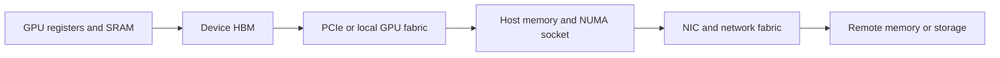
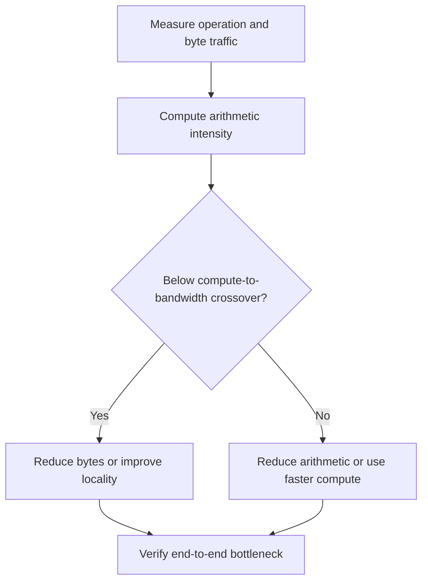

# 4. Hardware Is a Topology

A machine specification says that a server has eight GPUs. That sounds
precise, but it leaves out the information an inference engineer needs most.

Can every GPU communicate directly with every other GPU? Do four devices sit
behind one CPU socket and four behind another? Is there one network interface
or several? Which links are shared? Eight identical accelerators can form very
different systems.

The omitted facts decide real outcomes. A tensor-parallel group striped across
two islands runs the same arithmetic measurably slower than one kept inside a
fast island. A tokenizer pool pinned to the wrong socket steals bandwidth from
a network progress thread. Two replicas that look independent fail together
because they share a switch. None of these appear in a specification sheet;
all of them appear in production incidents.

Hardware is not a bag of processors. It is a map of places where bytes can live
and paths along which bytes can move.

## Visual map

**Every byte follows a physical path, even when the API hides it.**



**The roofline question chooses the first optimization direction.**



The first diagram is a cost ladder: each hop outward buys capacity with
latency and bandwidth, and the optimizer's job is to keep hot objects on the
lowest rung their access pattern justifies. The second diagram is a triage
procedure, not a description of the machine — it produces a hypothesis about
which resource governs, and the final node insists that measurement confirm
or falsify it before anyone optimizes.

| Boundary | First question | Evidence |
| --- | --- | --- |
| HBM | are weights or KV reread? | achieved bandwidth and cache traffic |
| GPU fabric | which collective dominates? | bytes, latency, overlap, stragglers |
| PCIe and NUMA | is the copy staged or remote? | affinity and transfer timeline |
| Network | is payload or setup dominant? | message-size throughput curve |

## Four limits to keep separate

Hardware discussions often collapse everything into “speed.” In practice, four
resources matter.

**Compute rate** describes how many arithmetic operations a device can perform
per second. **Capacity** describes how many bytes fit in a memory tier.
**Bandwidth** describes how quickly bytes move once a transfer is underway.
**Latency** describes how long a dependency takes, including the cost of
starting it.

A device can have enormous compute rate and still wait on memory. A network can
have high peak bandwidth but perform poorly for the tiny, frequent messages of
decode. A model can fit in device memory and still run out of space when the
engine reserves KV blocks, graph workspaces, and collective buffers.

Keep the four limits separate until measurements show which one governs the
workload.

### Four limits, one decode step

One decode step from Chapter 3's dense decoder touches all four limits, at
different stages. Walk the step and ask what could bind at each point.

Starting the kernels costs microseconds of launch latency each — pure
dependency overhead, paid even though no meaningful arithmetic or traffic has
happened yet; at small batch with short steps, these microseconds are a real
fraction of the step. Inside the attention kernel, the arithmetic itself is
trivial compared with streaming 140 GB of weights and each sequence's
accumulated state through the memory system, so bandwidth binds while the
compute units idle. If the model is sharded four ways, each layer ends with a
reduction whose duration depends on fabric latency and on the slowest rank —
a synchronization limit that no amount of local bandwidth fixes. And before
any of this, admission had to find room for the sequence's state: a capacity
limit that decides whether the step runs at all.

The practical consequence is diagnostic. A slow step could be any of the
four, and each has a different fix — fewer launches, fewer bytes, better
placement, or stricter admission. Treating “the GPU is slow” as one problem
produces optimizations aimed at the wrong limit; Chapter 8's profiling
discipline exists largely to tell them apart.

## A practical roofline

Arithmetic intensity measures how much computation an operation performs for
each byte it moves from a chosen memory tier:

```text
arithmetic intensity = operations / bytes transferred
```

If a device can perform `C` operations per second and the relevant memory path
can move `B` bytes per second, a simple upper bound is:

```text
attainable rate <= min(C, B * arithmetic intensity)
```

Below the crossover point `C / B`, the operation is limited by moving data.
Above it, compute becomes the tighter ceiling. This roofline model is simple,
but it asks the right first question: should you reduce arithmetic, reduce
traffic, or improve overlap?

Apply the model at the boundary that matters. A decode layer may be limited by
GPU memory bandwidth while the entire model step waits on a cross-node
collective. A cache load may be fast from local storage and slow across PCIe.
There is not one roofline for the whole service.

### Where the crossover sits for decode

Make the crossover concrete with declared assumptions. Suppose an accelerator
performs about one quadrillion arithmetic operations per second and its memory
system moves about three trillion bytes per second. The crossover intensity is
then roughly 333 operations per byte: work below that intensity is
bandwidth-bound no matter how idle the arithmetic units look.

Now place decode on that scale. Reading BF16 weights costs 2 bytes per
parameter, and each parameter contributes about two operations per sequence
in the batch — so the intensity of the weight read, in operations per byte,
is approximately the batch size. Batch 8 sits at intensity 8, more than a
factor of forty below the crossover: utterly bandwidth-bound. Batch 128
approaches intensity 128 and starts to matter computationally. The exact
crossover varies by orders of magnitude across hardware generations, but the
shape of the conclusion does not: small-batch decode lives far below the
roofline's knee, which is why Chapter 3 called it a streaming workload, and
why the scheduler's batch composition is a hardware-efficiency decision as
much as a latency one.

Prefill tells the opposite story. A 1,000-token prompt performs a thousand
positions' arithmetic per weight read, putting its intensity near a thousand —
comfortably above typical crossovers. The same weights, the same device, and
the binding limit flips. Any mechanism that mixes phases inherits both
profiles in one schedule, which is exactly why phase-mixing is hard.

The crossover also sorts the book's remaining mechanisms into two families.
Below it, the winning moves reduce bytes or improve reuse: paged allocation
(Chapter 7) stops state fragmentation from wasting capacity, quantization
(Chapter 10) shrinks the weight bytes themselves, and batching raises
intensity directly. Above it, bytes are no longer the constraint, so the
winning moves cut arithmetic or overlap it: speculative decoding (Chapter 11)
spends extra arithmetic to shorten the critical path, and disaggregation
(Chapter 14) moves work to where its limiting resource is plentiful. When a
profiler says a kernel sits below the crossover, that ordering tells you
which chapter to open first.

## Why batching changes hardware efficiency

During a long prefill, large matrix operations reuse model weights across many
token positions. That gives the GPU substantial work for each byte of weights
it reads.

During decode, a small batch may read nearly the same weights to process only a
few new positions. The operation is more likely to be memory-bound. Adding
sequences to the batch allows one weight read to support more useful work.

This is why larger batches often improve throughput. It is also why throughput
and latency conflict: requests may need to wait until enough compatible work is
available, and a larger step itself takes longer. The scheduler chooses where
the service operates on this curve.

The waiting term is not mysterious. If requests arrive at twenty per second
and the scheduler wants eight per batch, collecting them costs on average
8/20 = 0.4 seconds of added time to first token — simple arithmetic, but the
kind that decides SLOs. Waiting longer buys hardware efficiency at a rate the
arrival process sets, which is why continuous batching (Chapter 6) refuses to
wait for full batches and instead admits whatever is compatible each step:
it keeps most of the efficiency gain while charging almost none of the queueing
cost.

## Where the bytes live

An inference deployment may use a hierarchy that begins with registers and
on-chip scratch memory, continues through device caches and high-bandwidth
memory, and extends to host memory, local storage, remote storage, and durable
object storage.

Closer tiers are scarce and fast. Farther tiers provide more capacity at higher
access cost. Different objects deserve different treatment. Model weights are
large and repeatedly read. KV blocks grow with active sequences and may be
reused. Compiled graphs are expensive to recreate but tied to an execution
environment. Adapters and media embeddings have their own popularity patterns.
An object's right tier can also change over its lifetime: sequence state is
hot while the request runs, cold the moment it is preempted, and dead at
completion — three different storage problems wearing one name.

When checking whether a model fits, include the whole working set:

```text
weights
+ persistent request state
+ temporary activations
+ communication buffers
+ graph and compiler memory pools
+ allocator headroom
```

Parameter size alone is not a capacity plan.

### Turning the fit equation into an admission budget

Walk the fit list with Chapter 3's decoder on the worked deployment below:
an 80-GiB device holding one rank of a four-way split. Weights take about
35 GB — and note the trap: gigabytes are not gibibytes, and 35 GB is roughly
33 GiB, so the honest remainder is about 47 GiB, not 45.

Reserve, say, 12 GiB for activations, communication buffers, graph pools,
and allocator headroom — a declared planning assumption, not a measurement.
That leaves about 35 GiB for persistent state. Each 8,000-token sequence owes
its rank one quarter of 2.44 GiB, roughly 0.61 GiB, so the device admits
around fifty-seven such sequences. Fifty-seven is now an admission number: a
scheduler accepting the fifty-eighth long conversation without evicting
another is promising memory the device does not have, and Chapter 7's paged
allocation exists to make that accounting exact rather than approximate.

The same walk explains a common production surprise. The deployment ships,
fits comfortably, and serves short conversations for weeks. Users discover
long-document chat, contexts drift toward the maximum, and the KV share of
the working set quietly triples. Nothing was misconfigured; the fit
assumptions were, because capacity planning used the context lengths of the
pilot, not the ones the workload grew into.

### Which tier for which object

The fit equation says what must fit; the tier ladder says where each object
should live. The decision follows each object's access pattern, and the four
main objects disagree with each other.

Weights are read in full every step and never change within a deployment, so
they belong on the highest tier that fits — anything farther costs bandwidth
on every single step. KV state is the opposite: append-heavy while a sequence
lives, dead the moment it ends, and the only major object whose total size
the scheduler controls by admitting or evicting sequences. That controllability
is what makes offloading it plausible at all. Compiled graphs are read
constantly but are small next to weights and are invalidated by environment
changes, so device or host memory suits them. Media embeddings are reused
across requests about the same input, so they want a tier near the engine
with an eviction policy — a cache, not a residency guarantee.

The cost gap between tiers is the whole argument. Assume, as declared
planning numbers, a device memory system that moves about three trillion
bytes per second and a device-to-host path that manages about fifty billion —
a sixty-fold difference. One rank's share of an 8,000-token sequence, 0.61
GiB, streams from device memory in well under a millisecond but takes on the
order of thirteen milliseconds to pull back from host memory. A preempted
sequence whose state was swapped to the host does not resume for free; it
replays a ten-millisecond-scale penalty into some unlucky request's
inter-token latency — a visible bite out of a 150-millisecond budget. That is
why preemption policy (Chapter 6) and KV transfer design (Chapter 14) treat
tier placement as a latency decision, not a storage detail.

## Links decide which parallel plans make sense

Within a host, devices may communicate over PCIe or a higher-bandwidth GPU
fabric. Across hosts, data may travel over RDMA-capable networks. Exact product
names change, but the design questions stay stable.

Which pairs have direct peer access? Which transfers cross a CPU root complex?
Which ranks share a switch or network rail? Can a transfer overlap the kernels
that surround it? What happens when every rank communicates at once?

Topology inventory is evidence, not a performance result. NVIDIA's
[DCGM topology guide](https://docs.nvidia.com/datacenter/dcgm/latest/learn/core-services/topology-and-links.html)
explicitly separates known CPU, PCIe, and NVLink relationships from active path
tests and observed traffic. Use the analogous inventory and diagnostic tools
for the platform being measured.

Different forms of model parallelism create different traffic:

| Parallelism | Message shape | Frequency | Synchronization |
| --- | --- | --- | --- |
| Tensor | medium reductions or gathers | every layer | all ranks wait |
| Expert | token hidden states to owners | every MoE layer | busiest owner gates |
| Pipeline | stage-boundary activations | per stage boundary | neighbors only |
| Disaggregated | whole KV regions | once per handoff | producer-consumer |

Tensor parallelism tolerates slow links worst: its collectives sit inside the
critical path at layer frequency, so link quality multiplies across eighty
layers. Pipeline parallelism hides link latency better but pays in bubbles.
Disaggregation moves few, large messages, which favors paths chosen for
bandwidth over latency. Matching each pattern's traffic shape to the links
that suit it is the placement problem Chapters 10 and 14 solve concretely.

The important quantities are message size, frequency, synchronization, and
path—not only total bytes.

The last design question — what happens when every rank communicates at
once — deserves its own attention, because aggregate bandwidth is rarely the
sum of per-link bandwidth. Eight ranks that all reduce through one switch
contend for its backplane; a dual-rail design where each rank owns one rail
carries two full-width collectives concurrently, while a design that pins
half the ranks to each rail but lets collectives span both pays a bridging
hop on every message. Stragglers amplify the contention: a collective ends
when its last participant arrives, so one rank whose path is oversubscribed
stretches all eight. These are placement outcomes — visible in a topology
drawing, invisible in a per-link bandwidth specification.

## CPUs remain on the critical path

The GPU runs the model, but the CPU may parse requests, tokenize text,
preprocess media, make schedules, prepare metadata, coordinate transfers, and
turn outputs into stream events. Once GPU steps become short, Python work or a
host synchronization can take a large fraction of each iteration.

A declared-assumption arithmetic makes the exposure vivid. Suppose an engine
step takes six milliseconds on the device and the host needs four more per
step — sampling bookkeeping, metadata assembly, stream polling — serialized
before the next launch. The device then runs at most sixty percent duty cycle
no matter how its kernels are tuned, and the missing forty percent will never
appear in a GPU profile as memory or compute time. This is why Chapter 1's
engine separates launch path from scheduler path, and why captured graphs and
overlapping event loops exist: they attack the host-side term, not the
device-side one.

CPU placement also matters. A process can access memory attached to another
NUMA node or control a device behind another CPU socket. Tokenizer pools can
compete with network progress threads. Unified addressing can make memory
accessible without making it local or fast.

The penalty has a shape worth internalizing: it is per-interaction, and
inference is dense with interactions. A scheduler process on socket B driving
a device attached to socket A pays the crossing cost on every doorbell,
metadata write, and completion poll — individually small, but multiplied by
thousands of interactions per second, the crossings become a measurable
fraction of the host budget from the six-millisecond-step arithmetic above.
Pinning the scheduler, its tokenizer pool, and its network progress threads
to the sockets that own their devices removes the crossings without making
any single interaction faster — a placement fix, not a code fix, which is
why it belongs in the topology drawing rather than the profiler's hot path.

Measure CPU time, run-queue delay, memory placement, and synchronization beside
GPU utilization. A GPU that appears underused may be waiting for the host.

## Draw the physical map

Suppose you have 16 GPUs arranged as two groups of eight with fast links inside
each group and a slower network between them. A tensor-parallel group of eight
should usually fit within one fast island. Alternating its ranks across both
islands changes no arithmetic, but forces frequent collectives onto the slower
path.

Your topology drawing should follow each rank all the way out:

```text
rank -> accelerator -> local fabric -> CPU socket -> NIC -> switch -> rack
```

Now add traffic. Mark how many bytes cross each logical edge and how often. A
topology diagram without traffic is an inventory; adding traffic turns it into
a performance hypothesis.

Annotating the four-replica deployment shows how uneven the traffic lands.
Every intra-replica edge carries two reductions per layer, per step — with
eighty layers and dozens of steps per second, thousands of small messages per
second on the island fabric, each on the critical path of every rank in the
group. The inter-island edge carries almost nothing in steady state — no
collective, no activation — until a KV handoff or a cache hit crosses it,
and then it moves megabytes in one burst. Optimizing the busy edge means
lower latency; optimizing the quiet edge means higher burst bandwidth. The
annotated drawing makes it impossible to spend effort on the wrong one.

Topology also defines failure. If one request needs every rank in a parallel
group, losing one rank can stop the group. Two replicas placed behind the same
power or network boundary do not provide the independence their count suggests.
A remote cache can improve warm-start performance and become a shared failure
dependency at the same time.

Work the two-island scenario to its failure conclusion. The natural placement
puts one four-rank replica per island — but if both replicas' network
interfaces hang off the same switch, that single switch is now a
capacity-zero event for the whole service: one device fails, both replicas
become unreachable, and the replica count of two turns out to have been an
availability claim the physical map never supported. Splitting the replicas'
paths across switches or rails restores genuine independence without
changing any model arithmetic. The general rule: independence is a property of
the physical map, not of the replica count, and every shared edge in the
drawing — power, switch, cache, storage — is a correlated-failure candidate.

## Worked example: place before measuring

Place the dense model from Chapter 3 on two eight-GPU nodes with 80 GiB per GPU.
Fast links connect devices inside each node; the inter-node path is slower. A
four-way tensor-parallel replica holds about 35 GB of weights per rank before
overhead, and each rank holds roughly one quarter of the KV state.

Keep every four-rank group inside one fast-link island. Striping alternating
ranks across nodes changes no model arithmetic but moves layer-frequency
collectives onto the slower network. That is a topology error visible before a
profiler runs.

Predict long prefill to stress compute and attention traffic, batch-1 decode to
stress device-memory bandwidth and collective latency, and a 2.44-GiB KV move
to follow the slowest staging or network edge. The profiler's job is to falsify
those claims. Large CPU gaps during decode, for example, would reveal a host or
launch bottleneck the prediction omitted.

## Practice: write a falsifiable hardware prediction

Draw both nodes through GPU links, CPU sockets, NICs, and the connecting switch.
Place two four-way replicas, calculate per-rank weight and 8,000-token KV bytes,
and mark every collective and state-transfer path.

Predict the limiting resource for long prefill, batch-1 decode, and remote KV
load. For each prediction, name a counter or timeline observation that would
prove it wrong. Compare with
[Appendix G](../appendices/g-worked-solutions.md#4-topology-prediction).

That habit—predict, measure, explain—will be more useful than memorizing any
hardware table. Part II now follows a request through the software that turns
this topology into an executing service.
