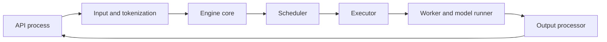
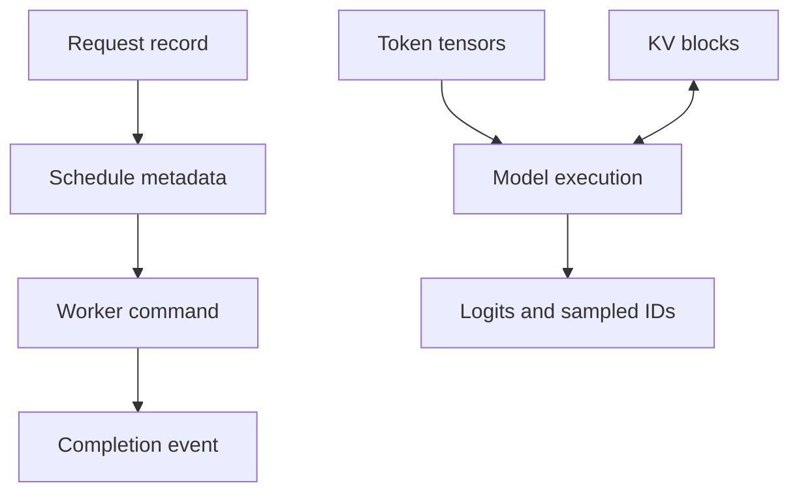
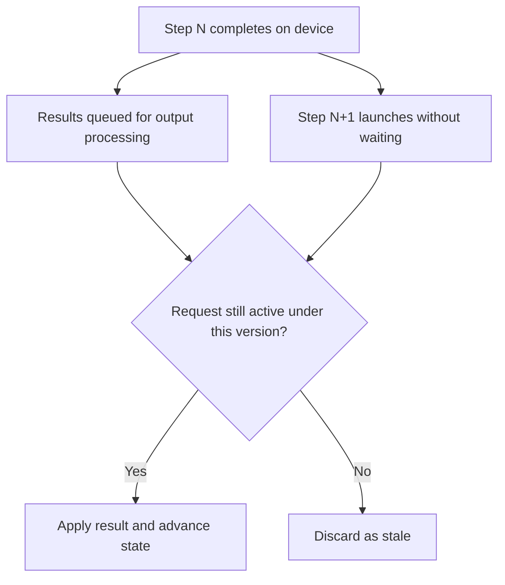

# 5. Anatomy of an Inference Server

In the previous chapters, we described the work, the model, and the hardware.
Now we can follow a request through the software that connects them.

Assume a user sends this chat request:

```text
System: You answer questions about Acme products.
User: Why is my device blinking amber?
```

The request looks simple. By the time its first token reaches the user, several
components have made decisions on its behalf. An API process decided whether
the request was well-formed before any expensive resource was touched. A
scheduler decided when it would run and what would share its step. A worker
decided which kernels and graph shapes would execute it. An output processor
decided what the user's stream would actually show — and when to throw a
computed result away.

Each of those decisions lives at a boundary. The chapter's job is to name the
boundaries precisely enough that you can reason about their failures: a
request accepted twice, a block table pointing at freed pages, a token
delivered after cancellation. Servers rarely fail in the middle of a
component; they fail in the contracts between them.

## Visual map

**The engine separates user-facing work from step-critical execution.**



**Control messages and bulk data take related but distinct paths.**



**Overlapped output work needs versions to discard stale results.**



The first two diagrams divide the server along its stable seam: user-facing
latency work runs ahead of execution, step-critical work runs behind it, and
the boundary table below says what must be true at each crossing. The third
diagram is the price of that separation. Once output processing lags
execution, results can arrive for requests whose state has already moved on,
and only a version discipline turns a corruption bug into a discarded
message.

| Boundary | Control object | Data object | Required invariant |
| --- | --- | --- | --- |
| API to engine | request and deadline | token IDs | accepted exactly once |
| scheduler to worker | step plan | block tables and tensors | metadata matches allocation |
| worker to output | completion and status | sampled tokens | tokens belong to current step |
| cleanup | terminal transition | KV and buffers | release after last device user |

## The public request becomes an internal request

The frontend receives the HTTP or RPC message. It authenticates the caller,
checks the requested model, validates generation parameters, and applies limits
on input size and output length.

For a chat endpoint, the messages are not yet the model input. A chat template
turns roles and content into formatted text. A tokenizer converts that text to
token IDs. Tool definitions, images, audio, adapters, and structured-output
rules may add more processing.

At the end of this stage, the engine needs an internal request that describes
exactly what will execute. That distinction is easy to miss:

- The **API request** records what the caller sent.
- The **execution request** records the resulting tokens, processors, model
  version, adapter, media features, positions, sampling rules, and deadline.

Cache identity must follow the execution request. Two equal prompt strings can
produce different tokens after a template or tokenizer change. Reusing state
because the strings match would be incorrect.

Validation should also finish before expensive state is reserved. A service
should reject an unsupported parameter or an oversized image before it occupies
GPU memory. Compressed media deserves special care because a small request body
can expand into a large decoded tensor. A 2 MB upload is not a 2 MB cost; the
question an admission check must answer is how many pixels, patches, or feature
tokens it becomes — Chapter 3's patch-count arithmetic, applied before the
encoder ever runs.

The ordering of these checks is itself a small design. Cheap, decisive checks
run first: authentication, model existence, parameter ranges, size limits.
Tokenization follows because it can fail (unknown characters, length overflow)
and because everything downstream consumes its output. Media decoding runs
last of the expensive steps, since it is the one most likely to reveal a
request that should never have been admitted — and by then the only honest
outcome is a fast, explicit rejection. An admission path that decodes media
before validating token limits has inverted the order and will pay for the
inversion at the worst time: under load, when rejected work is most expensive.

## The request enters the engine

Once prepared, the request enters a waiting queue. It does not immediately
become a GPU batch. The scheduler first considers the work already running,
available memory, the step's token budget, request priority, and any reusable
prefix state.

The scheduler's output is a plan for one engine step. It might say:

> Process 512 prompt tokens for request A, produce one decode token for
> requests B through K, use these KV blocks, and release the state for request
> J after its output is consumed.

The exact representation varies, but the idea is stable. A schedule connects a
policy decision on the CPU to concrete input preparation on one or more
workers.

The scheduler works closely with a state allocator. For a language model, the
allocator maps logical token positions to physical KV-cache blocks. For a
multimodal request, another cache may own encoder outputs. Allocation must
succeed on every required rank before the schedule is safe to execute — a
partial allocation across ranks is worse than none, because the schedule that
references it cannot be rolled back cheaply once any rank has begun executing.

### What the block table has to get right

The allocator's contract with the runner deserves a close look, because
attention correctness hangs on it. The block table is the mapping from a
sequence's logical positions to the physical pages that hold its state; the
runner trusts it completely, and the kernel indexes memory through it. Three
events stress the contract.

A prefix-cache hit hands a request state it did not compute: the table now
points at blocks shared with other sequences, which must be treated as
read-only until this sequence appends past them — at which point the shared
tail needs copy-on-write semantics, or the next append corrupts a stranger's
context. A preemption revokes the table: the sequence's pages return to the
pool or move to a slower tier, and any schedule still holding the old table
is stale by definition — this is where the version discipline from the output
path reappears on the input side. A finish releases pages that a cache may
want to retain as a reusable prefix, so “release” splits into two decisions:
free for allocation, and retain for reuse, with different lifetimes.

Each event has a silent failure mode: corrupted shared tails look like model
quality regressions, stale tables look like crashes or garbage tokens, and
premature release looks like a cache that never hits. Chapter 7 builds the
data structures that make these events cheap; the point here is that the
scheduler-to-worker boundary carries a live contract, not just a data
structure.

## Executors, workers, and model runners

The next layers are often confused because a small server can combine them in
one process.

An **executor** decides which workers participate in an engine operation and
how to communicate with them. A **worker** owns the resources for one device or
rank: device context, distributed groups, memory pools, and loaded model. A
**model runner** turns the schedule into tensors and invokes the model, kernels,
graphs, and collectives for that device.

The separation becomes useful on multiple GPUs. The executor knows that eight
ranks must run. Each worker knows its local shard and communication groups. The
model runner knows which graph shape and attention metadata are needed for this
step.

Combining these roles can reduce messages and process overhead. Separating them
can isolate failures and support several execution backends. Neither layout is
automatically better; you should judge it by ownership, synchronization, and
failure behavior.

### One step, three processes

Make the separation concrete by following the Acme request's first decode step
through a fully split deployment. The API process holds the HTTP connection
and the user's stream; it has already tokenized and validated, so it sends a
compact execution request across a process boundary. The engine-core process
runs the scheduler and allocator: it decides the step's membership, assigns
blocks, and emits a step plan toward the workers. Each worker process — four
of them for a four-way split — prepares local tensors from the plan, runs its
shard, participates in the layer collectives, and reports sampled results
back toward the output path.

Three hops, each with its own serialization and queue. The hops cost
microseconds each — negligible against a multi-millisecond engine step, and
still small against a TTFT budget measured in hundreds of milliseconds. What
the separation buys is not speed but isolation: the API server's event loop,
with its slow client connections and Python detokenization, cannot starve the
scheduler's loop; a worker crash is visible as a dead rank rather than a dead
server; and the scheduler can be restarted or upgraded independently of the
processes holding GPU memory. The cost is that every one of those hops needs
the ownership and failure answers the previous section demanded — which is
why the source systems in this chapter put real machinery, not just function
calls, at each boundary.

The Acme request from the chapter's opening crossed these boundaries twice:
downward as an execution request and then a step plan, upward as sampled
tokens and stream events. Every decision this chapter named happened in
between, and each one left a trace you now know how to look for.

## From logits back to a stream

The model runner returns logits or another task-specific result. For text
generation, the sampler applies temperature, top-k or top-p rules, penalties,
random state, and output constraints. It selects the next token ID.

Output processing then updates the request. It checks stop conditions, advances
a grammar or tool parser, converts token IDs to text, updates usage counters,
and creates streaming events. When the request finishes or is cancelled, it
also arranges for state to be released or retained as a reusable prefix.

This work happens on every decode step. If the GPU must wait for Python
detokenization and network serialization before it can begin the next step,
output processing becomes part of the critical path.

Engines often overlap output work with the next GPU operation. The price of
that overlap is bookkeeping. A preempted or cancelled request may have an old
result still in flight. The result needs a step or state version so the engine
can recognize and discard it — the third diagram's decision, implemented
rather than admired. Stop-string detection adds a subtlety: a stop string may
only become visible after several tokens have been processed together, so the
engine may learn of a finish condition after steps beyond the true stop point
have already executed, and must abort those follow-on steps deliberately.

### Where sampling runs, and why it matters

The sampler's placement is a real architecture decision, and the logits make
the stakes countable. Chapter 3's decoder emits 128,000 scores per sequence;
at four bytes each, one sequence's logits are about 512 KB. Copying them from
device to host every step for CPU-side sampling costs half a megabyte per
sequence per step — at a batch of sixty-four, 32 MB per step against a
memory system that Chapter 4 valued in trillions of bytes per second but a
PCIe budget measured in tens of billions. The copy is pure overhead: the
device that just produced the scores is also the cheapest place to filter and
select from them.

Placement interacts with structured output. A grammar or JSON-schema
constraint must mask forbidden logits before selection, and the mask state —
the parser's current position — usually lives host-side with the request. So
each step carries a small host-to-device journey for the mask and a small
device-to-host journey for the chosen token, and engines work hard to keep
both off the critical path, batching mask construction or computing it on
device. The design lesson generalizes: state lives where it is updated, and
the sampler's state is updated every step — which is why Chapter 3 called
sampling stateful, and why this chapter's boundary table gives the
worker-to-output hop its own invariant row.

## Messages are not all alike

An inference server carries several kinds of traffic between its components.
Schedules and lifecycle commands are small control messages. Tokens, positions,
and block tables are metadata. Streamed outputs and metrics flow back toward
the frontend. KV blocks and encoder embeddings are bulk data.

Using the same channel for all four creates problems. A large state transfer can
delay a cancellation command. A serialization format designed for convenient
objects can waste CPU on every decode step. A local queue can hide the absence
of backpressure once workers move across a network.

Representation choice is where that CPU goes. Suppose a batch of sixty-four
sequences at 8,000 positions each needs its block tables delivered every step.
As paged metadata — sixty-four tables over, say, sixteen-token pages — that is
a few hundred integers per sequence and kilobytes overall. As a naive
per-token list in a general-purpose text format, it is half a million
positions serialized as individual values: megabytes parsed on the host,
every step, to describe memory the device already holds. Same information,
three orders of magnitude apart, purely a representation decision — and the
step plan crosses this boundary at engine-step frequency, which is why the
boundary table demands “metadata matches allocation” rather than “metadata
is complete.”

For each channel, document ordering, serialization, ownership, backpressure,
and failure. If a sender dies after transferring data but before acknowledging
it, who owns the buffer? If the receiver restarts, can it distinguish a delayed
message from current work? These questions sound bureaucratic until the first
time a restart produces duplicated tokens in a paid stream; then they become
the checklist you wish you had written.

### Where the channels actually run

The four traffic classes end up on physically different transports in a
mature deployment, and the reasons are worth tracing. Control messages ride a
small local socket or IPC queue: tiny payloads, strict ordering, and the
receiver must never be busy long enough to delay a cancellation behind bulk
work — head-of-line blocking here is how a stuck transfer turns into an
uncancellable request. Output events flow back over a similar channel but in
the opposite direction, and their consumer is the user's connection, so
backpressure means pausing or dropping per-request streams rather than
blocking the engine. Bulk data — KV regions between prefill and decode
workers, encoder embeddings toward the language model — moves over
device-to-device paths such as collective transports or direct memory access,
because routing gigabytes through a CPU queue would spend Chapter 4's
bandwidth budget on copies. Metadata like block tables rides with the step
plan, sized so that serializing it costs far less than the step it describes.

The failure analysis differs by class. Losing a control message loses a
decision; losing a bulk transfer loses bytes that may be recoverable from
their source; losing an output event loses tokens the caller has already paid
latency for. A single unified channel cannot give each class what it needs —
which is the whole argument for separating them.

## How vLLM and SGLang divide the work

At the pinned source revision, vLLM's path includes an asynchronous engine, an
engine-core client, the engine core, scheduler, executors, workers, and model
runners. Useful entry points are
[`AsyncLLM`](https://github.com/vllm-project/vllm/blob/5cecfc01375052698823fc401e31518fb32a981e/vllm/v1/engine/async_llm.py),
[`EngineCore`](https://github.com/vllm-project/vllm/blob/5cecfc01375052698823fc401e31518fb32a981e/vllm/v1/engine/core.py),
and the GPU
[`ModelRunner`](https://github.com/vllm-project/vllm/blob/5cecfc01375052698823fc401e31518fb32a981e/vllm/v1/worker/gpu/model_runner.py).

SGLang exposes the corresponding work through a
[`TokenizerManager`](https://github.com/sgl-project/sglang/blob/e161bd1265a0082478b7f1c09f224a52d315dc71/python/sglang/srt/managers/tokenizer_manager.py),
[`Scheduler`](https://github.com/sgl-project/sglang/blob/e161bd1265a0082478b7f1c09f224a52d315dc71/python/sglang/srt/managers/scheduler.py),
[`TpModelWorker`](https://github.com/sgl-project/sglang/blob/e161bd1265a0082478b7f1c09f224a52d315dc71/python/sglang/srt/managers/tp_worker.py),
and
[`ModelRunner`](https://github.com/sgl-project/sglang/blob/e161bd1265a0082478b7f1c09f224a52d315dc71/python/sglang/srt/model_executor/model_runner.py).

Read the two frontends closely and the same shape appears twice. In vLLM,
`AsyncLLM.generate()` documents its own four-step choreography in its
docstring: create an `AsyncStream` for the request, process the input, add the
request to the detokenizer, and hand it to the `EngineCore` — which runs in a
separate process. The method then loops over a `RequestOutputCollector`, and
its read pattern, `q.get_nowait() or await q.get()`, carries a comment worth
internalizing: draining without awaiting avoids task switching under load. The
streaming contract ends where the client ends it — if the HTTP caller
disconnects, Python raises `GeneratorExit`, and the method calls
`abort(request_id, internal=True)` so the engine stops doing work nobody will
read.

vLLM's return path runs in one background task, `_run_output_handler`. It pulls
`EngineCoreOutputs` from the engine core, slices them into chunks bounded by
`VLLM_V1_OUTPUT_PROC_CHUNK_SIZE` — with an explicit `await asyncio.sleep(0)`
between chunks so the event loop can serve other tasks — and passes each slice
to `output_processor.process_outputs`, which pushes finished `RequestOutput`s
onto per-request queues rather than returning them. Two details carry real
operational weight. When output processing discovers a stop string, the handler
calls `engine_core.abort_requests_async` for those requests, because the engine
core does not yet know they finished. And any exception in the handler reaches
`output_processor.propagate_error(e)` — one background-task failure becomes an
error on every live stream, because there is no per-request recovery from a
dead output path.

SGLang's `TokenizerManager` plays the same role with different machinery. Its
`rid_to_state: Dict[str, ReqState]` is the frontend's truth about every
in-flight request; `_send_one_request` wraps payload fields for transport and
dispatches the tokenized request toward the scheduler. Results come back
through a dedicated loop, `handle_loop`, which receives batches from the
detokenizer and routes `BatchStrOutput` and `BatchTokenIDOutput` messages into
`_handle_batch_output`. That handler performs a lookup that vLLM handles
structurally instead: `rid_to_state.get(rid)`. When the lookup misses, the code
does not crash — it logs “Received output for {rid=} but the state was deleted
in TokenizerManager,” skips health-check identifiers, and moves on. The race
this tolerates is exactly Chapter 3's overlap hazard: a client disconnected,
cleanup ran, and a result computed earlier still arrived. Both systems pay
this cost somewhere unavoidable; where they differ is instructive — vLLM keys
outputs by request identity end to end, while SGLang keeps an explicit
per-request state table at the boundary and defends it against late arrivals.

Do not compare these systems by counting boxes. Compare what crosses each
boundary and which component owns the truth. A separate process is meaningful
only if you understand the isolation it provides and the communication it adds.

## Worked example: classify the waits

The control path for one request is submit, validate, admit, schedule, allocate,
execute, and finish. Its data path is text, token IDs, tensors, KV blocks,
logits, sampled IDs, and streamed text. Drawing them separately exposes four
different waits.

Admission waits before allocation so rejected work cannot consume model state.
The runner waits for the scheduler's block table so attention addresses the
right pages. Sampling waits for logits because the next token is a true data
dependency. Cleanup waits for the GPU completion event so a live address is not
reallocated. These waits protect correctness.

Tokenization for the next request and output processing for the previous step
do not necessarily protect those invariants. They can overlap execution if
their request-state updates are versioned and queues remain bounded.

The classification generalizes into a review habit. Every wait you find in a
server should fall into one of three bins: it protects an invariant (keep it),
it protects nothing (remove it), or it protects something cheaper could
protect (shrink it). The four waits above give one instance of each kind.
Sampling-waits-for-logits is pure invariant: removing it produces tokens from
the wrong distribution, so it stays no matter how expensive it gets.
Cleanup-waits-for-completion is an invariant that can shrink: instead of one
synchronization per request, engines batch releases behind generation
counters and reclaim many sequences' state in one pass. Tokenization and
output processing, unversioned, were the accidental bin — work that blocked
execution while protecting nothing, fixed by making them overlap safely. Most
latency incidents reduce to a correctness wait that grew large enough to
notice, or an accidental wait nobody classified at all.

## Practice: draw two paths and defend every wait

Trace one request through the frontend, engine process, scheduler, worker, model
runner, and output process. Draw messages and state transitions on the control
path; draw tokens, tensors, block tables, and logits on the data path.

Mark every CPU/GPU and process/process wait. For each, state the invariant or
classify it as an overlap candidate. The worked classification is in
[Appendix G](../appendices/g-worked-solutions.md#5-control-and-data-paths).

The most important wait sits inside the scheduler. Chapter 6 examines how it
decides which requests move forward.
