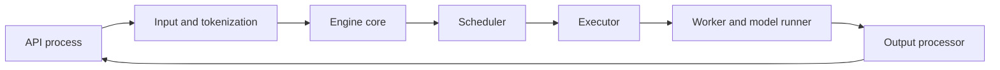
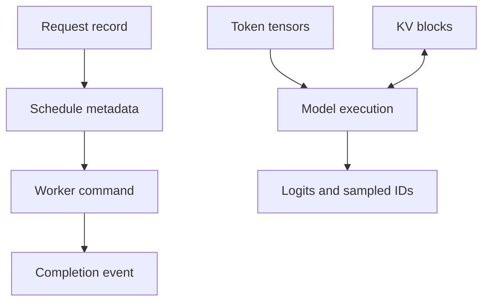

# 5. Anatomy of an Inference Server

In the previous chapters, we described the work, the model, and the hardware.
Now we can follow a request through the software that connects them.

Assume a user sends this chat request:

```text
System: You answer questions about Acme products.
User: Why is my device blinking amber?
```

The request looks simple. By the time its first token reaches the user, several
components have made decisions on its behalf.

## Visual map

**The engine separates user-facing work from step-critical execution.**



**Control messages and bulk data take related but distinct paths.**



| Boundary | Control object | Data object | Required invariant |
| --- | --- | --- | --- |
| API to engine | request and deadline | token IDs | accepted exactly once |
| scheduler to worker | step plan | block tables and tensors | metadata matches allocation |
| worker to output | completion and status | sampled tokens | tokens belong to current step |
| cleanup | terminal transition | KV and buffers | release after last device user |

## The public request becomes an internal request

The frontend receives the HTTP or RPC message. It authenticates the caller,
checks the requested model, validates generation parameters, and applies limits
on input size and output length.

For a chat endpoint, the messages are not yet the model input. A chat template
turns roles and content into formatted text. A tokenizer converts that text to
token IDs. Tool definitions, images, audio, adapters, and structured-output
rules may add more processing.

At the end of this stage, the engine needs an internal request that describes
exactly what will execute. That distinction is easy to miss:

- The **API request** records what the caller sent.
- The **execution request** records the resulting tokens, processors, model
  version, adapter, media features, positions, sampling rules, and deadline.

Cache identity must follow the execution request. Two equal prompt strings can
produce different tokens after a template or tokenizer change. Reusing state
because the strings match would be incorrect.

Validation should also finish before expensive state is reserved. A service
should reject an unsupported parameter or an oversized image before it occupies
GPU memory. Compressed media deserves special care because a small request body
can expand into a large decoded tensor.

## The request enters the engine

Once prepared, the request enters a waiting queue. It does not immediately
become a GPU batch. The scheduler first considers the work already running,
available memory, the step's token budget, request priority, and any reusable
prefix state.

The scheduler's output is a plan for one engine step. It might say:

> Process 512 prompt tokens for request A, produce one decode token for
> requests B through K, use these KV blocks, and release the state for request
> J after its output is consumed.

The exact representation varies, but the idea is stable. A schedule connects a
policy decision on the CPU to concrete input preparation on one or more
workers.

The scheduler works closely with a state allocator. For a language model, the
allocator maps logical token positions to physical KV-cache blocks. For a
multimodal request, another cache may own encoder outputs. Allocation must
succeed on every required rank before the schedule is safe to execute.

## Executors, workers, and model runners

The next layers are often confused because a small server can combine them in
one process.

An **executor** decides which workers participate in an engine operation and
how to communicate with them. A **worker** owns the resources for one device or
rank: device context, distributed groups, memory pools, and loaded model. A
**model runner** turns the schedule into tensors and invokes the model, kernels,
graphs, and collectives for that device.

The separation becomes useful on multiple GPUs. The executor knows that eight
ranks must run. Each worker knows its local shard and communication groups. The
model runner knows which graph shape and attention metadata are needed for this
step.

Combining these roles can reduce messages and process overhead. Separating them
can isolate failures and support several execution backends. Neither layout is
automatically better; you should judge it by ownership, synchronization, and
failure behavior.

## From logits back to a stream

The model runner returns logits or another task-specific result. For text
generation, the sampler applies temperature, top-k or top-p rules, penalties,
random state, and output constraints. It selects the next token ID.

Output processing then updates the request. It checks stop conditions, advances
a grammar or tool parser, converts token IDs to text, updates usage counters,
and creates streaming events. When the request finishes or is cancelled, it
also arranges for state to be released or retained as a reusable prefix.

This work happens on every decode step. If the GPU must wait for Python
detokenization and network serialization before it can begin the next step,
output processing becomes part of the critical path.

Engines often overlap output work with the next GPU operation. The price of
that overlap is bookkeeping. A preempted or cancelled request may have an old
result still in flight. The result needs a step or state version so the engine
can recognize and discard it.

## Messages are not all alike

An inference server carries several kinds of traffic between its components.
Schedules and lifecycle commands are small control messages. Tokens, positions,
and block tables are metadata. Streamed outputs and metrics flow back toward
the frontend. KV blocks and encoder embeddings are bulk data.

Using the same channel for all four creates problems. A large state transfer can
delay a cancellation command. A serialization format designed for convenient
objects can waste CPU on every decode step. A local queue can hide the absence
of backpressure once workers move across a network.

For each channel, document ordering, serialization, ownership, backpressure,
and failure. If a sender dies after transferring data but before acknowledging
it, who owns the buffer? If the receiver restarts, can it distinguish a delayed
message from current work?

## How vLLM and SGLang divide the work

At the pinned source revision, vLLM's path includes an asynchronous engine, an
engine-core client, the engine core, scheduler, executors, workers, and model
runners. Useful entry points are
[`AsyncLLM`](https://github.com/vllm-project/vllm/blob/5cecfc01375052698823fc401e31518fb32a981e/vllm/v1/engine/async_llm.py),
[`EngineCore`](https://github.com/vllm-project/vllm/blob/5cecfc01375052698823fc401e31518fb32a981e/vllm/v1/engine/core.py),
and the GPU
[`ModelRunner`](https://github.com/vllm-project/vllm/blob/5cecfc01375052698823fc401e31518fb32a981e/vllm/v1/worker/gpu/model_runner.py).

SGLang exposes the corresponding work through a
[`TokenizerManager`](https://github.com/sgl-project/sglang/blob/e161bd1265a0082478b7f1c09f224a52d315dc71/python/sglang/srt/managers/tokenizer_manager.py),
[`Scheduler`](https://github.com/sgl-project/sglang/blob/e161bd1265a0082478b7f1c09f224a52d315dc71/python/sglang/srt/managers/scheduler.py),
[`TpModelWorker`](https://github.com/sgl-project/sglang/blob/e161bd1265a0082478b7f1c09f224a52d315dc71/python/sglang/srt/managers/tp_worker.py),
and
[`ModelRunner`](https://github.com/sgl-project/sglang/blob/e161bd1265a0082478b7f1c09f224a52d315dc71/python/sglang/srt/model_executor/model_runner.py).

Do not compare these systems by counting boxes. Compare what crosses each
boundary and which component owns the truth. A separate process is meaningful
only if you understand the isolation it provides and the communication it adds.

## Worked example: classify the waits

The control path for one request is submit, validate, admit, schedule, allocate,
execute, and finish. Its data path is text, token IDs, tensors, KV blocks,
logits, sampled IDs, and streamed text. Drawing them separately exposes four
different waits.

Admission waits before allocation so rejected work cannot consume model state.
The runner waits for the scheduler's block table so attention addresses the
right pages. Sampling waits for logits because the next token is a true data
dependency. Cleanup waits for the GPU completion event so a live address is not
reallocated. These waits protect correctness.

Tokenization for the next request and output processing for the previous step
do not necessarily protect those invariants. They can overlap execution if
their request-state updates are versioned and queues remain bounded.

## Practice: draw two paths and defend every wait

Trace one request through the frontend, engine process, scheduler, worker, model
runner, and output process. Draw messages and state transitions on the control
path; draw tokens, tensors, block tables, and logits on the data path.

Mark every CPU/GPU and process/process wait. For each, state the invariant or
classify it as an overlap candidate. The worked classification is in
[Appendix G](../appendices/g-worked-solutions.md#5-control-and-data-paths).

The most important wait sits inside the scheduler. Chapter 6 examines how it
decides which requests move forward.
