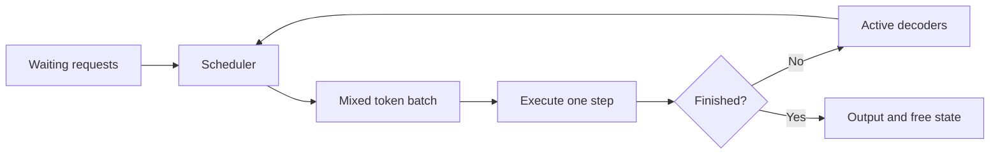
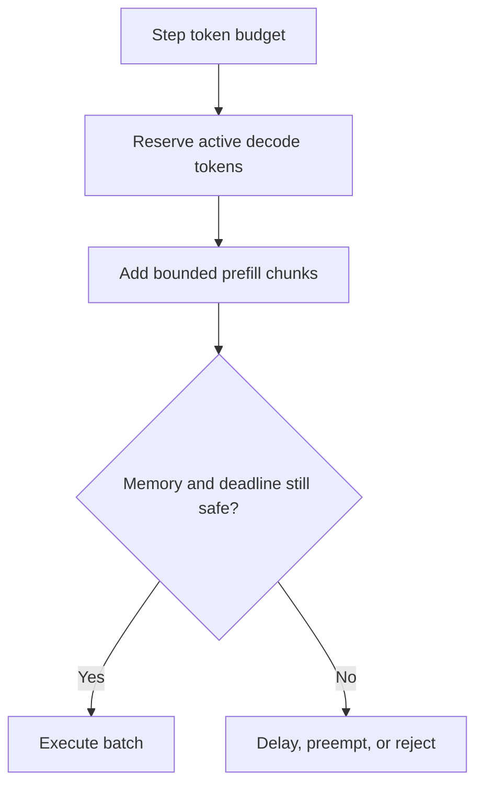
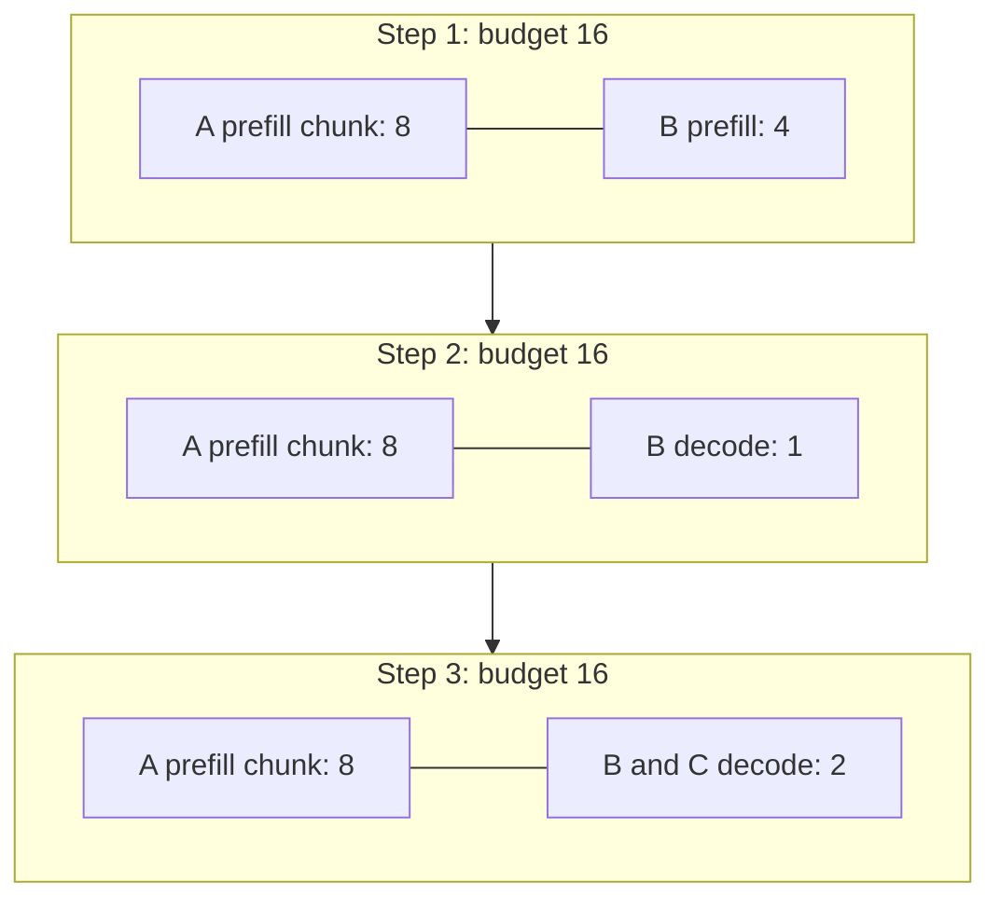

# 6. Scheduling the Decode Loop

At the beginning of a model step, an engine may have three kinds of work
waiting. Several conversations need one more decode token. A new request needs
to process a 12,000-token prompt. Another request has a deadline and higher
priority.

The GPU cannot execute a vague collection of requests. It needs a concrete
batch with valid memory for every position. Building that batch is the
scheduler's job.

The job is harder than picking winners. Every step is a small negotiation
among four parties with different clocks: users who notice gaps in their
stream, a GPU that wants full and regular batches, a memory pool that fills
as conversations grow, and downstream stages whose capacity the scheduler
does not control. A policy that pleases one party at step granularity can
starve another over a minute. This chapter builds the scheduler one decision
at a time — batch membership, work budgets, chunking, queue policy,
preemption, and admission — because each decision exists to protect a
different one of those parties.

## Visual map

**Continuous batching changes membership at every engine step.**



**A token budget forces an explicit priority between work types.**



**Chunking plus decode reservation, over three steps of the worked example.**



The first diagram is the control loop that replaced static batching: the
scheduler re-forms the batch every step, and finished work exits through the
decision node instead of holding slots. The second is the budget policy that
makes the loop safe under load — decode first, prefill with what remains,
then a safety gate. The third shows both working together on this chapter's
worked example: request A's 24-token prefill flows through bounded chunks
while B's four-token prompt and eight-token output keep a reserved slot in
every step, and high-priority C joins as a decoder the moment it arrives.

| Scheduler input | Why it matters | Failure if ignored |
| --- | --- | --- |
| remaining prompt work | sizes prefill chunks | one long prompt stalls decode |
| live KV bytes | constrains admission | preemption storm or allocation failure |
| priority and age | protects classes without starvation | unfair or permanently delayed work |
| downstream capacity | couples distributed stages | completed prefill waits without decode |

## Why static batches waste work

In a static batch, the server groups requests and runs them together until all
finish. This works well when inputs and outputs have similar shapes. Text
generation is less cooperative.

One sequence may stop after five tokens while another continues for 500. The
finished sequence leaves an empty slot, but the batch remains alive for the
long request. Padding preserves a regular tensor shape while spending compute
and memory on positions that no user needs.

The waste has a size. Take a static batch of sixteen sequences whose
completion lengths spread evenly between 5 and 500 tokens — a declared
assumption, but a realistic one for mixed traffic. At the moment the batch
finally finishes, the average member stopped long ago, and average occupancy
over the batch's life is roughly half: about half the token work the GPU
performed was padding that no request needed. Chapter 1 walked this cost for
a single padded step; static batching multiplies it by keeping the padding
alive for the batch's entire remaining duration, and no scheduler setting can
recover it because membership is frozen until the whole batch drains.

Iteration-level scheduling rebuilds membership between model steps. Finished
sequences leave and waiting sequences enter. This technique is commonly called
**continuous batching**. The
[Orca paper](https://www.usenix.org/conference/osdi22/presentation/yu) showed how
iteration-level scheduling improves transformer serving.

Continuous batching makes the GPU busier, but it also creates a fast control
loop. The engine must reconsider work and memory every step. That cadence is
the chapter's real subject: a control loop running at engine-step frequency
has to be cheap enough to run thousands of times per second, yet complete
enough to notice a full memory pool, a missed deadline, or a stalled expert
before committing the next batch.

## A request count is not a work budget

Suppose the scheduler can admit 32 requests. That limit says little about the
next step. Thirty-two decoders need roughly one new token each. One large
prefill may need thousands of token positions.

Schedulers therefore use a token budget in addition to a sequence limit:

```text
scheduled tokens <= token budget
active sequences <= sequence budget
allocated state <= available capacity
```

Multimodal and speculative execution add more budgets. The engine may limit
encoder work, media items, draft tokens, or the number of requests using a
particular adapter.

Tokens are still an approximation. A prefill token with long-context attention
can cost more than a decode token. An MoE token may take a different path from
its neighbor. The budget is useful because it is cheap to compute, not because
all tokens are equal. That cheapness is deliberate: the budget is evaluated
every step, so it must cost far less to compute than the step it shapes. Any
richer cost model — per-token attention cost, expert-routing estimates —
belongs to admission or placement decisions made once per request, not to the
per-step loop.

## The long-prompt problem

Return to the 12,000-token prompt. Processing it as one prefill operation may
occupy a long engine step. Every active conversation pauses while the GPU works
on the new prompt. Their average TPOT might remain acceptable, yet users notice
a large gap in streaming output.

**Chunked prefill** divides the prompt across several steps. The scheduler can
mix a chunk with decode work, allowing existing conversations to keep moving.
The [Sarathi-Serve paper](https://arxiv.org/abs/2403.02310) develops this idea as
a way to control interference between prefill and decode.

Smaller chunks protect decode latency but perform more scheduling and metadata
work. They may also lose some efficiency from large matrix operations. Very
large chunks recover that efficiency and recreate the stall. The right size
depends on the model, batch composition, parallel plan, and SLO.

This is a recurring pattern in inference systems: a parameter that looks like a
hardware tuning knob is also a policy about which user waits.

### Deriving a chunk ceiling from the ITL budget

The chunk-size trade-off can be made numeric with the planning constants from
Chapter 2 and Appendix G: a mixed step's prefill cost is approximately
`20 + 0.035 × chunk tokens` milliseconds, and the service owes decoders an
inter-token latency of at most 150 ms. A decode-only portion of a mixed step
might add around 10 ms for a modest batch — a declared planning assumption.
The ceiling falls out of the budget:

```text
20 + 0.035 * c + 10 <= 150   =>   c <= 3,428 tokens
```

So roughly a 3,400-token chunk is the largest this service can mix into a step
without breaking its decode promise. The arithmetic cuts both ways: a team
that raises the chunk to 8,192 for prefill throughput has silently rewritten
the SLO — mixed steps now take about 307 ms, twice the inter-token
budget — and a team that tightens the SLO to 100 ms must shrink chunks to
about 2,000 tokens and accept more scheduling overhead. Chunk size is where
the throughput-versus-latency exchange becomes a single integer, and the
integer should be derived, not borrowed from another deployment's config.

The same formula prices the chapter's opening problem. An unchunked
12,000-token prefill takes about `20 + 0.035 × 12,000 = 440` ms — every
active decoder sees a single 440-millisecond gap, well past the 150-ms
promise. Chunked at 3,400, the same prompt becomes three large chunks and a
tail of 1,800 tokens, each mixed into a step of at most about 150 ms: total
prefill time barely changes, so the big prompt's own TTFT grows only by
scheduling overhead, while every other conversation's worst gap drops from
440 ms to the SLO boundary. That asymmetry — one user pays almost nothing,
everyone else stops paying a penalty — is the entire argument for chunked
prefill in four numbers.

## Which request goes first?

First-come-first-served is easy to explain and usually fair by arrival time. It
can still let a large request block smaller ones when the work cannot be
chunked. Shortest-job policies improve average completion time but require an
estimate and can starve large requests. Priority queues protect important
traffic but need quotas or aging so low-priority work eventually runs.

Before choosing a queue policy, decide what fairness means. Equal request
starts, equal scheduled tokens, equal accelerator time, and tenant-weighted
shares produce different schedules. A token-based policy can remain unfair when
tokens have different costs because of context length, modality, or expert
routing.

Deadlines add another dimension. Work that cannot possibly finish before its
deadline may be better rejected than scheduled ahead of requests that could
succeed. This is one reason scheduling cannot replace admission control.

Aging deserves one concrete pass, because it is the standard escape from
priority starvation. Give each waiting request an effective priority of
`priority − age × rate`: a background request that arrived sixty seconds ago
at a decay of one level per twenty seconds now competes at priority three,
ahead of fresh priority-five traffic. The rate is the policy: too slow and
starvation persists with better optics, too fast and the priority classes
merge into FCFS with extra bookkeeping. Whatever the rate, aging must apply
to a measurable quantity — arrival time is the honest one; queue position
drifts as requests ahead are admitted, and an aged request can watch its
effective age reset every time the queue reshuffles.

## What happens when memory runs out?

A running sequence consumes more state as it grows. Eventually the scheduler
may be unable to allocate the next block.

The cheapest response is to evict cached state that belongs to no active
request. If that is insufficient, the engine can wait, preempt a running
request, move state to another memory tier, or reject work.

Preemption frees capacity, but the evicted request loses time. If its state is
discarded, the engine must recompute the prefix later. If state is swapped, it
must move bytes out and back. Frequent preemption is often a sign that admission
allowed too many long-lived sequences or that the cache reservation left too
little headroom.

Victim choice changes the cost. A recently admitted request may have little
computed state to lose. A large request may free many blocks. A low-priority
request may be the correct product decision. The scheduler needs an explicit
policy rather than an accidental list order.

### What a preempted request costs

The recompute-versus-swap choice has a price comparison, and the Atlas
constants make it concrete. Take a request preempted with 4,000 tokens of
computed context. Recomputing the prefix later costs `0.06 ms` per token —
about 240 ms of GPU work, all of it competing with paying traffic when the
request resumes. Swapping instead moves `4,000 × 320 KiB ≈ 1.22 GiB` out and
back across a host path moving tens of billions of bytes per second — on the
order of fifty milliseconds of transfer, but the bytes occupy host memory for
the request's entire suspension and the round trip consumes PCIe bandwidth
that decode steps share.

Neither number dominates universally. Recompute costs GPU time exactly when
the engine is busy enough to have preempted; swap costs capacity and
bandwidth continuously while the request waits. Short suspensions favor
swap, long queues favor recompute — and a queue deep enough to hold many
gigabytes of swapped state is itself a signal that admission, not preemption
policy, is failing. This is also why preemption frequency is a first-class
metric: it is the visible symptom of an admission boundary set too
permissively, and Chapter 7's allocator exists partly to postpone the day it
fires.

## Keeping the CPU ahead of the GPU

As GPU kernels become faster, the CPU work needed to prepare each step becomes
visible. Rebuilding tensors, copying metadata, processing old outputs, and
waiting for device results can leave gaps between GPU operations.

A **persistent batch** keeps stable slots for running requests and updates only
what changed. This reduces preparation and helps preserve fixed memory
addresses for graph replay.

An asynchronous scheduler goes further. While the GPU executes step `t`, the
CPU prepares step `t+1`.

```text
CPU: schedule t ---- schedule t+1 ---- schedule t+2
GPU:        execute t ----- execute t+1 ----- execute t+2
```

The overlap removes idle time, but the CPU is now making decisions with an
incomplete view. It may not yet know which speculative tokens were accepted or
which request just stopped. It must reserve memory conservatively and attach
versions to results. If a request is preempted, an old output may need to be
discarded. A block cannot be reused while an earlier step can still write it.

Conservative reservation has a quantifiable price. Planning step `t+1` before
step `t`'s completions arrive means reserving blocks for sequences that may
finish within the next few milliseconds — at any moment, up to one step's
worth of allocation is committed on optimism. For a step admitting a handful
of sequences, that is a tolerable float; for a step that would admit fifty,
the stranded reservation can exceed the free list. This is why overlapped
engines bound how far ahead they schedule — vLLM's multiple in-flight batches
and SGLang's result queue both exist to keep the optimism window at one or two
steps — and why the bound tightens when speculation inflates the number of
tokens each in-flight step might consume.

At the pinned revision, vLLM's
[`scheduler.py`](https://github.com/vllm-project/vllm/blob/5cecfc01375052698823fc401e31518fb32a981e/vllm/v1/core/sched/scheduler.py)
handles token budgets, preemption, encoder work, speculative lookahead, cache
connectors, and multiple in-flight batches in one scheduling path. SGLang's
[`scheduler.py`](https://github.com/sgl-project/sglang/blob/e161bd1265a0082478b7f1c09f224a52d315dc71/python/sglang/srt/managers/scheduler.py)
and
[`overlap_utils.py`](https://github.com/sgl-project/sglang/blob/e161bd1265a0082478b7f1c09f224a52d315dc71/python/sglang/srt/managers/overlap_utils.py)
show another approach to overlapping scheduling and execution.

Reading the two schedulers side by side starts with a comment vLLM leaves at
the top of `schedule()`: there is no "decoding phase" nor "prefill phase" in
the algorithm. Each request carries `num_computed_tokens` and
`num_tokens_with_spec` — prompt plus output plus any speculative draft — and
the scheduler's whole job is to assign tokens so each request's computed count
catches up to its target count. That one framing absorbs chunked prefill,
prefix caching, and speculation as special cases of the same bookkeeping, and
it explains the budgets the method sets up: a `token_budget` from
`max_num_scheduled_tokens`, a separate `input_budget`, slots held back for
speculative drafting, and an encoder compute budget for multimodal work. The
loop schedules running requests first, then admits from the waiting queue
while budget remains — decode keeps its reserved share, exactly the policy
the second diagram draws.

The same loop shows what preemption costs in bookkeeping. When a request
cannot fit, the scheduler picks a victim — under the priority policy, the
maximum of `(priority, arrival_time)`; otherwise simply the last entry in the
running list — and calls `_preempt_request`, which frees the request's blocks,
resets `num_computed_tokens` to zero, and puts the request back at the front
of the waiting queue. Two details repay attention. First, the caller restores
every budget the victim had consumed — token budget, input budget, draft
slots, even encoder compute — so the step can admit replacement work in the
same pass. Second, preemption under asynchronous scheduling marks in-flight
output as stale: `num_stale_output_tokens` is set from the tokens still in
flight, so results computed before the preemption are tracked and drained
rather than silently applied — the version discipline from Chapter 5,
appearing exactly where the hazard lives. A `long_prefill_token_threshold`
caps how much of one long prompt a single step may take, making chunking a
scheduler-internal fact rather than a caller-visible one.

SGLang reaches similar behavior through different seams. Its
`event_loop_overlap` keeps a `result_queue` of in-flight `(batch, result)`
pairs and processes the previous step's results with `pop_and_process` while
forming the next batch — and it carries an explicit `disable_overlap_for_batch`
check, because some batches (certain modes, pipeline-parallel boundaries)
must not overlap, and the loop needs a synchronous drain point. Batch
formation lives in `get_next_batch_to_run`, whose most delicate resident is
`chunked_req`: the partially processed long prompt is excluded from the
running batch so that only finished requests merge back in, and its previous
chunk is stashed into the prefix cache only when it actually produced new KV
beyond what was already cached — the code checks `extend_range.end` against
`prefix_indices` rather than stashing unconditionally. New prefill batches
come from `get_new_batch_prefill`, where a prefill delayer consults current
pool usage before admitting more prompt work, and grammar-bound requests wait
in their own queue until their constraint machines are ready.

The code is complicated because the interactions are real. Prefix hits,
chunking, speculative tokens, remote state, and asynchronous outputs all change
what “one more step” means.

## Admission protects the scheduler

A scheduler orders work that the service has accepted. It cannot rescue a
system that accepts more work than it can finish.

Imagine 120 requests arriving each second while the deployment can complete
100 within the SLO. Keeping the GPU full is not success; the queue grows by 20
requests every second. Eventually almost everyone waits too long.

Admission control uses the estimated work, queue, resident state, priority,
deadline, and downstream stage capacity to decide whether a request should
enter. Rejecting early may produce more goodput than accepting a request that
will time out. The rejection must also create backpressure. Automatic retries
without delay can turn overload into a larger burst.

The retry arithmetic explains the warning. At 120 arrivals against 100
completions, twenty requests per second are rejected; if every rejected
request retries immediately, next second's arrivals are 140, then 160 — the
rejection itself is generating load at exactly the rate the system cannot
absorb. A retry with exponential backoff and jitter converts that loop into a
damped one, and a retry budget — capping what fraction of traffic may be
retries — bounds it entirely. Load balancers and clients own half of this
design, which is why admission is a system contract and not a setting inside
the engine.

The 120-versus-100 example also explains why admission belongs to the
scheduler's neighborhood rather than a load balancer far away. Only the
engine knows its live state bytes, its preemption rate, and its downstream
stage queues — the quantities admission decisions consume. A balancer working
from request counts alone will keep sending work into a deployment that has
already passed its memory knee, and the first symptom to reach users will be
preemption storms, not a clean signal the balancer could have acted on.

## Worked example: one token budget, four requests

Give the scheduler 16 token slots per step. Request A arrives with a 24-token
prefill; B arrives beside it with four prompt tokens and needs eight output
tokens. If A consumes an unbroken prefill, B's interactive response waits even
though both fit within a few steps.

With an eight-token chunk limit, the first step can schedule eight tokens of A
and four of B. B can enter decode on the next step while A continues in bounded
chunks. Reserving decode slots prevents later prefills from breaking B's output
cadence.

The example is incomplete unless step duration depends on its composition. A
step with 16 prefill tokens and one with 16 decodes need not take the same time.
Use a measured lookup table keyed by decode batch and prefill tokens; otherwise
the simulator merely counts tokens.

The chunk ceiling derived above is the same lesson pointed the other
direction: the eight-token limit here is small enough that B's cadence is
never in danger, and large enough that A finishes in three steps. A real
deployment picks its limit exactly this way — from the latency it owes its
decoders and the prefill rate it must sustain — and then defends the choice
with a test that fails when someone raises the limit to chase throughput.

## Practice: implement and explain a schedule

Simulate A `(arrival 0, prefill 24, output 4)`, B `(0, 4, 8)`, high-priority C
`(1, 8, 4)`, and D `(2, 20, 2)` under a 16-token step budget and 40 units of
live-state capacity. Compare FCFS with no chunking, eight-token chunks, and
priority plus aging.

Report each step's contents, TTFT, deadline-qualified goodput, preemptions, and
memory state. State when D should be rejected. A worked schedule and scoring
rule appear in [Appendix G](../appendices/g-worked-solutions.md#6-scheduler-simulation).

The scheduler can only make safe decisions if memory has clear ownership. The
next chapter examines the block manager and the reusable state behind it.
