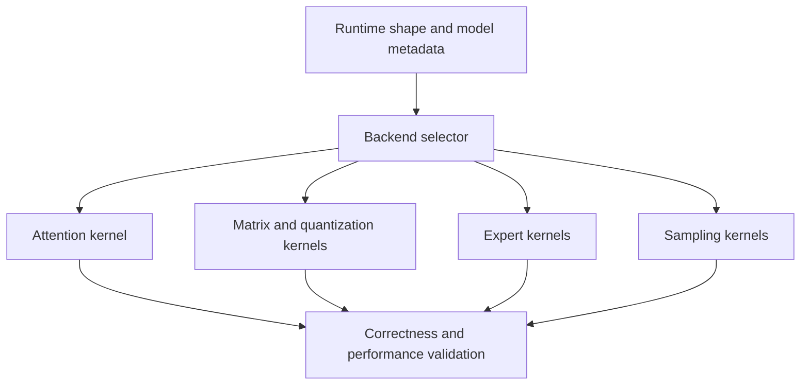
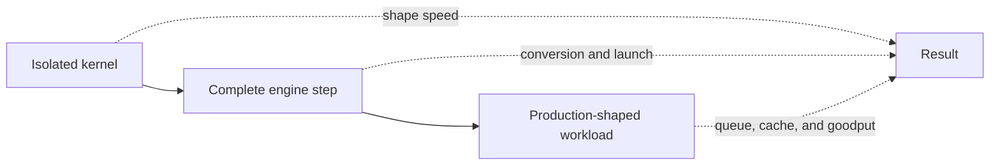

# 8. Kernels and Attention Backends

The scheduler has chosen 23 requests for the next step. Their sequences have
different lengths, their KV blocks are scattered through memory, and some use
an attention pattern that others do not. The model runner must turn this
irregular description into fast GPU work.

That work is performed by kernels: programs that execute across many GPU
threads. A model server may launch hundreds of kernels in one step, including
matrix multiplications, normalization, positional encoding, attention,
activation functions, expert routing, sampling, and memory copies.

Each kernel is a small contract: it promises a numerical result for a family
of shapes, and the engine promises to feed it shapes it can handle. Most of
this chapter is about what happens when those promises meet — a kernel that is
fast for one shape family and slow for another, a backend that is correct only
for certain attention semantics, a fusion that wins in isolation and loses in
a step. The runner's craft is knowing which contract governs the current step,
and the benchmark discipline at the end of the chapter exists because no
single measurement can check them all.

## Visual map

**Backend selection is a compatibility decision before a speed decision.**

**A kernel claim must survive three expanding measurement boundaries.**

The first diagram is a dispatch, and the selector's inputs deserve the
emphasis: shape and model metadata enter at the top, which means selection is
deterministic per configuration — the same model on the same device picks the
same backends every start. The second diagram is an epistemology for
performance claims: each boundary can invalidate the previous level's
conclusion, and the dashed edges name what each level fails to see. The table
below is the same idea as an evidence checklist.

| Level | Includes | Can establish | Cannot establish alone |
| --- | --- | --- | --- |
| Kernel | one operation and shapes | local speed and numerical error | scheduler or cache effect |
| Engine step | metadata and surrounding operations | step critical path | production queue behavior |
| Workload | arrivals, reuse, output, quality | service goodput | universal hardware ranking |

## Why fewer operations can mean more speed

Framework code often expresses a calculation as several tensor operations.
Each operation may write an intermediate tensor to high-bandwidth memory, only
for the next operation to read it back.

Kernel fusion keeps intermediate values in registers or on-chip memory and
performs several logical operations in one launch. A fused normalization and
residual update, for example, can avoid round trips through device memory.

Fusion helps when memory traffic or launch overhead is the bottleneck. It can
hurt when the combined kernel uses too many registers, lowers occupancy, or
prevents a specialized library routine from running. “Fused” is not a synonym
for “faster.” It is a claim about a different movement and launch pattern.

The arithmetic-intensity frame from Chapter 4 tells you which case you are in
before benchmarking. A fusion that eliminates one intermediate round trip
removes bytes from a low-intensity operation — exactly the fix the roofline
prescribes below the crossover. The same fusion applied to a compute-bound
operation removes bytes the memory system was not waiting on anyway, while the
merged kernel's register pressure may slow the arithmetic that does bind.
“Should this fuse?” is “which side of the crossover is this operation on?”
wearing an implementation hat.

### Pricing one fusion

The launch half of the argument deserves its own arithmetic. Take the fused
normalization-plus-residual example and assume the decoder's hidden state is
8,192 values at BF16 — sixteen kilobytes per sequence-position tensor.
Unfused, the pair runs as two kernels: the normalization writes its output,
and the residual add reads it back, costing one extra thirty-two-kilobyte
round trip and one extra launch per layer. The round trip is trivial against
a step's total traffic. The launch is not: at a few microseconds each, the
extra launch costs perhaps `80 layers × 4 µs = 320 µs` per step — six
percent of Chapter 1's five-millisecond step, spent doing nothing but
starting work. This asymmetry explains why fusion decisions in serving are
usually won on launch counts rather than bytes, and why the win grows as
steps shrink: the same fusion that saves three percent of a prefill-heavy
step saves more of a thin decode step, where fixed overheads are a larger
share.

## Attention is an I/O problem

The straightforward attention calculation creates a matrix of scores between
query and key positions, applies a softmax, and multiplies by values. Materializing
the full score matrix moves a great deal of data through GPU memory.

[FlashAttention](https://arxiv.org/abs/2205.14135) reorganizes the calculation
into tiles so that intermediate score regions remain in faster on-chip memory.
It computes exact attention while reducing reads and writes to high-bandwidth
memory. The important idea is broader than one kernel: algorithm design should
count data movement, not only arithmetic operations.

Exactness under tiling is the genuinely clever part. Softmax needs a global
maximum over all scores, but a tiled kernel sees one tile at a time — so it
carries a running maximum and rescales everything accumulated so far whenever
a larger score appears, keeping the result identical to the untiled
computation without ever holding more than one tile's scores. The rescaling
is why "tiled attention" and "approximate attention" are different claims,
and why the correctness tests below compare against full precision rather
than accepting drift.

Serving attention is more complicated than the dense training case. Sequences
are ragged. Decode reads a growing history for one new query position. KV state
may be paged. Models use different masks, head layouts, latent representations,
sliding windows, or sparse patterns. A backend must understand both the model's
attention semantics and the engine's memory layout.

### Counting attention's traffic

The I/O claim can be priced for one head of the Chapter 3 decoder at a
4,096-token prefill, head dimension 128, BF16 throughout — declared
assumptions on tile behavior included. The naive calculation materializes the
score matrix: `4,096 × 4,096 × 2 bytes = 32 MiB` per head, written once,
read back for the softmax, and read again for the value multiply — call it
three passes, roughly 96 MiB of high-bandwidth memory traffic per head per
layer. The tiled calculation instead streams keys and values through on-chip
memory once: about `2 × 4,096 × 128 × 2 bytes = 2 MiB` per head, plus
negligible query and output traffic. Roughly fifty times less movement for
identical arithmetic — and the arithmetic was never the problem, since
attention's intensity sits far above the compute crossover at these shapes.

Decode inverts the lesson. One new query position against a 4,096-token
history produces a score vector of eight kilobytes — materialization is
trivial — but the kernel must still read the whole history's keys and values,
that same two megabytes per head, to do it. Decode attention is bound by
state reads no matter how clever the tiling, which is why Chapter 3's
long-context crossover and Chapter 9's compression matter more to decode
latency than any attention kernel improvement ever will.

## Backends are compatibility decisions

An engine may integrate several attention implementations. Selection can depend
on device architecture, dtype, head dimension, page size, prefill or decode,
mask type, graph compatibility, and parallel plan.

If a preferred backend does not support one condition, the engine can reject
the configuration or fall back to another path. Silent fallback is dangerous
when the operator expects a particular performance profile. Startup logs and
metrics should identify the backend actually selected for each layer type.

The danger has a standard failure story. A deployment pins its preferred
attention backend; a driver or library update removes it from the supported
set; the engine silently falls back to a slower path and keeps serving. No
error fires, dashboards stay green because utilization looks normal, and the
only symptom is a fifteen-percent throughput decline someone eventually
attributes to "traffic changes." The defenses are cheap: assert the selected
backend at startup against an expected value, emit the selection as a labeled
metric, and alert when the label drifts. Both pinned engines log their
resolution — the discipline is treating that log line as a contract instead
of trivia.

Reject-versus-fallback is itself a policy with two failure modes, not a
correctness question with one answer. Rejecting at startup turns a missing
backend into an availability outage — loud, immediate, safe. Falling back
turns it into a slow degradation that may run for weeks. Production services
usually want the first for unexpected conditions and the second only for
conditions they have benchmarked deliberately, which is why the registry's
override mechanism matters operationally: registering an alternative is how a
deployment says "this fallback was chosen," distinct from whatever the engine
guessed.

At the pinned vLLM revision, the attention registry and implementations live
under
[`vllm/v1/attention/backends`](https://github.com/vllm-project/vllm/tree/5cecfc01375052698823fc401e31518fb32a981e/vllm/v1/attention/backends).
SGLang centralizes setup in
[`attention_backend_setup.py`](https://github.com/sgl-project/sglang/blob/e161bd1265a0082478b7f1c09f224a52d315dc71/python/sglang/srt/model_executor/model_runner_components/attention_backend_setup.py)
and maintains device- and model-specific backends elsewhere in the runtime.
The number of choices in both trees is evidence that one attention kernel does
not fit every serving shape.

The pinned sources show how the selection contract is actually enforced. At
the vLLM revision, the backends directory holds roughly twenty implementations
side by side — FlashAttention and FlashInfer variants, Triton kernels,
Torch's flex attention, ROCm-specific paths, CPU fallbacks, and a family of
linear-attention and Mamba backends for recurrent layer types, plus a
dedicated subdirectory for multi-head latent attention. Selection goes through
`registry.py`, where an `AttentionBackendEnum` maps each name to a default
class path — and the design's most interesting feature is that the mapping is
a default, not a constant: deployments can call `register_backend()` to
override any entry at runtime, and a `CUSTOM` slot exists that refuses to
resolve until something registers it. Device gating is explicit in the
source — one entry carries a comment restricting it to Hopper-class GPUs —
which is the registry telling you that compatibility, not preference, is the
first filter.

SGLang's setup component resolves something subtler than one backend: a pair
of them. `resolve_attention_backend_strs` returns separate prefill and decode
backend strings, stamped on the runner before backends are built, so the same
model can run one attention implementation while absorbing prompts and
another while extending conversations — Chapter 3's two-kinds-of-work
distinction, expressed in the selector itself. The build path then branches on
execution mode: disaggregated prefill-mux deployments construct a whole *group*
of decode backends, one per streaming-multiprocessor group, and two-batch
overlap wraps the backend in a `TboAttnBackend` that interleaves two
microbatches. A draft worker overrides its own backend string, because target
and draft models coexist in one process and cannot share the process-wide
choice. None of this is visible in a config file; all of it changes which
kernel executes. When a performance profile looks wrong, the first question
is which of these resolved paths actually ran — the startup log's selected
backend, per layer type, is the ground truth both engines provide.

## Matrix multiplication has shapes, not just FLOPs

Most model compute reduces to matrix multiplication, but two multiplications
with equal arithmetic counts can run at different speeds. Dimensions determine
whether tensor-core tiles are fully used. Alignment, dtype, transposition,
batching, and grouped execution all matter.

The mechanism is visible at the tile boundary. A tensor core consumes tiles of
fixed shape — say 128 by 128 by 64 for one common generation — and a
multiplication whose dimensions are multiples of those numbers fills every
tile; one at 4,096 by 4,096 runs at full efficiency, while 4,000 by 4,000,
ninety-eight percent of the work, leaves ragged edge tiles that the hardware
pads internally. Two percent sounds tolerable, but decode's thin shapes are
not near-misses — a matrix of thirty-two rows against a 4,096-column weight
fills a quarter of one tile dimension, and no autotuner can recover arithmetic
the shape never contained. This is why Chapter 6's batch composition and this
chapter's kernel efficiency are the same conversation held in different
rooms.

MoE layers make this visible. Each expert receives a different number of
tokens, so the engine often uses grouped GEMM to launch many expert
multiplications efficiently. A popular expert has a large matrix; another may
receive only a few rows. Padding can improve regularity while doing extra work.

Kernel libraries therefore offer families of implementations. Autotuning
measures candidate tiles or algorithms for representative shapes. The result is
usually cached because tuning itself is expensive. A production image should
decide whether tuning occurs during build, warm-up, or first traffic.

### What the tuner knows, and when it learns it

A tuner's cache is only as good as its key. Entries are keyed by the shape,
dtype, and layout family of the call — so a fleet that always serves
4,096-token prefills gets perfectly tuned GEMMs, while one whose contexts
drift with traffic pays repeated cold searches on shapes the cache has never
seen. On a miss, the library either tunes live — spending the step's time
budget on benchmarking itself, visible as latency outliers at exactly the
moments traffic looks new — or falls back to a heuristic choice that may be
twenty percent off the tuned optimum. Neither failure appears in a benchmark
replay, because replays reuse yesterday's shapes. This is the operational
argument for pinning the workload record from Chapter 2 into the build:
tune against the recorded shape distribution, warm the cache at startup, and
alert on cache-miss rates in production rather than discovering them as a
mystery tail.

## Sampling can become expensive

Sampling appears small beside a transformer, but it touches a vocabulary that
may contain more than 100,000 entries for every active sequence. Applying
penalties, constraints, softmax, top-k or top-p selection, and random sampling
through separate kernels creates launches and memory traffic.

Fused sampling paths can help, especially for small models or large batches.
Structured-output masks add another tensor operation. The end-to-end effect
depends on how much of the step the model itself consumes.

The exposure scales with how little else the step does. Chapter 5 priced the
logits copy at about 512 KB per sequence; the kernels that filter and select
over those 128,000 entries are individually microseconds, but a step whose
model work has shrunk — small batch, short context, quantized weights — can
find sampling a visible fraction of its critical path. Chapter 3's processor
chain is the semantic specification; this section's point is that the chain's
length is also a performance parameter, and fusing it changes launch count
without changing distribution semantics — the one optimization in this
chapter whose correctness test is a distribution comparison rather than a
tensor comparison.

## Test the kernel at three levels

A microbenchmark is useful for validating one operation. It controls shapes and
removes unrelated work. It does not show whether the engine can present those
shapes, whether conversion is needed, or whether the scheduler changes batch
composition.

For any proposed kernel change, measure three levels:

1. the isolated operation with representative shapes;
2. a complete engine step containing input preparation and surrounding work;
3. an end-to-end workload with queueing and output processing.

The levels also have different costs and cadences, which decides where each
belongs. A kernel microbenchmark runs in minutes and belongs in development —
it answers "is this worth pursuing" cheaply and kills most candidates early.
The step-level benchmark takes real integration but runs in seconds per
configuration, making it the gate for every pull request that touches
execution. The workload-level test is the expensive one — replaying
production traces with quality evaluation takes hours — so it runs only for
candidates that passed the first two, at the moment of enablement. Matching
measurement cost to decision size is what makes the discipline sustainable;
teams that require level three evidence for every experiment stop measuring
altogether.

Before any of it, ask whether the kernel is where the time goes. Chapter 4's
four limits apply here as triage: if the step is bound by host-side gaps or a
cross-rank collective, kernel microbenchmarks will show large percentage wins
that never reach users — the step's critical path runs through a different
resource. The cheapest level-zero measurement is a step timeline with kernels,
gaps, and collectives labeled; if attention does not dominate it, this
chapter's optimizations are the wrong chapter.

Suppose an attention kernel is 20 percent faster in isolation but requires a
page size that reduces useful prefix matches. The engine-step benchmark may
still improve while a multi-turn workload regresses. All three measurements
are necessary to explain the outcome.

Correctness tests should include awkward shapes: one-token decode, long
prefill, partially filled pages, uneven head dimensions, empty experts,
extreme logits, and masks with no valid continuation. Compare against a trusted
implementation with tolerances suited to the dtype. Performance cannot excuse
a model-semantic difference.

The awkward shapes earn their place by sitting exactly where fast paths skip
work. A fully masked row has a softmax whose denominator is zero — the naive
path produces NaN, and the production path must produce a defined token
instead; an empty expert receives zero rows, and grouped kernels that assume
non-empty groups either crash or corrupt neighbors' output slots. Each test
case is a bet the kernel author made about what never happens, and serving
guarantees that something makes it happen eventually — one-token decodes come
from max_tokens=1 calls, empty experts from Chapter 3's skewed routing, no
valid continuations from over-tight grammars in Chapter 11's territory.
Tolerances belong to the dtype: a BF16 comparison at float32 strictness fails
every correct implementation, and one at float32 laxity hides real semantic
drift.

### What a launch costs

The three-level discipline earns its keep on overhead that only exists at
level two. Chapter 1 walked a step whose five-odd milliseconds of device work
carried roughly 0.9 ms of launch overhead when every kernel launched eagerly
from Python, and about 0.2 ms under graph capture — launch cost is real,
measurable, and shape-dependent. With hundreds of kernels per step, the
per-launch microseconds sum into a visible fraction of short steps, which is
why fusion, persistent kernels, and capture (the next chapter's subject) all
attack the same tax from different directions. A kernel that wins 10 percent
of its own runtime in isolation can lose the step if it forces an extra
conversion launch around itself; only the step-level boundary sees the
conversion, and only the workload boundary sees whether the step matters.

## Worked example: Amdahl meets the page size

Suppose a new attention kernel is 22 percent faster in isolation. Attention is
2.0 ms of a 5.0 ms engine step, so the maximum step saving is 0.44 ms. If the
new layout conversion costs 0.3 ms, the actual saving is 0.14 ms, or 2.8
percent—not 22 percent.

Now suppose the kernel requires 64-token pages instead of 16-token pages. More
tail waste and coarser prefix boundaries reduce cache capacity. Preemption or
recomputation can erase the remaining step win. The three levels answer
different questions: whether the operation improved, whether the step improved,
and whether users received more qualifying work.

The example generalizes into an enablement rule worth writing down before the
benchmark runs: enable if step-level saving exceeds a threshold *and*
workload goodput does not regress *and* output equivalence holds within
tolerance. Writing the rule first prevents the common failure of running the
workload test until a favorable window appears. Conditional rules also
encode the honest outcome — this kernel helps long contexts and hurts
prefix-heavy fleets — which a universal winner claim cannot.

Amdahl's arithmetic behind the first paragraph is worth keeping in reusable
form: a kernel that gets faster by fraction `s`, running inside a step where
it occupies fraction `f` of the time, improves the step by at most `f × s`
— 0.36 in the worked case, before conversion costs eat their share. The
reason serving needs levels beyond this formula is the interaction term
Amdahl cannot see: the page-size change altered *other* components' behavior
(cache capacity, preemption), so the system's response is not a sum of local
speedups. Any optimization that changes shared state — layouts, page sizes,
memory reservations — must be judged at the level where its side effects live.

## Practice: decide whether to enable the kernel

Evaluate the candidate above at isolated operation, complete step, and
production-trace levels. Include batch 1 and 32, contexts 127 and 4,096,
partially filled pages, and a multi-turn trace with prefix reuse. Measure
conversion, metadata, cache occupancy, preemption, output equivalence, and
goodput.

Write a conditional enablement rule rather than declaring a universal winner.
See [Appendix G](../appendices/g-worked-solutions.md#8-kernel-evaluation) for the
worked arithmetic.

Kernels reduce the cost of individual operations. The next chapter looks at a
different source of overhead: launching and specializing the whole operation
sequence.
