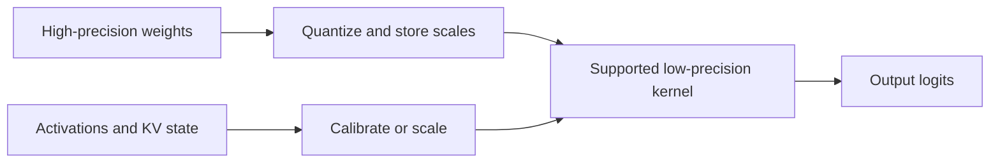
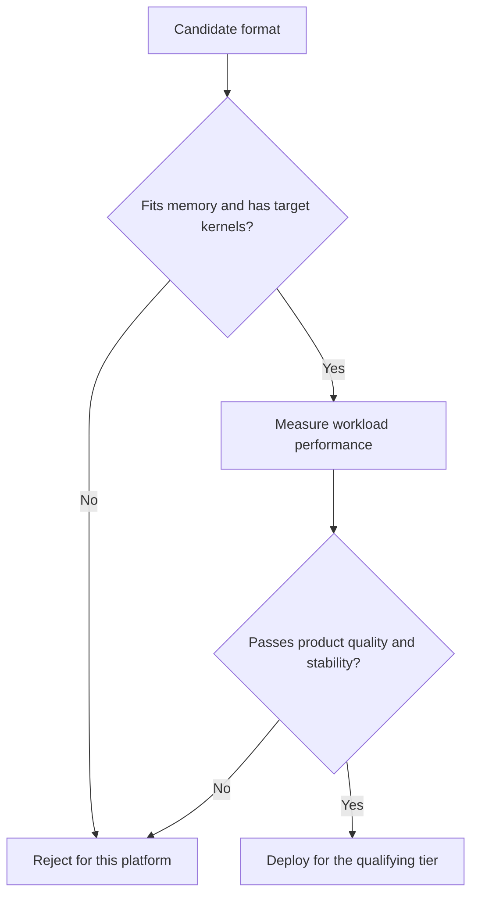

# 10. Quantization and Numerical Behavior

A model's weights may occupy hundreds of gigabytes in a 16-bit format. Storing
the same number of values in 8 or 4 bits can make the model fit on fewer devices
and reduce the bytes read during decode. That sounds like an automatic win.

The catch is that fewer bits represent fewer distinct values. Quantization must
preserve the information the model needs, and the hardware must have an
efficient way to use the chosen format.

## Visual map

**Quantization inserts representation changes into the execution path.**



**A deployable format must pass both a systems gate and a quality gate.**



| Quantized object | Main benefit | Main numerical risk | System dependency |
| --- | --- | --- | --- |
| Weights | fit and lower weight traffic | dequantization error | matrix-kernel support |
| Activations | lower intermediate traffic | outlier range | calibration and accumulation |
| KV state | more active context | attention drift over length | attention-backend support |
| Logits or sampler | smaller final operations | changed token probabilities | output contract |

## Values, ranges, and scales

Floating-point formats divide their bits among sign, exponent, and significand.
Integer quantization usually maps a range of real values onto a small set of
integers using a scale and sometimes a zero point.

One scale for an entire tensor is cheap but must cover outliers. Per-channel or
per-group scales adapt to smaller regions and preserve more detail, at the cost
of extra metadata and conversion work. Dynamic schemes calculate scales from
the current activation or token; static schemes use values determined during
calibration.

The granularity becomes part of the kernel. A file labeled “4-bit weights” does
not fully describe how groups, scales, outliers, and accumulation are handled.

## What can be quantized?

**Weight-only quantization** compresses model parameters while keeping
activations at a wider precision. It directly reduces weight memory and can
help memory-bound decode. The kernel must unpack or dequantize weights while
multiplying them.

**Weight-and-activation quantization** reduces both operands and can use lower
precision matrix hardware. Activations are harder because their ranges change
with tokens and layers. Techniques such as
[SmoothQuant](https://arxiv.org/abs/2211.10438) move some activation difficulty
into the weights to enable practical 8-bit execution.

**KV-cache quantization** reduces the persistent bytes per token, allowing more
or longer sequences. Attention must dequantize or operate on the compressed
state every step. Small quality errors can accumulate over long contexts, so
long-sequence evaluation matters.

Communication can also be quantized. Reducing collective or transfer bytes may
help a network-bound plan, but conversion and cross-rank numerical behavior
become part of the contract.

## Smaller does not always mean faster

Assume a 4-bit model uses half the weight bytes of an 8-bit model. It may still
run slower if the target GPU lacks a native kernel for the format, if group
shapes are poorly aligned, or if conversion overhead dominates a small batch.
The 4-bit representation might also require a workspace that reduces KV-cache
capacity.

Performance depends on a chain:

```text
model format -> engine loader -> quantization method -> kernel
             -> device support -> actual workload shapes
```

Break any link and the engine may reject the model, fall back to a slower path,
or silently convert to another representation.

Both implementation snapshots contain large quantization registries because
formats interact with devices and layer types. vLLM's implementations live
under
[`layers/quantization`](https://github.com/vllm-project/vllm/tree/5cecfc01375052698823fc401e31518fb32a981e/vllm/model_executor/layers/quantization),
while SGLang's live under
[`srt/layers/quantization`](https://github.com/sgl-project/sglang/tree/e161bd1265a0082478b7f1c09f224a52d315dc71/python/sglang/srt/layers/quantization).
The directories are compatibility maps, not interchangeable labels.

## Quality needs a workload-specific gate

Perplexity can detect broad language-model changes but may miss the product
behavior that matters. A coding service should test code tasks. A tool-using
agent should test tool selection and valid arguments. A long-context service
should test retrieval and generation at target lengths.

Measure the unquantized and quantized models with the same prompts, decoding
rules, templates, and evaluation. Include calibration-sensitive tasks, rare
tokens, structured outputs, and log probabilities if callers depend on them.

Do not hide output changes behind a speed average. Report quality alongside
latency, throughput, memory, and cost. If a lower-precision model requires more
retries or longer outputs to solve the same task, token throughput exaggerates
its value.

## Numerical reproducibility is a separate choice

Greedy decoding returns the same token only when logits remain ordered the same
way. Quantization, batch shape, fused reductions, parallel collectives, and
attention backend can change rounding. Two close candidates may swap order.

Strict batch invariance or reproducibility may require deterministic kernels,
fixed reduction order, controlled random state, and restrictions on dynamic
batching. Those choices can reduce performance. Decide whether the product
needs exact token equality, statistically equivalent sampling, stable log
probabilities, or only task-level quality.

## Run a four-axis evaluation

Choose two candidate quantization strategies and one unquantized baseline.
Evaluate them on:

1. memory: weights, cache capacity, workspaces, and peak allocation;
2. performance: TTFT, ITL, throughput, and goodput over several batch shapes;
3. quality: product tasks plus long-context and structured-output checks;
4. stability: repeated runs, batch changes, and log-probability differences.

Record the exact model artifact, calibration method, engine commit, kernel,
device, and command. The winning format is the one that improves the service's
constraint—not the one with the fewest bits in its name.

## Worked example: bits do not choose the winner

Compare BF16, weight-only INT4, and FP8 weights with FP8 KV state. INT4 can cut
weight storage to roughly one quarter plus scales, but it leaves KV capacity
unchanged and may pay dequantization or weak small-batch kernels. FP8 can reduce
both weight and cache bytes, which may avoid long-context preemption even when
one isolated operation is not faster.

The correct decision begins with the binding constraint. If interactive ITL is
the problem, test batch-1 decode kernels. If long documents exhaust memory,
measure admitted contexts and preemption. Gate both against product quality,
tool-call validity, long-context retrieval, and numerical stability.

## Practice: make a deployment decision

Evaluate those three formats on the same Atlas trace. Record weight, KV,
workspace, and peak bytes; TTFT, ITL, throughput, and goodput across batch
shapes; product-task quality; schema validity; repeated-run and log-probability
drift.

Choose a format for interactive and long-document tiers separately, and name
the constraint that justifies each choice. Compare your reasoning with
[Appendix G](../appendices/g-worked-solutions.md#10-quantization-decision).

Chapter 11 turns to another way of reducing decode time: predicting several
future tokens and checking them together.
