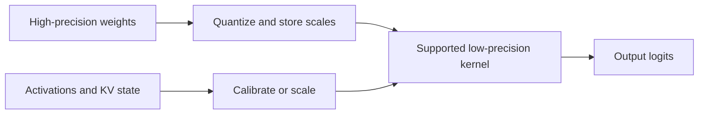
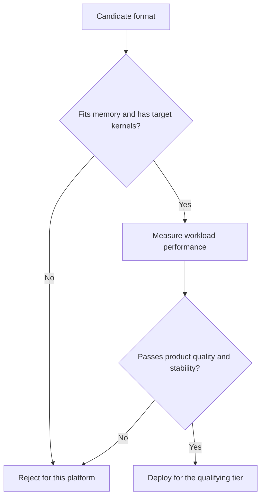
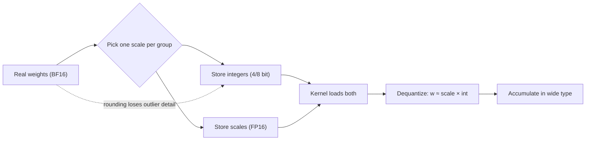

# 10. Quantization and Numerical Behavior

A model's weights may occupy hundreds of gigabytes in a 16-bit format. Storing
the same number of values in 8 or 4 bits can make the model fit on fewer devices
and reduce the bytes read during decode. That sounds like an automatic win.

The catch is that fewer bits represent fewer distinct values. Quantization must
preserve the information the model needs, and the hardware must have an
efficient way to use the chosen format. Both conditions are load-bearing. A
format the target GPU cannot execute natively can end up slower than the
16-bit original; a format that passes every performance test can still change
what the model says. This chapter treats quantization as a systems decision
with a quality gate, not a compression setting.

## Visual map

**Quantization inserts representation changes into the execution path.**



**A deployable format must pass both a systems gate and a quality gate.**



**A quantized multiply is a real multiply plus a scale, a round, and a wider
accumulator.**



| Quantized object | Main benefit | Main numerical risk | System dependency |
| --- | --- | --- | --- |
| Weights | fit and lower weight traffic | dequantization error | matrix-kernel support |
| Activations | lower intermediate traffic | outlier range | calibration and accumulation |
| KV state | more active context | attention drift over length | attention-backend support |
| Logits or sampler | smaller final operations | changed token probabilities | output contract |

## Values, ranges, and scales

Floating-point formats divide their bits among sign, exponent, and significand.
Integer quantization usually maps a range of real values onto a small set of
integers using a scale and sometimes a zero point. A scale says how wide each
integer step is; a zero point says where the real value zero lands inside the
integer range. Symmetric schemes skip the zero point and spend everything on
step width.

One scale for an entire tensor is cheap but must cover outliers. Per-channel or
per-group scales adapt to smaller regions and preserve more detail, at the cost
of extra metadata and conversion work. Dynamic schemes calculate scales from
the current activation or token; static schemes use values determined during
calibration. Static scales make execution cheaper and reproducible; dynamic
scales track the data at the price of a reduction before every quantized
operation.

The granularity becomes part of the kernel. Scales are not annotation — they
are extra operands the kernel loads alongside every tile, and the group size
determines the weight layout in memory. A file labeled "4-bit weights" does
not fully describe how groups, scales, outliers, and accumulation are handled.

### What calibration actually stores

For static schemes, calibration is the process that decides those scale
operands, and it is worth knowing what it produces. A calibration pass runs
representative prompts through the unquantized model and records, per tensor,
the range the activations actually take. A percentile-based scheme keeps the
range covering, say, 99.9 percent of observed values and clips the rest —
accepting error on outliers in exchange for a finer step for everything else.
The artifact is small: a scale (and optionally a zero point) per quantized
tensor, serialized alongside the checkpoint. For a 70B model the calibration
file is megabytes against hundreds of gigabytes of weights, but those
megabytes change every downstream number.

Two failure modes follow directly. Distribution shift is the first: scales
frozen on English chat traffic may clip badly when the service later serves
code, tables, or another language, because the outlier structure of
activations is language- and domain-dependent. The second is subtler —
calibration is measured on *activations*, but weight-only schemes never see
activation statistics at all, so the two families fail differently: weight-only
quality degrades smoothly with coarser groups, while activation-quantized
schemes can fall off a cliff when an uncalibrated outlier channel appears.
SmoothQuant's insight is aimed exactly here: rescaling activation channels
into the weights — dividing activation ranges by a factor and multiplying the
corresponding weight columns — evens out the range mismatch so one shared
8-bit scale can serve both sides.

### One tile through a 4-bit kernel

Make the representation loss concrete with one group. Take 128 consecutive
BF16 weights — group size 128, a common choice — and suppose the largest
magnitude among them is 0.5, a declared assumption for the sake of the walk.
A symmetric signed 4-bit format offers the integers −8 through 7, so the scale
must map +7 to 0.5: one step is 0.5 / 7 ≈ 0.071. A weight of 0.32 becomes
round(0.32 / 0.071) = round(4.5), landing on integer 4 and reconstructing
0.286. The stored integer is half the size, and this one weight
is wrong by 0.034, about eleven percent of its value. Every weight in the group
carries up to half a step of rounding error, and the tighter the group's range,
the smaller the step and the error — which is the entire argument for groups.

Two properties of that error matter downstream. First, it does not wash out in
the dot product: rounding errors across a 128-weight accumulation behave like
independent noise, adding in quadrature alongside the signal, so a longer
summation does not improve the ratio. The levers are a smaller step (more
bits) or a tighter group (better-fitted scales), never more arithmetic. Second,
the error is systematic per group — an outlier that stretched the scale taxes
every other weight in the group, which is why outlier-aware methods exist.

The metadata has a price too. One FP16 scale per group of 128 adds 2 bytes to
the 64 bytes of 4-bit payloads: about 3 percent overhead, lifting 4-bit to
roughly 4.12 effective bits per value. At group size 64 the overhead is 6
percent. Finer granularity buys accuracy with bytes and with kernel-side
conversion work.

### Three families of weight-only methods

Round-to-nearest with good groups — the tile walk above — is only the
baseline. The field's weight-only methods divide into three families by how
they fight that systematic per-group error, and the names are worth knowing
because the trade-offs travel with them:

| Family | Mechanism | Needs activation data | Characteristic failure |
| --- | --- | --- | --- |
| RTN + groups (baseline) | round to the fitted grid | no | outlier stretches one scale, taxes its group |
| error-compensation (GPTQ lineage) | quantize sequentially, push each weight's rounding error into not-yet-quantized weights via second-moment statistics of the layer's inputs | yes — a calibration sample of activations | accumulated compensation degrades on out-of-distribution inputs |
| salient-channel protection (AWQ lineage) | find channels activations actually amplify; rescale them to absorb quantization error where it hurts least | yes — activation magnitudes | protection mis-ranks channels when the workload shifts |

Both calibrated families spend a calibration pass to buy back accuracy at
fixed bit width, and both inherit the distribution-shift risk described
above: their statistics describe the calibration set, not the model. The
practical interview-grade summary: at 8 bits the families converge and the
format choice dominates; at 4 bits the family choice is worth more than the
group-size dial, and the honest evaluation is Chapter 22's — same trace,
same quality gates, differences classified before conclusions.

## What can be quantized?

**Weight-only quantization** compresses model parameters while keeping
activations at a wider precision. It directly reduces weight memory and can
help memory-bound decode — Chapter 3 showed decode traffic is dominated by
weight reads, so halving weight bytes attacks the dominant term. The kernel
must unpack or dequantize weights while multiplying them, which is why
weight-only formats live or die by kernel support at the shapes that arrive.

**Weight-and-activation quantization** reduces both operands and can use lower
precision matrix hardware. Activations are harder because their ranges change
with tokens and layers. Techniques such as
[SmoothQuant](https://arxiv.org/abs/2211.10438) move some activation difficulty
into the weights to enable practical 8-bit execution.

**KV-cache quantization** reduces the persistent bytes per token, allowing more
or longer sequences. Attention must dequantize or operate on the compressed
state every step. Small quality errors can accumulate over long contexts, so
long-sequence evaluation matters.

Communication can also be quantized. Reducing collective or transfer bytes may
help a network-bound plan, but conversion and cross-rank numerical behavior
become part of the contract.

The final operations are quantizable too — logits and sampler state — but
they sit on the thinnest ice. The vocabulary projection is small relative to
the model, so the byte savings are minor, while the risk lands on the output
contract itself: token probabilities, ranking, and derived quantities such as
perplexity or confidence scores all shift with rounding this close to the
user. Most deployments quantize everything below the logits and leave the
last miles wide.

### KV state at half the bytes

The Atlas constants make the KV trade walkable. At BF16, one token of KV state
costs 320 KiB and an 8,000-token sequence holds 2.44 GiB. FP8 KV state halves
both numbers: 160 KiB per token, about 1.22 GiB per sequence. Chapter 4's
admission budget — 35 GiB of KV space per rank after weights and reserve —
then admits roughly twice as many 8,000-token sequences for the same memory:
about 114 where BF16 admitted about 57. The per-step cost falls too: the KV
read that Chapter 3 counted as a decode step's second-largest traffic term
halves, so attention over long contexts gets proportionally cheaper.

The risks are as concrete as the gains. Attention scores drift as compressed
state accumulates over thousands of tokens, and the drift is invisible at
short lengths — only a long-context evaluation can see it. Support is a
registry question, not a flag: the attention backend selected in Chapter 8
must handle scaled KV state, and the checkpoint must carry the scales under
names the loader recognizes. That second hazard is real enough that vLLM's
quantization interface ships a dedicated name-mapping table for KV scales —
the guided reading below walks it.

## Smaller does not always mean faster

Assume a 4-bit model uses half the weight bytes of an 8-bit model. It may still
run slower if the target GPU lacks a native kernel for the format, if group
shapes are poorly aligned, or if conversion overhead dominates a small batch.
The 4-bit representation might also require a workspace that reduces KV-cache
capacity.

Performance depends on a chain:

```text
model format -> engine loader -> quantization method -> kernel
             -> device support -> actual workload shapes
```

Break any link and the engine may reject the model, fall back to a slower path,
or silently convert to another representation. The chain explains a common
field surprise: two engines report different throughput for the *same* 4-bit
checkpoint, because "same format" resolved to different methods and different
kernels on each. The format name travels with the model; the execution path
does not.

Walk one failure to see the two shapes it can take. A checkpoint whose method
declares a minimum compute capability of 90 arrives at capability-80 hardware:
the registry's device gate refuses at load time, the service fails loudly
before serving, and the fix is a different artifact — the good outcome. The
same checkpoint on capable hardware but with an unsupported group size takes
the other shape: the method loads, then the kernel layer discovers at first
use that its fast path rejects the shape and falls back per call. Nothing
errors; the deployment simply runs slower forever. Loud failures get fixed in
minutes, silent ones in weeks — which is why the startup-time gate is worth
more than its assert.

### The workspace tax

Some low-precision kernels need scratch space beyond their operands —
workspace for repacked tiles, staging buffers for dequantized copies, or
algorithm-specific storage. Assume a declared 3 GiB workspace for a candidate
4-bit kernel. Against Chapter 4's per-rank budget the tax is immediate: 35 GiB
of KV budget becomes 32 GiB, which at 625 MiB per sequence is five fewer
8,000-token sequences admitted. A format that looked free has paid for itself
partly in context capacity.

Batch shape taxes it further. Weight-only kernels amortize conversion work
across the batch: at batch 32 one dequantized tile feeds many rows, but at
batch 1 the same conversion serves a single row, so fixed kernel overheads
dominate and the effective bandwidth drops below what the byte count promises.
This is why the worked example's first diagnostic question is "test batch-1
decode kernels" — the small-batch regime is where weight-only formats most
often fail to deliver their theoretical traffic savings, and interactive ITL
lives exactly there.

Both implementation snapshots contain large quantization registries because
formats interact with devices and layer types. vLLM's implementations live
under
[`layers/quantization`](https://github.com/vllm-project/vllm/tree/5cecfc01375052698823fc401e31518fb32a981e/vllm/model_executor/layers/quantization),
while SGLang's live under
[`srt/layers/quantization`](https://github.com/sgl-project/sglang/tree/e161bd1265a0082478b7f1c09f224a52d315dc71/python/sglang/srt/layers/quantization).
The directories are compatibility maps, not interchangeable labels.

### Guided reading: the quantization registry interface

vLLM's
[`base_config.py`](https://github.com/vllm-project/vllm/blob/5cecfc01375052698823fc401e31518fb32a981e/vllm/model_executor/layers/quantization/base_config.py)
splits the problem into two abstract classes. `QuantizationConfig` faces the
checkpoint: `get_config_filenames` names the files to search for in the model
directory, `from_config` builds the config from the checkpoint's JSON, and
`get_min_capability` states a hardware floor — its docstring is explicit that
the requirement exists because of "the custom CUDA kernels used by the
quantization method," citing capability 70 for Volta, 75 for Turing, 80 for
Ampere. The device gate Chapter 8 built for attention backends is baked into
this interface at the same depth.

`QuantizeMethodBase` faces execution: `create_weights` allocates the layer's
parameters in the format's own layout, and `apply` runs the forward pass.
Between them sits the dispatch that makes registries necessary:
`get_quant_method(layer, prefix)` returns a *different* method per layer —
or `None` for layers the format does not quantize. Embeddings are the
standard example, and the interface even carries `method_has_implemented_
embedding`, which inspects whether a method overrode the base's
`NotImplementedError` stub before routing embedding lookups through it. One
checkpoint format is a family of per-layer decisions, not a single switch.

Two lifecycle details reward attention. `process_weights_after_loading` is the
repacking hook — its docstring offers "transpose weights for computation" as
the canonical use, and formats with hardware-specific layouts do their
rearrangement here rather than in the checkpoint. And the `uses_meta_device`
flag marks methods that create weights on the meta device and quantize
layer-wise during loading, "reducing peak memory during loading" — online
quantization exists partly as a loading-memory strategy.

The KV-scale mapper is the most surprising member. `get_cache_scale_mapper`
returns a table of regular expressions renaming checkpoint scale tensors —
"Deprecated fused kv_scale -> attn.k_scale," ModelOpt layouts, fused QKV
projections, several model-specific spellings — so that, in its own words,
"individual model `load_weights` methods do not need to know about KV-cache
scales." The interface even declares a list of scale suffixes (`.q_scale`,
`.k_scale`, `.v_scale`, and zero-point variants) that may appear in a
checkpoint without a matching model parameter and should be ignored rather
than rejected. The *names* of scale tensors are a compatibility surface all
their own.

SGLang's
[`base_scheme.py`](https://github.com/sgl-project/sglang/blob/e161bd1265a0082478b7f1c09f224a52d315dc71/python/sglang/srt/layers/quantization/base_scheme.py)
draws the boundary differently: `BaseLinearScheme` and `BaseMoEScheme` are
separate abstract classes, so the layer-family split is structural rather
than per-layer dispatch. Its `apply_weights` docstring locates the work
precisely — "this is where scheme-specific dequant/quant steps/kernels should
be applied" — the same dequantize-in-kernel step the third diagram above
walked. Both registries, read together, are the chapter's chain made
concrete: format, method, kernel, and device each own one link.

## Quality needs a workload-specific gate

Perplexity can detect broad language-model changes but may miss the product
behavior that matters. A coding service should test code tasks. A tool-using
agent should test tool selection and valid arguments. A long-context service
should test retrieval and generation at target lengths.

Measure the unquantized and quantized models with the same prompts, decoding
rules, templates, and evaluation. Include calibration-sensitive tasks, rare
tokens, structured outputs, and log probabilities if callers depend on them.
Log-probability drift deserves first-class status: downstream routers,
classifiers, and confidence thresholds consume those numbers, and a format
can preserve every task-level metric while shifting the distribution under
them.

| Product surface | What to test | Why perplexity misses it |
| --- | --- | --- |
| Code generation | executable-task pass rate | syntax-adjacent token swaps still compile to failures |
| Tool-using agent | argument schema validity | rare tokens and exact identifiers are calibration-sensitive |
| Long-context service | retrieval at target lengths | KV drift accumulates beyond calibration lengths |
| Routers over logprobs | distribution drift per position | ordering flips leave aggregate loss nearly unchanged |

Do not hide output changes behind a speed average. Report quality alongside
latency, throughput, memory, and cost. If a lower-precision model requires more
retries or longer outputs to solve the same task, token throughput exaggerates
its value — a fifteen-percent throughput win erased by a twenty-percent retry
rate is a loss wearing a win's clothes.

## Numerical reproducibility is a separate choice

Greedy decoding returns the same token only when logits remain ordered the same
way. Quantization, batch shape, fused reductions, parallel collectives, and
attention backend can change rounding. Two close candidates may swap order —
and a swap at the top of the distribution is a different response, not a
slightly different one.

A two-number walk shows how little it takes. Suppose the top two logits are
10.32 and 10.28 under the baseline engine. A different reduction order nudges
them to 10.29 and 10.30; greedy decoding now emits the other token, and every
subsequent position conditions on it. Under temperature sampling the flip
probability per position is tiny, but a 200-token response offers 200 chances:
one percent per position compounds to roughly 87 percent of responses differing
somewhere — declared figures for the sake of the shape of the argument. This
is why "the model got better or worse" is the wrong frame for many quantization
comparisons; the right frame is whether response-level differences stay inside
what the product treats as equivalent.

Strict batch invariance or reproducibility may require deterministic kernels,
fixed reduction order, controlled random state, and restrictions on dynamic
batching. Those choices can reduce performance. Decide whether the product
needs exact token equality, statistically equivalent sampling, stable log
probabilities, or only task-level quality — four postures with very different
price tags, and the cheapest one that satisfies the contract is the right one.
A/B tests and evaluation pipelines have their own stake: an evaluation that
cannot reproduce itself across batch shapes measures the scheduler as much as
the model.

## Run a four-axis evaluation

Choose two candidate quantization strategies and one unquantized baseline.
Evaluate them on:

1. memory: weights, cache capacity, workspaces, and peak allocation;
2. performance: TTFT, ITL, throughput, and goodput over several batch shapes;
3. quality: product tasks plus long-context and structured-output checks;
4. stability: repeated runs, batch changes, and log-probability differences.

Record the exact model artifact, calibration method, engine commit, kernel,
device, and command — enough for a colleague to reproduce the number rather
than believe it. The winning format is the one that improves the service's
constraint—not the one with the fewest bits in its name.

## Worked example: bits do not choose the winner

Compare BF16, weight-only INT4, and FP8 weights with FP8 KV state. INT4 can cut
weight storage to roughly one quarter plus scales, but it leaves KV capacity
unchanged and may pay dequantization or weak small-batch kernels. FP8 can reduce
both weight and cache bytes, which may avoid long-context preemption even when
one isolated operation is not faster.

The Atlas planning numbers turn that sketch into arithmetic. Weights are
140 GB in BF16; a 4-way TP shard therefore holds about 33 GiB of them, and
INT4 at one quarter plus the 3 percent scale overhead from the tile walk
brings a shard to about 8.4 GiB, FP8 to about 16.3 GiB. Chapter 4's admission
budget is 80 GiB per rank minus weights minus a 12 GiB reserve, and each
8,000-token sequence costs 625 MiB of KV per shard in BF16, or about 313 MiB
with FP8 state. The budgets then admit, per rank: about 57 sequences on BF16,
about 98 on INT4 with BF16 state — the freed weight bytes buy context even
though the KV format never changed — and about 169 with FP8 weights and FP8
state. Halving the KV bytes alone doubles capacity per GiB of budget; the
weight shrinkage adds more on top.

The ITL side walks just as far. Chapter 4 priced HBM at 3 TB/s, so a batch-1
decode step that reads a 33 GiB BF16 shard spends at least 11 ms on weight
traffic alone. An INT4 kernel that sustains full bandwidth would read about
8.4 GiB — under 3 ms — but real 4-bit kernels rarely sustain peak while
dequantizing; at 70 percent of peak the step is nearer 4 ms. Either way the
direction is decisive *if* the small-batch kernel is good, which is precisely
what "test batch-1 decode kernels" exists to learn: the same checkpoint can
deliver the 11-to-4 ms win on one engine and lose most of it on another whose
kernel converts poorly at batch 1.

The correct decision begins with the binding constraint. If interactive ITL is
the problem, test batch-1 decode kernels. If long documents exhaust memory,
measure admitted contexts and preemption. Gate both against product quality,
tool-call validity, long-context retrieval, and numerical stability.

## Practice: make a deployment decision

Evaluate those three formats on the same Atlas trace. Record weight, KV,
workspace, and peak bytes; TTFT, ITL, throughput, and goodput across batch
shapes; product-task quality; schema validity; repeated-run and log-probability
drift.

Choose a format for interactive and long-document tiers separately, and name
the constraint that justifies each choice. Compare your reasoning with
[Appendix G](../appendices/g-worked-solutions.md#10-quantization-decision).

Chapter 11 turns to another way of reducing decode time: predicting several
future tokens and checking them together.
