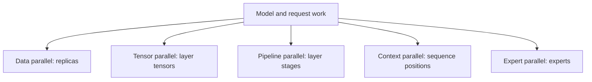
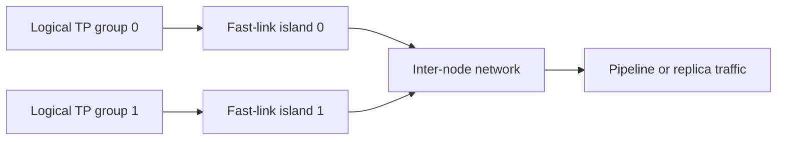

# 12. Parallelism as Data Movement

A model no longer fits on one GPU. The obvious response is to add another GPU.
The difficult question is what to split.

You can split weights, layers, tokens, experts, attention heads, sequence
positions, or complete requests. Each choice reduces one device's work or
memory by moving something between devices — and every byte moved is paid for
on a link with its own latency and bandwidth. Parallelism is therefore best
understood as a data-movement plan: pick what moves, how often it moves, and
which fabric it moves over. Two plans that partition the same model can differ
by an order of magnitude in served latency, because they differ in what
crosses which wire.

## Visual map

**Parallel dimensions split different objects and create different traffic.**



**A rank mesh must be mapped onto the physical fabric.**



| Dimension | Partitioned object | Frequent communication | Best first use |
| --- | --- | --- | --- |
| Data | requests | little on inference path | model fits and concurrency exists |
| Tensor | layer computation and weights | layer-frequency collectives | weights do not fit one device |
| Pipeline | layer ranges | stage activations | slower links or very large models |
| Context | positions and KV | partial attention results | context state is binding |
| Expert | expert weights and tokens | dispatch and combine | MoE weight fit and scaling |

## Start with replication

If the model fits on one device, the simplest scale-out design is replication.
Each replica holds the complete model and serves independent requests. This is
data parallelism in its inference form.

Replication adds capacity without putting a collective on the critical path of
one request. It also duplicates weights and fragments warm state across
replicas. The state fragmentation is subtler than the memory duplication:
each replica builds its own prefix cache (Chapter 7), so two replicas serving
the same popular document each pay to warm it, and a router that bounces a
user between replicas silently discards that investment. A router must decide
where requests go, and its decision quality becomes part of the cache design.

The router also inherits a queuing problem. Two replicas behind one address
see arrival bursts that neither controls; a naive round-robin can hand three
long prefills to one while the other sits idle, and the queued request's TTFT
absorbs the difference even though the fleet had capacity. Least-loaded
routing fixes the queue and breaks the cache affinity; prefix-affinity
routing fixes the cache and re-creates the queue. Production routers end up
weighting both signals — load first, affinity as a tiebreaker — because a
cache hit worth 350 ms cannot repay a queue worth 900. The exact numbers are
workload property, but the tension is structural: Chapter 7 made state
valuable, so placement now trades two goods against each other.
For latency-sensitive models
that fit, replication is the baseline against which more complicated plans
should be justified.

## Tensor parallelism splits a layer

Tensor parallelism divides the matrices inside a layer across ranks. A common
transformer plan shards one linear operation by output dimension and another by
input dimension. Partial results are combined with an all-reduce or
reduce-scatter.

The benefit is immediate: each rank stores and multiplies only a shard. The cost
is also immediate: ranks communicate at layer frequency. Fast links and large
matrix shapes can make the exchange worthwhile. Small decode batches or slow
cross-node links can make synchronization dominate.

The foundational [Megatron-LM paper](https://arxiv.org/abs/1909.08053) explains
intra-layer tensor parallelism for transformer models. Its training context is
different, but the partition and collective reasoning carries into inference.

Tensor parallelism can lower single-request latency when the communication is
cheaper than the removed computation. It should not be a reflexive default.

### What TP does to attention heads

Tensor parallelism also decides where attention heads live, and the Atlas
constants show how sharp that decision is. The model has 8 KV heads of
dimension 128; its 320 KiB per token of KV state is exactly
8 heads × 128 × 2 (K and V) × 2 bytes × 80 layers. At TP4, each rank owns 2
of the 8 KV heads — 80 KiB per token, the 625 MiB per 8,000-token sequence
that Chapter 3 counted. The division is clean because 4 divides 8. At TP8,
each rank would own exactly one head; at TP16, there are no heads left, and
implementations replicate heads across ranks — spending memory on copies
that compute nothing new. Grouped-query-attention models therefore carry a
practical ceiling: tensor width beyond the KV-head count buys no attention
memory, only duplication. When a sizing conversation reaches "why not TP8
everywhere," the head count is the first number to check.

### Two ways to cut attention state

Tensor and context parallelism can each hold attention memory down to the
same number by splitting different objects — and their traffic differs in
instructive ways. Splitting heads (TP): each rank keeps 2 heads × all 8,000
positions = 625 MiB, and attention needs no cross-rank communication at all,
because heads are independent — but the rank is now locked into the tensor
group for every layer, MLP included. Splitting positions (decode-context):
each rank keeps all 8 heads × 2,000 positions = 625 MiB, attention runs
locally over its stripe, and the new query — under a kilobyte — must reach
every stripe, with partial results reduced back each step. Same memory, same
per-rank attention compute; different coupling. TP-attention couples the
attention dimension to the whole layer's tensor width; context parallelism
couples it to a per-step collective instead. Deployments choose based on
which coupling their other dimensions tolerate — and on whether their
attention backend implements the stripe-and-reduce path at all, which is
Chapter 8's registry question wearing a parallelism costume.

### Pricing one all-reduce

Appendix A's transfer model makes the cost concrete: a transfer of `S` bytes
takes `transfer time = a + S / b`, where `a` is startup latency and `b` is
sustained bandwidth. Decode collectives live almost entirely in the `a` term,
and that fact shapes everything. Take Atlas's width: hidden size 8,192 in
BF16 is a 16 KiB activation per token. At decode batch 8, one rank's
contribution to a collective is about 128 KiB; assume intra-island figures of
a = 20 µs startup and b = 450 GB/s for a ring-style reduce, and the transfer
term is under half a microsecond while the whole collective costs roughly its
startup. The message is small; the round trip is not negotiable.

Now count collectives. A transformer layer typically needs two — one after
attention, one after the MLP block — so a TP4 Atlas step performs about 160
collectives at 80 layers. At 20 µs each, that is roughly 3.2 ms of
synchronization per step, against a weight-read term of about 11 ms per rank
(a 35 GB shard over 3 TB/s). Communication is nearly a third of the step even
though the messages are tiny. This is why tensor parallelism wants the
fastest fabric available and why it stops helping when batch growth pushes
decode past the memory-bound knee: once the target is compute-limited, both
the compute it saves and the collectives it adds scale together, and the `S`
term starts mattering too. Prefill flips the balance — activations there are
megabytes per token-batch, so `S / b` dominates and wide groups pay real
bytes as well as real latency.

## Pipeline parallelism splits layers

Pipeline parallelism assigns consecutive layer ranges to different stages. An
activation moves from one stage to the next. Each stage stores only its layers,
so pipeline parallelism solves model capacity without a collective inside every
layer — the communication drops from twice per layer to once per stage
boundary, and it crosses whatever link separates the stages.

The pipeline must remain occupied. If only one microbatch is present, later
stages wait while the first stage begins and earlier stages wait after their
work moves on. These empty periods are pipeline bubbles.

Serving makes scheduling difficult because sequences enter and leave
dynamically. Chunked prefills can provide pipeline work, while short decode
steps may expose bubbles. Pipeline parallelism is attractive across links where
one activation transfer per stage is cheaper than repeated tensor collectives,
but it needs enough concurrent work.

### Bubble arithmetic and what fills it

The bubble has an arithmetic, and it is brutal at serving batch sizes. With
`s` stages and only one unit of work in flight, exactly `s − 1` stages idle
during any step: at depth 2 the best steady-state utilization is half the
fleet doing nothing. The classic training remedy is many microbatches in
flight — utilization approaches `m / (m + s − 1)` for `m` concurrent units —
but inference cannot manufacture microbatches on demand; it has requests, and
their arrival is the workload's choice, not the scheduler's.

What serving can do is keep *some* stream flowing through the empty slots.
A chunked prefill supplies stage-filling work while decodes run — Chapter 6's
chunk ceiling exists partly so those chunks stay schedulable alongside
decodes. Multiple pipeline-parallel replicas can be staggered so one fills
while another drains. And the bubble cost shrinks relative to stage time when
stages are long: deep pipelines amortize the boundary crossing over more
layers per stage, which is another way of saying pipeline parallelism suits
very large models whose stages are inherently busy. None of these tricks make
the bubble vanish; they decide whether the fleet's idle fraction is five
percent or fifty.

## Splitting sequence positions

Long contexts can make attention state or computation too large for one rank.
Context or sequence parallelism divides token positions across devices. Each
rank computes a portion of attention and the partial results are combined.

Ring-style attention passes key/value regions around ranks. Ulysses-style
methods exchange tensor dimensions so each rank can compute local attention.
The two move comparable bytes in a step — both traffic scales with context
size, not batch size — but the patterns differ in ways links care about:
ring streams stripes neighbor-to-neighbor, tolerating slower fabrics but
paying hop-by-hop latency, while Ulysses all-gathers head slices so every
rank ends up holding what it needs at once, preferring fast fabric and
paying for it in one burst.
Decode-context parallelism can stripe the stored context across ranks while a
small number of new queries attend to all shards — at Atlas's 320 KiB per
token, striping an 8,000-token sequence over four ranks holds 625 MiB per
rank instead of 2.44 GiB, the same arithmetic Chapter 4 used to justify the
shard budget.

These methods trade memory capacity and attention compute for communication.
They become attractive when context state, not weights, is the limiting
resource — long-context services where Chapter 7's eviction pressure, not
weight fit, is the daily constraint.

## Expert and attention parallelism

MoE models allow experts to be distributed independently from the attention
layers. Expert parallelism places different experts on different ranks and
moves token representations to their selected owners.

Its traffic profile differs from every other dimension in one respect: the
destination is decided at runtime by the router, not by a fixed partition.
Each token's representation must reach its top-k experts' ranks — an
all-to-all whose message count scales with tokens × k and whose completion
time is set by the slowest participant. A hot expert that attracts more than
its share turns one rank into a straggler for the whole layer; balancing
expert load is therefore part of the parallelism plan, not just a modeling
concern, and Chapter 13 walks what it costs.

Some deployments replicate or data-parallelize attention while expert layers
span a larger group. This is often called attention data parallelism. It avoids
tensor collectives in attention and uses the expert all-to-all as the main
cross-replica exchange.

The model no longer has one parallel size. It has a mesh of dimensions — and
the expert dimension's traffic is the most irregular of them all, which is
why Chapter 13 gives it a chapter of its own.

## Compose a rank mesh

Suppose a deployment has 64 GPUs and chooses:

```text
data parallel = 4
tensor parallel = 2
expert parallel = 8
```

The product is 64 only if those axes are independent in the implementation.
Some systems define expert parallel within or across data-parallel groups;
others couple sizes. Pipeline and context axes add further constraints.

Write down what each coordinate means. A rank might be identified as:

```text
(replica 2, tensor shard 1, expert shard 6)
```

Then list the communication groups. Which ranks participate in layer
all-reduces? Which participate in expert dispatch? Which share a KV partition?
This exercise catches configurations that multiply cleanly but communicate
poorly.

Both source snapshots centralize group construction and rank state: vLLM in
[`parallel_state.py`](https://github.com/vllm-project/vllm/blob/5cecfc01375052698823fc401e31518fb32a981e/vllm/distributed/parallel_state.py)
and SGLang in
[`parallel_state.py`](https://github.com/sgl-project/sglang/blob/e161bd1265a0082478b7f1c09f224a52d315dc71/python/sglang/srt/distributed/parallel_state.py).
Reading these files is often the fastest way to learn what a framework's
parallel-size arguments actually compose.

### Guided reading: the mesh is a reshape

vLLM's `initialize_model_parallel` turns the composition question into linear
algebra you can read. The heart of the function is one line:

```python
all_ranks = torch.arange(world_size).reshape(
    -1,
    data_parallel_size,
    pipeline_model_parallel_size,
    prefill_context_model_parallel_size,
    tensor_model_parallel_size,
)
```

Every rank coordinate system this chapter described is that reshape. Each
parallel group is then extracted by transposing its axis to the end and
slicing — the comment spells out the recipe ("transpose that dimension to the
last dimension, then reshape to 2D, then unbind"), and the getters around it
(`get_tp_group`, `get_pp_group`, `get_dp_group`, `get_ep_group`,
`get_dcp_group`, `get_pcp_group`) hand back one coordinator per axis. A
deployment "composes" sizes exactly when this reshape succeeds without
coupling axes it wanted separate.

The docstring works the same example this chapter asked you to try. Eight
GPUs with tensor size 2 and pipeline size 4 produce four TP groups —
`[g0,g1], [g2,g3], [g4,g5], [g6,g7]` — and two PP groups `[g0,g2,g4,g6],
[g1,g3,g5,g7]`, followed immediately by the topology warning that matters:
"for efficiency, the caller should make sure adjacent ranks are on the same
DGX box." Rank numbering is a fabric-mapping decision; the reshape assumes it.

Two further details reward attention. First, there are two data parallels:
the comment distinguishes ExternalDP, "the data parallel group that is not
part of the model" where "every dp rank can generate independently," from the
model-side DP where "all the ranks in the same DP group should generate
simultaneously … otherwise it will cause deadlock." That is the difference
between the weak-sync replication row and a synchronized axis, expressed as a
deadlock condition. Second, decode-context parallelism does not stand alone —
when context size exceeds one, DCP "spans PCP first, then TP," composing with
the prefill-context and tensor axes rather than replacing them. Real meshes
have axes inside axes, and the file is where the framework admits it.

SGLang's `parallel_state.py` draws the same conclusion from the other end:
its getters include `get_attn_tp_group`, `get_attn_cp_group`,
`get_moe_dp_group`, `get_moe_ep_group`, and `get_moe_tp_group` — separate
coordinators for attention tensor width and expert placement, because MoE
deployments genuinely run different parallel shapes in the attention layers
than in the expert layers. The chapter's "the model has a mesh of dimensions"
is not a figure of speech; both engines allocate one communication group per
mesh edge. One more construction detail carries an operational lesson: each
group initializer asserts its global is unset — `assert _TP is None` and its
siblings — because groups are process-lifetime singletons. Parallelism is
decided once at startup and never re-negotiated; changing the mesh means a
restart, which is why the decision procedure above earns its paper review —
and why a mesh change silently invalidates everything Chapters 8 and 9
cached: tuned kernels and captured graphs are keyed to shapes that no
longer exist after the group sizes change.

## Map frequent traffic to fast links

A logical mesh becomes a serving topology only when it is mapped to hardware.
Keep frequent, latency-sensitive collectives inside the fastest fabric when
possible. Put communication that uses larger, less frequent transfers on
slower links.

For every parallel dimension, create a small ledger:

| Dimension | What is split? | What moves? | How often? | Synchronization? |
| --- | --- | --- | --- | --- |
| Tensor | weights and partial activations | reductions or gathers | per layer | strong |
| Pipeline | layer ranges | activations | per stage | pipeline dependency |
| Context | sequence positions | KV or partial attention | per layer or step | strong |
| Expert | experts | routed token activations | per MoE layer | all-to-all and stragglers |
| Data | requests | usually no model tensors | per request/control update | weak |

Attach message sizes from the target model and batch. The labels alone cannot
predict performance — but the ledger plus Appendix A's transfer formula will
get within shouting distance, which is enough to reject most bad meshes on
paper. Keep Appendix A's caveat in view while doing it: concurrent
transfers contend for the same fabric, registration and serialization add
overhead the formula does not model, and a plan that assumes every
collective gets the full link bandwidth will flatter itself.

## A decision procedure

Begin by asking whether the weights and required state fit on one device. If
they do, test replication first. If weights do not fit, choose between splitting
layers and splitting tensors based on links, latency, and available concurrency.
If context state does not fit, add a sequence or decode-context dimension. If
experts dominate model size, distribute experts and model the all-to-all.

Next, check the workload. Low-concurrency interactive traffic is sensitive to
collective latency and pipeline bubbles. High-throughput offline work can fill
larger parallel groups. Long-context traffic changes the fraction of memory and
communication due to state.

Finally, measure the plan at several batch shapes. Parallel efficiency is not a
fixed property of the model. And check one non-performance property before
committing: failure scope. A tensor group whose ranks share one switch fails
as a unit — Chapter 4's shared-switch arithmetic means a single fabric fault
can zero the capacity of every replica that depends on it. Pipeline stages
spread across independent links partition the blast radius but reintroduce
the bubble; replication across islands shrinks it furthest at the highest
memory price. The parallel plan is also a failure-domain plan, and both
reviews deserve to happen on paper, before the first deployment teaches them
at production cost.

## Worked example: TP8 or PP2 × TP4

On one fast eight-GPU island, Plan A uses tensor parallel size eight. Plan B
uses two pipeline stages, each with tensor parallel size four. TP8 avoids a
pipeline bubble but performs layer-frequency collectives across the widest
group. PP2 × TP4 confines those collectives to four ranks and sends activations
once across the stage boundary; it needs concurrency to keep both stages busy.

For hidden width 8,192 in BF16, the stage-boundary activation is about 16 KiB
per sequence token before batching. Walk both plans' decode traffic at batch
16. Plan B crosses the boundary with 16 sequences × 16 KiB = 256 KiB per step
— one transfer per step, latency-dominated like every decode collective, plus
the four-rank TP collectives inside each stage. Plan A runs the same 160
per-step collectives but across eight ranks instead of four, paying somewhat
longer ring paths on every one; what it never pays is the bubble. So the
comparison reduces to a single question: does the concurrency that batch 16
represents keep both Plan B stages busy? At sixteen active sequences the
answer is usually yes — each stage always has work — while at batch 2, Plan B
idles half its fleet every other step and Plan A's wider collectives are the
smaller evil. Prefill shifts the argument again: chunk activations are
megabytes, so the `S / b` term dominates and Plan A's eight-rank collectives
move real bytes on every layer, while Plan B keeps its collectives on four
ranks and crosses the boundary once per chunk. Which plan wins which phase
is exactly the kind of question the ledger table exists to structure — and
the reason G's answer lets the phases disagree.

Tensor-parallel message volume depends on
the exact sharding and collective algorithm, so derive it from the execution
plan rather than copying a generic formula.

## Practice: compare two legal meshes

Draw both rank meshes and map them to physical links. For batch 16, calculate
the stage-boundary payload and derive the chosen TP collective messages for one
prefill and decode step. Predict phase winners at low and high concurrency.

Include memory fit, collective latency, pipeline bubbles, and failure scope.
The worked comparison is in
[Appendix G](../appendices/g-worked-solutions.md#12-two-parallel-plans).

The next chapter focuses on the parallel dimension with the most irregular
traffic: experts.
