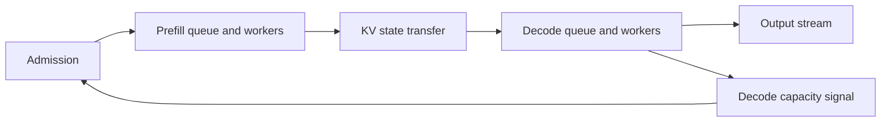
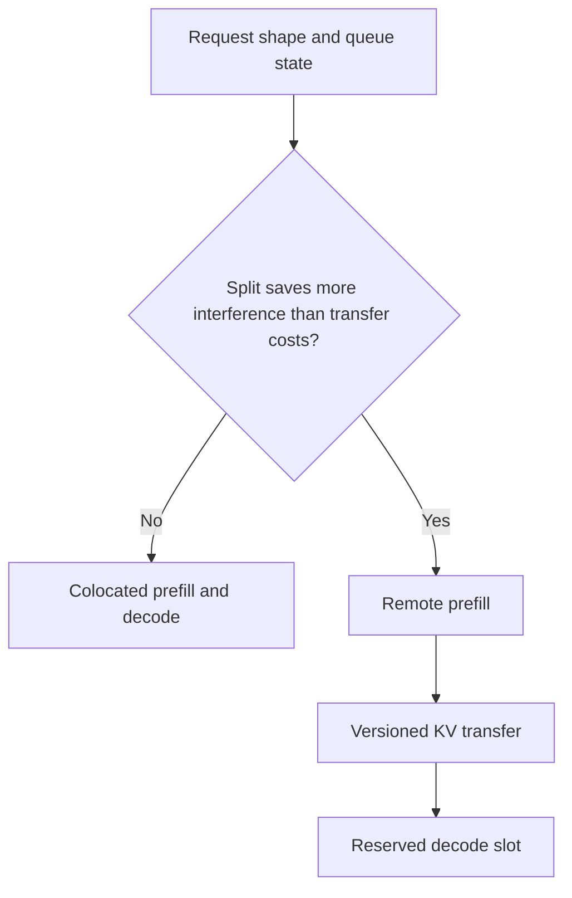

# 14. Disaggregated Serving

A colocated LLM worker performs both prefill and decode. That arrangement keeps
state local and makes one worker responsible for the whole request. It also
forces two different workloads to share the same queue, hardware, and parallel
configuration.

Disaggregated serving separates stages so each can be scheduled and scaled
independently. The common case places prefill on one worker pool and decode on
another.

## Visual map

**Prefill/decode separation turns one engine queue into a stage pipeline.**



**Conditional placement chooses between local reuse and a transfer boundary.**



| Stage | Capacity variable | New failure mode | Admission signal |
| --- | --- | --- | --- |
| Prefill | prompt tokens per second | output state piles up | estimated service time |
| Transfer | bytes and concurrent copies | partial or timed-out KV | reserved bandwidth and deadline |
| Decode | active sequences and context | no slot after prefill | predicted decode availability |
| Output | client consumption | backpressure retains state | buffer age and disconnect |

## Why split prefill from decode?

Prefill benefits from large compute-efficient operations. Decode values steady,
low-latency steps and sufficient memory bandwidth. A long prompt running beside
active decoders can create an output stall. A tensor-parallel plan that helps
prefill may add too much synchronization to decode.

With separate pools, a prefill worker processes the prompt and produces the
initial KV state. That state moves to a decode worker, which generates the rest
of the response.

```text
request -> prefill queue -> prefill workers
                              |
                           KV transfer
                              |
                              v
          stream <- decode workers <- decode queue
```

The [DistServe](https://arxiv.org/abs/2401.09670) and
[Splitwise](https://arxiv.org/abs/2311.18677) papers study phase splitting as a
way to reduce interference and select phase-specific resource plans.

## The transfer is part of latency

The KV cache for a long prompt can be large. Disaggregation helps only if the
state can be transferred, registered, and made visible before the saved
interference or better placement pays for that cost.

A transfer protocol needs several pieces of metadata: request identity, model
and cache format, source and destination ranks, block ranges, memory addresses
or handles, and completion state. The sender and receiver must agree on how
tensor-parallel or context-parallel shards map between them.

Bulk data should move on a path designed for it, while control messages arrange
the rendezvous. A push design lets the prefill side initiate. A pull design lets
decode request the blocks. Both need timeouts, cancellation, and idempotent
cleanup.

If transfer fails, the system can retry, choose another decode worker, recompute
prefill, or fail the request. The policy should depend on the remaining deadline
and expected recompute cost.

## Two queues create a coupled system

Separating stages does not remove queueing. It creates a queue before prefill, a
transfer boundary, and a queue before decode.

If prefill produces requests faster than decode can consume them, completed KV
state accumulates while users wait for a decode slot. Scaling prefill harder
would make the system worse. If decode is overprovisioned, expensive workers
wait for prefills.

The correct pool ratio depends on arrival rate, prompt and output lengths,
cache hits, and each phase's service time. Measure the whole pipeline. A low
prefill queue can hide a growing decode queue.

Raw throughput may fall after adding transfer while goodput rises because TTFT
and ITL become more predictable. State the metric. “Disaggregation increases
throughput” and “disaggregation never increases throughput” are both too broad.

## Conditional and dynamic disaggregation

Not every request should cross a stage boundary. A short prompt may be cheaper
to run entirely on a colocated worker. A request whose prefix is already cached
on a decode worker may skip remote prefill. A large prompt with a tight ITL SLO
may benefit most from separation.

A conditional router compares local execution with remote prefill plus transfer
and queueing. A dynamic system can also change pool membership as workload
phase ratios change. Reconfiguration must account for warm weights, graph
capture, cache loss, and draining.

## Encoder, prefill, and decode

Multimodal models add an encoder stage. Large video or vision encoders can
dominate first-output latency and use different hardware shapes from language
decode. Separating encoder, prefill, and decode produces an E/P/D topology.

Encoder outputs must now move to prefill, followed by KV state moving to decode.
The additional boundary is worthwhile only when independent batching, caching,
or hardware assignment pays for it. Repeated questions about the same media can
make an encoder cache especially valuable.

The idea generalizes beyond language. A diffusion pipeline can place its text
encoder, denoiser, and decoder in different pools. A rollout system can separate
generation from training and weight distribution. Disaggregation is stage
placement, not a feature unique to KV caches.

## What the implementations reveal

vLLM defines connector interfaces and several transfer or offload integrations
under
[`distributed/kv_transfer`](https://github.com/vllm-project/vllm/tree/5cecfc01375052698823fc401e31518fb32a981e/vllm/distributed/kv_transfer).
SGLang's prefill, decode, staging, and transport implementations live under
[`srt/disaggregation`](https://github.com/sgl-project/sglang/tree/e161bd1265a0082478b7f1c09f224a52d315dc71/python/sglang/srt/disaggregation).

Both code trees contain several backends and compatibility checks. That is a
useful warning: a transport name alone does not guarantee support for a model's
cache layout, parallel sizes, speculative mode, or device.

The [Mooncake paper](https://arxiv.org/abs/2407.00079) extends the design around
a KV-centric architecture using GPU, CPU, memory, and storage resources. It
also highlights early rejection under overload, connecting disaggregation back
to goodput and admission control.

## Worked example: price the state boundary

Use `prefill_ms = 20 + 0.035 × tokens`, a 45 ms decode step, and a KV link with
12 ms setup plus payload at 22 GiB/s. The 6,000-token Atlas prompt creates about
1.83 GiB of KV state. Ideal transfer is therefore roughly 97 ms, compared with
about 230 ms of prefill.

That boundary is material. Disaggregation wins only if isolating decode from
prefill interference and improving pool utilization repays the transfer and a
new queue. An idle prefill worker is not capacity when no decode slot will be
available afterward.

## Practice: simulate three placements

Build prefill, transfer, and decode service-time tables from the functions
above. Compare colocated, always-disaggregated, and conditional placement for
short and 6,000-token prompts under bursts.

Report every stage queue, TTFT, ITL, goodput, transferred bytes, failure cleanup,
and idle capacity. Derive a conditional split threshold. The worked model is in
[Appendix G](../appendices/g-worked-solutions.md#14-prefilldecode-split).

Disaggregation creates a new question: if valuable state can move between
workers, should it survive beyond the request? Chapter 15 builds a distributed
cache around that question.
