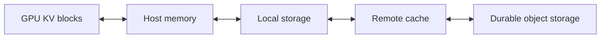
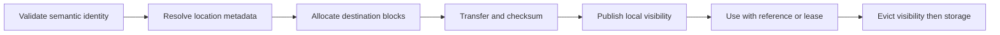

# 15. Hierarchical and Distributed Caching

One worker finishes processing a 40,000-token document. Ten minutes later,
another request asks a new question about the same document—but the router
sends it to a different worker. The first worker has the useful KV state. The
second has free capacity.

A local prefix cache cannot satisfy both goals. A distributed cache makes state
visible beyond one GPU, but turns reuse into a placement, transfer, and
consistency problem.

## Visual map

**A hierarchical cache trades increasing capacity for increasing access cost.**



**A remote hit becomes usable only after an ordered publication protocol.**



| Tier | Capacity | Access shape | Best candidate |
| --- | --- | --- | --- |
| GPU | smallest | direct attention reads | active and hottest prefixes |
| Host memory | larger | device transfer | recently evicted state |
| Local storage | larger still | bulk sequential load | warm deployment-local state |
| Remote cache | shared | network transfer and metadata | reused state across replicas |
| Durable storage | largest | high latency | artifacts worth reconstructing later |

## Recompute, retain, or transfer

Every reusable state object presents three choices. The service can discard and
recompute it, keep it near the producer, or move it to a tier where another
consumer can retrieve it.

The decision depends on four quantities:

```text
expected reuse value
- storage cost
- transfer cost
- management and failure cost
```

A long prefix is expensive to recompute and expensive to move. A short prefix
may be cheap enough that caching it adds more metadata and traffic than it
saves. Popularity and reuse delay matter because a valuable object held too far
in advance displaces other state.

## A cache can have several tiers

A practical hierarchy might include GPU memory, host memory, local NVMe, and a
remote memory or storage service. The fastest tier holds active request state
and the hottest reusable blocks. Lower tiers trade access time for capacity.

Promotion moves a block toward the GPU when reuse becomes likely. Demotion or
write-back preserves an evicted block in a lower tier. Prefetch begins a load
before the request reaches execution. A write-through policy backs up state as
it is created; write-back waits until eviction or another trigger.

Each policy moves bytes at a different time. Write-through adds traffic to the
foreground path but leaves a ready copy. Write-back avoids copying cold state
and may delay eviction. Prefetch hides latency when prediction is correct and
wastes bandwidth when it is not.

At the pinned SGLang revision,
[`hiradix_cache.py`](https://github.com/sgl-project/sglang/blob/e161bd1265a0082478b7f1c09f224a52d315dc71/python/sglang/srt/mem_cache/hiradix_cache.py)
implements host and storage coordination, prefetch, backup, write policies, and
eviction around the radix index. vLLM exposes a connector and offloading model
with scheduling, events, metrics, and workers under its
[`offloading` package](https://github.com/vllm-project/vllm/tree/5cecfc01375052698823fc401e31518fb32a981e/vllm/distributed/kv_transfer/kv_connector/v1/offloading).

The implementations differ, but both show that an external cache is an
asynchronous subsystem rather than a larger dictionary.

## Identity must cross machines

The local identity rules from Chapter 7 still apply: model version, exact token
IDs, positions, adapter, media, cache layout, and namespace all affect whether
state is reusable.

A distributed cache adds representation questions. Do all consumers use the
same block size, dtype, layer layout, tensor-parallel size, and rank mapping? If
not, a connector must transform the state or declare the route incompatible.

Use content-derived identities or trusted metadata with collision checks. A
directory entry should not become visible until the complete state is durable
enough for its advertised tier. Partial writes and stale locations must fail
closed: recomputation is safer than consuming incorrect KV state.

Model updates provide a clean invalidation boundary. Include the weight version
in the namespace instead of attempting to inspect whether a change happens to
leave cached values equal.

## Metadata and data take different paths

A cache directory answers where a prefix or block can be found. The bulk data
path moves the tensor state. Keeping them separate allows small metadata updates
to propagate without routing large buffers through the control service.

Events can announce block creation, removal, or movement. Consumers need a way
to handle delayed or reordered events. A location advertised moments ago may
already be evicted. Treat directory results as hints until the source confirms
and pins the data.

The request lifecycle can look like this:

```text
lookup -> choose source -> reserve destination -> transfer -> validate
       -> publish local mapping -> execute -> release transfer pins
```

Cancellation at each stage needs cleanup. A timed-out prefetch must release
destination buffers and source references even if its completion arrives late.

## Cache-aware routing creates a trade-off

If one replica has a 30,000-token prefix and another is idle, which should serve
the request? Sending it to the warm replica avoids prefill and may increase
queueing. Sending it to the idle replica balances load and repeats compute.

The router should compare estimated saved work with queue and transfer cost. A
static preference for the largest prefix can create a hotspot around popular
state.

The [Preble paper](https://arxiv.org/abs/2407.00023) studies distributed prompt
scheduling that balances prefix reuse, load, and fairness. Its central tension
is durable even as routing algorithms evolve: locality is valuable until the
queue it creates costs more than recomputation.

Popular prefixes may be replicated deliberately. Replication uses more cache
capacity and allows several replicas to share traffic. The control plane should
measure demand before copying and remove replicas when popularity fades.

## Security changes the cache key and policy

Shared state can leak information through content, timing, or existence. A
tenant may infer that another tenant used a prefix by observing a faster
response. Adapters or private documents can place sensitive information in KV
state even if token strings are not stored beside it.

Use namespaces and access checks at lookup and transfer time. Encrypt or protect
remote tiers according to the data policy. Define retention and deletion for
cached state, not only original prompts. Consider whether cross-tenant sharing
is permitted at all.

Randomized cache salts reduce accidental or adversarial cross-request matches,
but they do not replace authorization. The safest reuse boundary is often one
tenant, model version, and policy domain.

## Measure useful caching

A cache dashboard should go beyond hit rate. Track matched tokens, prefill time
avoided, bytes retained by tier, bytes promoted and demoted, failed or cancelled
transfers, lookup latency, eviction churn, and request latency after hits and
misses.

Calculate saved compute per byte stored and per byte transferred. A high hit
rate on tiny prefixes can be less useful than rare reuse of a very expensive
document. Include queueing on the warm replica when evaluating the benefit.

## Worked example: a hit worth 110 ms

A 1-GiB prefix avoids 180 ms of prefill and takes 70 ms to load. Its gross
saving is 110 ms before queueing and the opportunity cost of destination GPU
memory. That value exists only if the prefix identity includes model, tokenizer,
adapter, tenant namespace, token positions, and state format.

Publication is ordered: GPU A seals data, host backup verifies it, metadata
advertises a versioned location, and GPU B reserves and verifies destination
blocks before local visibility. Cancellation leaves an unpublished destination
that is released after the copy event. Invalidation removes lookup visibility
before physical deletion.

## Practice: write the state machine

Trace that 1-GiB prefix from GPU A through host backup, remote metadata, transfer
to GPU B, and invalidation. At each transition, record identity, owner,
reference or lease, checksum, timeout, and failure response.

Calculate net saved latency and saved compute per byte stored and transferred.
If any transition delegates correctness to “the cache,” refine it. The worked
lifecycle is in [Appendix G](../appendices/g-worked-solutions.md#15-distributed-prefix-lifecycle).

A distributed cache provides locality information to the control plane. The
next chapter considers how that plane routes and scales the service as a whole.
