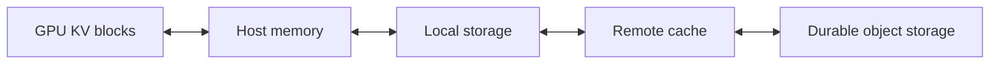
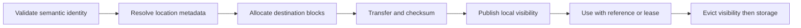

# 15. Hierarchical and Distributed Caching

One worker finishes processing a 40,000-token document. Ten minutes later,
another request asks a new question about the same document—but the router
sends it to a different worker. The first worker has the useful KV state. The
second has free capacity. The first worker's cache cannot help the second, and
the second's idle compute cannot help the request except by redoing work that
was already done correctly somewhere else.

A local prefix cache cannot satisfy both goals. A distributed cache makes state
visible beyond one GPU, but turns reuse into a placement, transfer, and
consistency problem. The cache stops being a data structure and becomes a
small distributed system with its own failure modes — which is why this
chapter spends more time on publication protocols and invalidation than on
hit rates.

## Visual map

**A hierarchical cache trades increasing capacity for increasing access cost.**



**A remote hit becomes usable only after an ordered publication protocol.**
Every arrow below can fail or be cancelled independently; the protocol's job
is to make sure each failure leaves the system in the state the step before it
would have left.



| Tier | Capacity | Access shape | Best candidate |
| --- | --- | --- | --- |
| GPU | smallest | direct attention reads | active and hottest prefixes |
| Host memory | larger | device transfer | recently evicted state |
| Local storage | larger still | bulk sequential load | warm deployment-local state |
| Remote cache | shared | network transfer and metadata | reused state across replicas |
| Durable storage | largest | high latency | artifacts worth reconstructing later |

## Recompute, retain, or transfer

Every reusable state object presents three choices. The service can discard and
recompute it, keep it near the producer, or move it to a tier where another
consumer can retrieve it.

The decision depends on four quantities:

```text
expected reuse value
- storage cost
- transfer cost
- management and failure cost
```

The three costs are computable for real state, and they are not close.
Recompute price comes straight from Chapter 4's constant: at 0.06 ms per
token, recomputing a 40,000-token document costs 2.4 seconds of GPU time.
Transfer price uses Chapter 14's KV link: the document's 40,000 × 320 KiB =
12.2 GiB move in about 555 ms at 22 GiB/s. Retention price is the tier's
capacity times how long the state waits — 12.2 GiB parked in host memory is
memory that cannot back active sequences. So for long documents the ordering
is stable across any plausible reuse probability: transfer beats recompute by
4×, and both beat losing the state. For short prefixes the ordering flips —
a 500-token prefix costs 30 ms to recompute, and moving its 156 MiB buys
nothing unless another request arrives before it would have been evicted
anyway.

Popularity and reuse delay matter because a valuable object held too far
in advance displaces other state. Expected value is reuse probability times
recompute savings, discounted by how late the reuse arrives — the same shape
as any caching economics, applied to tensors instead of pages.

The three prices side by side, using the constants above:

| Prefix | Recompute | Transfer at 22 GiB/s | Verdict |
| --- | --- | --- | --- |
| 500 tokens | 30 ms | 156 MiB ≈ 7 ms + setup | recompute unless hits are certain |
| 6,000 tokens | 360 ms | 1.83 GiB ≈ 85 ms + setup | transfer pays on second use |
| 40,000 tokens | 2.4 s | 12.2 GiB ≈ 555 ms | always retain something |

The middle row is Chapter 14's boundary seen from the cache's side of the
glass, and the setup term matters more than the byte count for small state:
a 156 MiB transfer spends 12 ms of its 19 ms on setup, so tiny prefixes
travel badly no matter how fast the link is.

## A cache can have several tiers

A practical hierarchy might include GPU memory, host memory, local NVMe, and a
remote memory or storage service. The fastest tier holds active request state
and the hottest reusable blocks. Lower tiers trade access time for capacity.

Promotion moves a block toward the GPU when reuse becomes likely. Demotion or
write-back preserves an evicted block in a lower tier. Prefetch begins a load
before the request reaches execution. A write-through policy backs up state as
it is created; write-back waits until eviction or another trigger.

Each policy moves bytes at a different time. Write-through adds traffic to the
foreground path but leaves a ready copy. Write-back avoids copying cold state
and may delay eviction. Prefetch hides latency when prediction is correct and
wastes bandwidth when it is not.

| Policy | Bytes move | Foreground cost | Dominant failure |
| --- | --- | --- | --- |
| write-through | at creation | copy competes with steps | backup slower than production |
| write-back | at eviction trigger | eviction latency spikes | pressure arrives before staging |
| prefetch | on prediction | wasted bandwidth on misses | late or orphaned loads |

The rows expose the real constraint: all three policies spend the same
bandwidth pool, so the choice is not whether to pay but when — and "when"
determines which failure mode you must engineer cleanup for.

At the pinned SGLang revision,
[`hiradix_cache.py`](https://github.com/sgl-project/sglang/blob/e161bd1265a0082478b7f1c09f224a52d315dc71/python/sglang/srt/mem_cache/hiradix_cache.py)
implements host and storage coordination, prefetch, backup, write policies, and
eviction around the radix index. vLLM exposes a connector and offloading model
with scheduling, events, metrics, and workers under its
[`offloading` package](https://github.com/vllm-project/vllm/tree/5cecfc01375052698823fc401e31518fb32a981e/vllm/distributed/kv_transfer/kv_connector/v1/offloading).

The implementations differ, but both show that an external cache is an
asynchronous subsystem rather than a larger dictionary.

### Two tier implementations

SGLang's `HiRadixCache` extends the ordinary radix cache with a second pool:
at construction it builds `token_to_kv_pool_host`, sized from the server's
`hicache_ratio` and `hicache_size` settings relative to the GPU pool. The
constructor is also a reminder that cache tiers inherit every layout question:
each attention-pool type gets its own host-pool class — MHA, MLA with its own
DCP rank parameters, DSA and sparse variants filled in by later attachment —
and anything else fails fast with "HiRadixCache only supports MHA, MLA, DSA,
and MSA models." Every
demotion and promotion then becomes a copy between two allocators the cache
owns, tracked per node. Which direction moves bytes when decides the policy
name: in `write_through` mode, `write_backup` copies a finished node to host
as part of normal operation and eviction just drops the GPU copy of anything
already marked `backuped`; the `_evict_write_through` docstring states the
invariant plainly — "drop non-backuped leaves, demote already-backuped ones.
Nothing is staged to host during eviction." In `write_back` mode eviction
itself does the staging, and the code carries a warning worth heeding:
"note this path will be deprecated in the future."

Eviction walks a heap of `evictable_leaves` ordered by the strategy's
priority, skips any node with `lock_ref > 0` — in-use prefixes simply do not
evict — and calls `_promote_parent` afterward: once all of a node's children
are evicted, the parent becomes the new device leaf, so the shared prefix
above survives even as divergent continuations fall away. That is the radix
structure paying rent: popular stems stay, unpopular branches go.

Prefetch has its own guardrails. The storage backend parses a
`prefetch_threshold` and a timeout policy, checked through a linear function
(`is_prefetch_timeout`), with a configurable stop policy — the system treats
"a prefetch that never completes" as an expected state with cleanup, not an
exception.

vLLM's offloading model reaches the same shape through the connector
interface of Chapter 14. In
[`offloading/common.py`](https://github.com/vllm-project/vllm/blob/5cecfc01375052698823fc401e31518fb32a981e/vllm/distributed/kv_transfer/kv_connector/v1/offloading/common.py),
a `TransferJob` bundles `req_id` with a source and destination `LoadStoreSpec`
and is "keyed by scheduler-assigned job ID. The worker reports the job ID back
when the transfer finishes." Loads and stores accumulate separate
`DirectionalTransferStats` — bytes, time, and a per-transfer `sizes` list —
so dashboards can see that stores trickle in small blocks while loads arrive
in large ones. The metadata also carries a `jobs_to_flush` set — the
scheduler's explicit cleanup list for jobs cancelled before completion, the
same orphaned-work problem SGLang's prefetch timeouts solve, expressed as a
set of IDs instead of a timer.

## Identity must cross machines

The local identity rules from Chapter 7 still apply: model version, exact token
IDs, positions, adapter, media, cache layout, and namespace all affect whether
state is reusable.

A distributed cache adds representation questions. Do all consumers use the
same block size, dtype, layer layout, tensor-parallel size, and rank mapping? If
not, a connector must transform the state or declare the route incompatible.
A pool running TP=8 produces shards that a TP=4 consumer cannot place without
either resharding logic or a hard refusal — and refusal is the cheaper
correctness story, because resharding silently couples the cache to the model's
attention implementation.

Use content-derived identities or trusted metadata with collision checks. A
directory entry should not become visible until the complete state is durable
enough for its advertised tier. Partial writes and stale locations must fail
closed: recomputation is safer than consuming incorrect KV state. An incorrect
cache hit is worse than a miss in a way ordinary caches rarely are — the
output is fluent text that is quietly wrong about the document. Each identity
field exists because omitting it has a specific failure: drop the adapter ID
and a LoRA-tuned request reads another tenant's base-model state; drop the
position scheme and attention sees correct values at wrong offsets; drop the
TP size and shards simply do not line up; drop the dtype and dequantized
values shift under every query. None of these fail loudly — which is exactly
why the key must carry them rather than the lookup hoping.

Model updates provide a clean invalidation boundary. Include the weight version
in the namespace instead of attempting to inspect whether a change happens to
leave cached values equal. Comparing outputs is expensive and inconclusive;
versioning the key is cheap and decisive.

## Metadata and data take different paths

A cache directory answers where a prefix or block can be found. The bulk data
path moves the tensor state. Keeping them separate allows small metadata updates
to propagate without routing large buffers through the control service.

Events can announce block creation, removal, or movement. Consumers need a way
to handle delayed or reordered events. A location advertised moments ago may
already be evicted. Treat directory results as hints until the source confirms
and pins the data — concretely: the entry carries a version and the source's
answer to "do you still hold this" is the only thing that converts the hint
into a transfer. Chapter 20 meets the same problem from the other side, where
stale events must be discarded by generation counter rather than trusted.

The request lifecycle can look like this:

```text
lookup -> choose source -> reserve destination -> transfer -> validate
       -> publish local mapping -> execute -> release transfer pins
```

Cancellation at each stage needs cleanup. A timed-out prefetch must release
destination buffers and source references even if its completion arrives late.
Late completions are the dangerous case precisely because they arrive after
everyone stopped waiting: the cleanup must be driven by timeouts and
generation counters, not by the arrival of the event that would have made
cleanup easy.

### Completion is a distributed fact

Both pinned implementations refuse to let one rank decide that a tier
operation finished, and both pay for the agreement in different currencies.

SGLang's `writing_check` counts ready write acknowledgments and then
all-reduces the count across the cache group with `ReduceOp.MIN` — the write
is considered progressed only up to what the slowest rank has confirmed.
Completions drain in acknowledgment-queue order (`ack_write_queue.pop(0)`),
so the MIN bound doubles as a safety rule: no rank processes an
acknowledgment its peers have not also counted. The
comment explains why every rank must enter the collective unconditionally:
"`ongoing_write_through` can diverge across ranks (e.g. write_backup
returning 0 on a subset under host memory pressure), so a conditional skip
desyncs the NCCL op sequence and deadlocks under TP > 1." This is the same
lesson Chapter 13's EPLB dummy steps taught: participation in collectives is
part of correctness, independent of whether this rank has work. On the load
path, `loading_check` pairs each completed load-back with
`dec_lock_ref(end_node)` — the pin taken when the transfer started is
released exactly when the data is confirmed, which is the lease lifetime in
code.

vLLM's offloading connector counts workers instead of reducing counts. Its
`OffloadingWorkerMetadata` docstring specifies the rule: "The scheduler
accumulates across steps and processes a transfer completion only when count
reaches num_workers." A job ID is reported `{job_id: 1}` by each finishing
worker, aggregates sum across a step, and only a unanimous tally retires the
job. Different mechanism, same semantics: a cache operation is done when
every rank that owns a piece says so, and the bookkeeping exists to make
partial completion visible rather than silent.

## Cache-aware routing creates a trade-off

If one replica has a 30,000-token prefix and another is idle, which should serve
the request? Sending it to the warm replica avoids prefill and may increase
queueing. Sending it to the idle replica balances load and repeats compute.

The router should compare estimated saved work with queue and transfer cost. A
static preference for the largest prefix can create a hotspot around popular
state. The comparison has a natural unit — milliseconds of expected latency —
and both sides convert: saved prefill from Chapter 4's service model,
queueing delay from observed queue depth times recent service time per
request.

Put numbers on the opening scenario. A 30,000-token prefix saves
0.035 × 30,000 = 1,050 ms of prefill plus its 20 ms constant — call it
1,070 ms. The warm replica wins while its predicted queue delay stays under
1,070 ms, which sounds generous until the third concurrent request about the
same document arrives: each queued request behind one 230 ms-class prefill
adds hundreds of milliseconds, and the idle replica's full 1,070 ms recompute
starts looking cheap. The crossover is one or two concurrent requests, not
ten — which is why the comparison must run per request against live queue
depth, not per prefix against a static table.

The [Preble paper](https://arxiv.org/abs/2407.00023) studies distributed prompt
scheduling that balances prefix reuse, load, and fairness. Its central tension
is durable even as routing algorithms evolve: locality is valuable until the
queue it creates costs more than recomputation.

Popular prefixes may be replicated deliberately. Replication uses more cache
capacity and allows several replicas to share traffic. The control plane should
measure demand before copying and remove replicas when popularity fades —
replication decisions deserve the same amortization arithmetic as EPLB's
weight movement in Chapter 13, with cache bytes standing in for expert
weights.

## Security changes the cache key and policy

Shared state can leak information through content, timing, or existence. A
tenant may infer that another tenant used a prefix by observing a faster
response. Adapters or private documents can place sensitive information in KV
state even if token strings are not stored beside it.

Use namespaces and access checks at lookup and transfer time. Encrypt or protect
remote tiers according to the data policy. Define retention and deletion for
cached state, not only original prompts. Consider whether cross-tenant sharing
is permitted at all.

Randomized cache salts reduce accidental or adversarial cross-request matches,
but they do not replace authorization. The safest reuse boundary is often one
tenant, model version, and policy domain.

The timing channel deserves a concrete statement, because it survives every
content-level defense. A cache hit on a shared prefix removes hundreds of
milliseconds of prefill; the response arrives measurably earlier. A tenant
that can propose prompts differing only in whether another tenant's document
is prefixed can read the hit-or-miss timing like a side channel and confirm
— token by token — whether specific text exists in the shared cache.
Existence leaks even when content never moves. Namespace isolation at lookup
time is what closes it, which is why the check belongs in the cache itself
rather than only at the API boundary.

## Measure useful caching

A cache dashboard should go beyond hit rate. Track matched tokens, prefill time
avoided, bytes retained by tier, bytes promoted and demoted, failed or cancelled
transfers, lookup latency, eviction churn, and request latency after hits and
misses.

Calculate saved compute per byte stored and per byte transferred. A high hit
rate on tiny prefixes can be less useful than rare reuse of a very expensive
document. Include queueing on the warm replica when evaluating the benefit.
The pinned implementations make this concrete: SGLang records backup and
load-back byte and token counters plus duration histograms per operation, and
vLLM's directional stats keep load and store separately — both designs
distinguish the expensive direction from the cheap one, because a cache that
spends 70 ms storing everything to save 110 ms once looks very different from
one that spends 70 ms to save 110 ms fifty times. Lookup latency belongs on
the same dashboard with its tail visible: a directory that answers in single
milliseconds most of the time but stalls for seconds under load converts the
cache from latency saver into latency risk exactly when traffic is heaviest.

Each metric earns its place by deciding something:

| Metric | Decision it informs |
| --- | --- |
| prefill time avoided per hit | whether the tier earns its capacity |
| bytes promoted and demoted | whether policies churn more than they save |
| failed or cancelled transfers | whether the hint path is lying about liveness |
| eviction churn by tier | whether thresholds are set against real reuse delays |
| latency after hits vs misses | whether hits actually help once queueing is counted |

## Worked example: a hit worth 110 ms

A 1-GiB prefix avoids 180 ms of prefill and takes 70 ms to load. Its gross
saving is 110 ms before queueing and the opportunity cost of destination GPU
memory. That value exists only if the prefix identity includes model, tokenizer,
adapter, tenant namespace, token positions, and state format.

Walk the publication order and its failure points. GPU A seals the blocks —
until sealed, nothing downstream may observe them. The host backup takes a
read reference, copies, and publishes its location only after a checksum and
generation match succeed; the directory entry that follows is a hint, not a
promise. GPU B resolves the hint, obtains a lease, revalidates identity,
reserves destination blocks, transfers, verifies, and only then inserts the
blocks into its local index. If B cancels mid-transfer, the reservation dies
unpublished and releases on the abort event — no other reader ever saw it.
If B's lookup times out instead, the outcome is a miss and a recompute, never
an indefinite wait on a maybe.

Net the saving honestly: 180 − 70 = 110 ms assumes the destination had the
blocks free and the source pinned them without displacing hotter state. Price
the opportunity cost by what else 1 GiB of destination GPU memory would hold —
about 3,300 tokens' worth of active KV at 320 KiB per token — and subtract the
queueing added on whichever replica absorbs the hit traffic. Amortization is
what makes the trade clearly good: the 70 ms load cost recurs per consumer,
but the 180 ms saving recurs per request, and a document queried ten times
returns roughly 1.1 seconds of prefill for 70 ms of load plus the storage
footprint. The same arithmetic run at hit count two is already positive; the
failure case is the document asked about exactly once, where the service paid
70 ms and a gigabyte of retention to save nothing. Invalidation runs
the same ladder downward: remove lookup visibility first, let existing readers
finish through their references and leases, and physically delete only when
the last reference drops.

## Practice: write the state machine

Trace that 1-GiB prefix from GPU A through host backup, remote metadata, transfer
to GPU B, and invalidation. At each transition, record identity, owner,
reference or lease, checksum, timeout, and failure response.

Calculate net saved latency and saved compute per byte stored and transferred.
Mark every point where completion requires agreement across ranks and say
which mechanism (MIN-reduce, worker-count, or single-owner publish) you rely
on. If any transition delegates correctness to “the cache,” refine it. The
worked
lifecycle is in [Appendix G](../appendices/g-worked-solutions.md#15-distributed-prefix-lifecycle).

A distributed cache provides locality information to the control plane. The
next chapter considers how that plane routes and scales the service as a whole.
