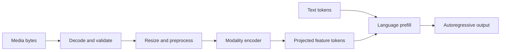
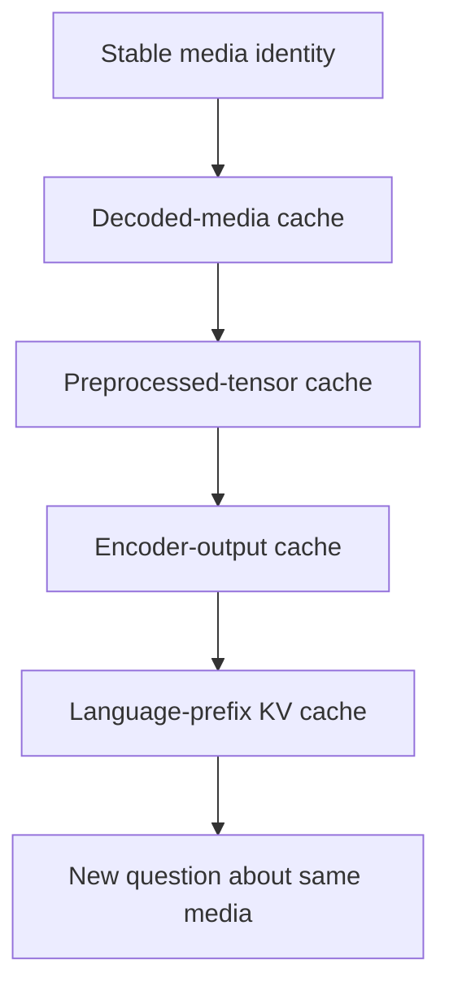
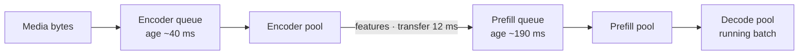

# 17. Multimodal and Encoder-Heavy Serving

A user uploads a 20-second video and asks one short question. The language model
may generate only ten tokens, yet the request can be far more expensive than a
long text prompt. Before the first output token appears, the service must fetch
and validate the media, decode it, sample frames, resize them, run a vision
encoder, project the results into the language model's representation, and merge
them with the text prompt under a template that both sides agree on. Each stage
has its own hardware profile, its own queue, and its own notion of identity.

If you measure only language decode, you miss most of the request. A serving
system that treats "the prompt" as an opaque token array will discover the
pipeline the hard way: CPU saturation from video decoding, an accelerator idle
while encoders wait behind preprocessing, and cache hits that never happen
because two stages disagree about what makes two pieces of media "the same."

## Visual map

**A multimodal request is a pipeline before language decoding begins.**



**Reuse can occur at several boundaries with different identity rules.**



| Reuse boundary | Saves | Version identity must include | Typical size |
| --- | --- | --- | --- |
| decoded media | codec work | content and decoder policy | pixels or samples |
| preprocessed tensor | resize and normalization | preprocessing configuration | dense input tensor |
| encoder output | encoder queue and compute | encoder and projection weights | feature sequence |
| language KV | language prefill | full token and model semantics | per-layer attention state |

## Media begins as untrusted bytes

Images, audio, video, and documents arrive in formats optimized for storage and
transport. Their decoded representation can be much larger: a few megabytes of
compressed video may expand into hundreds of full-resolution frames, and a
document upload may contain many high-resolution pages. Expansion is the attack
surface as well as the cost. Decompression bombs, malformed codec streams, and
metadata that lies about dimensions all present themselves as ordinary requests.

The frontend should validate type, byte size, dimensions, duration, frame count,
and decompression limits before expensive work begins — ideally before the bytes
are fully buffered, since a validation failure should never have paid for a
decode. Fetching remote media needs timeouts, address restrictions, and a policy
for redirects, because a URL field is otherwise a tool for making your cluster
fetch arbitrary network content. Media parsers and codecs belong inside the
service's security boundary, not in the API server process.

Preprocessing then converts the input into the exact form expected by the model:
resizing, normalization, frame sampling, audio resampling, or document layout
processing. These choices affect model output — two frames sampled from the same
video at different rates produce different answers — so processor version is part
of the execution identity and every downstream cache key. Chapter 6's execution
request concept extends naturally: the identity of a multimodal execution request
includes the preprocessing configuration that produced its tensors.

### Where the decode actually happens

Frame sampling looks like a preprocessing detail and is often the single
largest cost multiplier in the pipeline. Take the chapter's opening request:
a 20-second video at 30 frames per second contains 600 frames, but a typical
vision-language configuration samples one to two frames per second — call it
20 frames consumed. A naive pipeline decodes *all* 600 frames and discards
580: thirty times the necessary codec work, paid on the CPU, before the
encoder sees anything. Seek-based sampling instead jumps directly to each
sampled timestamp — except codecs do not store arbitrary frames; decoders
must start from the previous keyframe, so the cost of sampling timestamp t
depends on how far t sits from keyframe boundaries in the container's group
of pictures. Two videos of identical duration and resolution can differ by
several times in decode cost purely through keyframe spacing — an identity-
irrelevant property that never appears in any cache key yet dominates the
stage the decoded-media tier is supposed to save. Practical services respond
by keeping decode off the accelerator entirely, bounding concurrent decodes,
and treating decode throughput as a first-class capacity number rather than
an implementation accident.

## The encoder is a separate workload

A vision or audio encoder usually processes many positions in parallel. Its
shapes depend on resolution, patch count, frame count, or audio duration rather
than on a token count chosen by the caller. It may be compute-heavy while
language decode is memory-bound — the opposite hardware profile — which is why
co-locating them on one GPU works at low load and fights itself at high load.

The output is a tensor of media features. A projection layer maps those features
to the language model's representation, and placeholder positions tell the
language model where they belong:

```text
media -> decode and normalize -> encoder -> projected features
                                                   |
text -> template -> tokenizer ---------------------+
                                                   v
                                     language prefill -> decode
```

The placeholder and feature lengths must agree. Truncating a text prompt can
accidentally remove media positions — the placeholders live in the token stream,
so a length-based truncation written for text silently corrupts multimodal
requests by cutting feature anchors while leaving the features themselves intact
and unused. Batching requests with different numbers of images or frames requires
ragged metadata: per-request lists of grid shapes, feature lengths, and offsets.
These are correctness concerns, not only tensor-shape concerns — a mismatched
length usually produces plausible garbage rather than an error.

The feature length itself is computed, not read off the request: images derive
it from their patch grid after any token-merging the model applies, audio from
sample counts and stride, video from frames times per-frame grids. That derived
length must travel with the features as *metadata* — grid shapes, per-modality
feature lengths, original image sizes — because the language worker's job at
merge time is to splice feature tensors into placeholder positions inside the
token stream, and it can only do that if the geometry arrives alongside the
bytes. SGLang's receiver carries exactly this cargo per part (`img_grid_thw`,
`video_grid_thw`, `audio_feature_lens`, plus model-specific video attributes)
and reassembles it when parts complete; vLLM's connector keys saved tensors by
`mm_hash` for the same reason. A feature tensor without its geometry is not a
cacheable object at all — it cannot be placed in a prompt.

## Batch compatible encoder work

Encoders benefit from batching, but compatible shapes matter more than batch
size. Padding every image to the largest resolution in a batch repeats Chapter
13's capacity-padding trap in a sharper form, because vision patch grids scale
with area: an image with twice the side length of another occupies four times
the patches. Pad three quarter-resolution images up to one full-resolution
neighbor and you pay roughly four times their necessary encoder compute for the
privilege of batching them — a loss no reasonable batch-size win repays.

Bucketing by resolution, aspect ratio, frame count, or audio length improves
efficiency while adding queueing delay: an image that could run now waits for
company in its bucket. The right window depends on the endpoint. An offline
document-indexing job can hold a bucket for a couple of hundred milliseconds to
fill a large batch — assume its TTFT budget is minutes, not milliseconds. An
interactive visual question should not wait long for another image of the same
size — its user is watching, and against this chapter's 465 ms worked trace,
even a 50 ms bucket wait is a tenth of the entire budget.

### Padding is the same trap twice

The mechanism deserves the comparison spelled out. In MoE dispatch, padding to
capacity wasted FLOPs on expert slots that computed nothing. In encoder
batching, padding to max shape wastes FLOPs on *real* transformer work over
empty patches — worse, because the padded compute is numerically meaningful and
therefore cannot be skipped by clever kernels; masked attention over pad patches
still costs memory traffic. And there is a second layer: ragged batches also pad
in the *time* dimension when a scheduler holds a fast request for a slow bucket
mate, which is latency padding — invisible in throughput dashboards and fully
visible in TTFT percentiles. Both paddings respond to the same medicine:
schedule compatible work together and incompatible work immediately, and let
the bucket boundaries come from measured shape distributions rather than
round-number defaults. Measure preprocessing and encoder queueing separately
either way — a busy CPU decoder can starve an otherwise idle accelerator, and
moving transforms onto the GPU trades that starvation for contention with model
execution plus extra copies across the PCIe boundary.

## Encoder outputs can be reused

Users often ask several questions about the same image, document, or video.
Reusing encoder features avoids repeated media work, and the cache key must
include content, preprocessing configuration, encoder and projection weights,
precision, and any model-specific placeholder layout. Miss any term and two
different computations collide under one key; include redundant terms and hit
rates collapse. Caching processed bytes alone saves decoding. Caching encoder
outputs saves more compute and consumes more space. Caching language KV state
after the first question can save still more, but may be tied to the exact
conversation template. These are distinct cache layers with different reuse
scopes — the chapter's second diagram — and they fail independently.

Treat privacy carefully. Encoder features can reveal information about the
original media — they are sufficient to reconstruct coarse image content in
known attacks — so the same tenant, retention, and deletion policy used for
source content must reach into every tier that derived from it.

The tiers also have a natural eviction order, and it is worth making explicit.
Encoder outputs are the largest per-item objects and the most narrowly valid —
bound to encoder weights, projection weights, precision, and preprocessing
version — so they should evict first among the reusable tiers. Decoded pixels
are smaller and survive model upgrades: a new vision tower still consumes the
same decoded frame, so the pixel tier outlives every weight-dependent tier
above it. Language KV sits under Chapter 15's policies entirely. A model-version
bump therefore cascades *upward* through the diagram: KV entries die, encoder
outputs die, preprocessed tensors die if normalization changed, decoded pixels
survive. Deploying that cascade as one invalidation event — rather than letting
stale tiers answer under new versions — is Chapter 15's identity discipline
applied to one more cache family.

### Inside SGLang's encoder cache

SGLang's disaggregated encode path implements exactly this tier, and reading it
at the pinned SHA shows how many distributed-systems problems hide inside "just
cache the features." The encoder lives in
[`encode_server.py`](https://github.com/sgl-project/sglang/blob/e161bd1265a0082478b7f1c09f224a52d315dc71/python/sglang/srt/disaggregation/encode_server.py),
and its `encode_with_global_cache` runs each request through a three-outcome
per-item pipeline: items either **hit** the global cache, **miss** and encode
now, or **fall back** — nominally hits whose prefetched data failed to arrive,
re-encoded rather than awaited. The fallback path exists because a hit is a
claim about remote state, and claims need deadlines: `_wait_global_cache_prefetch`
waits on `check_prefetch_progress` under a 60-second timeout, and any item still
absent goes to `fallback_indices` with the log line "cache-hit items failed to
load, falling back to ViT." A cache that trusts its own hit mask hangs requests.

Identity has teeth here. Hashes are computed per *grid* entry — one per encoder
grid cell — and the comment on the length check explains why: "a leaf-space list
would size-mismatch rank>0's mask (zeros(num_items)) and deadlock TP." Rank 0
computes hashes and queries `batch_is_exist`; every other rank allocates a zero
mask and joins the broadcast anyway, because the lookup result crosses the TP
group as a collective and a rank that skips it desyncs the op sequence — the
same participation-as-correctness principle as Chapter 13's dummy steps and
Chapter 15's MIN-all-reduce. Note also who writes: only rank 0 stores to the
pool and assembles the response embedding; other ranks return `(0, 0, 0, None,
None)`. Single-writer avoids N copies of the same insert racing through the
pool.

The final ordering is the surprising one: cache *insertion* happens after the
response is assembled, in a fire-and-forget task — `store_to_pool_async` hands
back device-to-host handles, and `_launch_global_cache_insert` waits on them in
`asyncio.to_thread` inside `_background_insert`. The request never pays for its
own cache write; a following request does. If the process dies between response
and insert, the recompute simply happens again — an acceptable loss priced
against putting a D2H copy on the interactive path.

## Separate encoder, prefill, and decode when it pays

An encoder-heavy service can place media encoders in their own worker pool. The
pool batches media efficiently and sends features to language-prefill workers;
decode runs in a third pool. This E/P/D topology allows independent scaling and
hardware selection — encoders want compute, prefill wants bandwidth, decode
wants capacity — and isolates each stage's queue from the others' bursts. The
pools scale to different drivers, too: encoder load tracks media volume and is
indifferent to how many questions get asked about each item, language load
tracks template-plus-question-plus-feature tokens, and the decode pool tracks
concurrent output streams. One 20-second upload might feed ten follow-up
questions; sizing all three pools as one fleet guarantees two of them are wrong
at any given time. Chapter 14's coupled-queue arithmetic applies unchanged —
estimate per-stage service time and arrival rate, then size downstream pools so
upstream output never accumulates faster than it drains.

The boundary adds a queue and a transfer, so it wins conditionally. Short,
uncached media may be faster colocated; long videos or repeated questions
benefit from separation. Route based on estimated encoder time, feature size,
cache state, and current queueing — the same hybrid-score reasoning as Chapter
16, with one more term.

vLLM documents its disaggregated-encoder design (release-dependent:
[docs.vllm.ai](https://docs.vllm.ai/en/stable/features/disagg_encoder/)) around
independent scaling, TTFT isolation, and cross-process reuse. In the pinned
source, the connector abstraction lives in
[`ec_connector/base.py`](https://github.com/vllm-project/vllm/blob/5cecfc01375052698823fc401e31518fb32a981e/vllm/distributed/ec_transfer/ec_connector/base.py),
split into scheduler-side primitives (`check_caches_exist`,
`update_state_after_alloc`) and worker-side ones (`start_load_caches` — "called
before `_gather_mm_embeddings`" — plus `save_caches` and `get_finished`). SGLang's
side of the boundary — the encode servers, receivers, and bootstrap registry —
lives in the same [`disaggregation`](https://github.com/sgl-project/sglang/tree/e161bd1265a0082478b7f1c09f224a52d315dc71/python/sglang/srt/disaggregation)
package as the KV path from Chapter 14.

### The deferral contract

What actually happens when features have not arrived yet? Both systems answer
with a *deferred request*, not a blocked thread. vLLM's `ensure_cache_available`
returns a boolean with the docstring "False if any items are still in transit
(request should be deferred)" — the scheduler simply declines to schedule the
request this step and tries again, exactly the posture of Chapter 12's waiting
queue, with feature arrival playing the role of KV load completion.

SGLang's receiver makes completeness explicit. Features arrive as parts —
`calculate_modality_num_parts` splits a mixed-modality request across encoders
by assignment counts — and `MultiModalEmbeddingData.ready` is `sum(ready_list)
== num_parts`: a request is schedulable only when every part has landed, from
whichever encoder held it. Parts carry suffixed identities (`_local_part_N`)
and the receiver drops arrivals whose original id does not match, warning about
"ZMQ port reuse" — a stale part from a previous incarnation of the connection
would otherwise satisfy someone else's `ready`. Fan-out is explicit too: the
receiver registers `receive_count=self.tp_size`, because every TP rank of the
language worker needs the features before prefill can begin. The E/P/D
boundary, in other words, is not just a network hop; it is a distributed
agreement problem about when a request's inputs exist, solved with the same
tools as everywhere else in Part III — counted completions, stable identities,
and defensive drops. Even pool membership is explicit: SGLang's encode path
runs a bootstrap server where encoder workers *register* their URLs and a health
loop probes them, so language workers discover encoders through the same
join/leave/health protocol Chapter 16 requires of any replica — an encoder that
stops answering probes is routed around before requests pile up behind it.



Each pool's queue ages differently — encoder queues fill with megabytes and
drain in tens of milliseconds, prefill queues with token budgets — which is why
the pools scale independently and why a single fleet-wide utilization number
cannot tell you which one is falling behind.

## Not every encoder leads to generation

Embedding, classification, reranking, and reward endpoints produce a complete
output after one model pass — no decode loop, no KV cache to manage, a genuinely
different serving regime despite sharing the encoder machinery. Their main
questions are dynamic batching, padding, pooling, output normalization, and
latency limits.

Reranking shows the regime's characteristic hazard: one query paired with
hundreds of documents. Flatten pairs into a batch and scores must return to the
correct request-and-document order; let one wide query-document pair dominate
the batch and everyone else's latency follows the largest pair. Limit work per
request and restore order by carrying indices through the batch, not by
trusting arrival order.

| Endpoint | Output contract | Characteristic scheduling hazard |
| --- | --- | --- |
| embedding | one vector per input, normalization defined | truncation semantics silently change vectors |
| classification | label or distribution per input | class imbalance skews batch composition |
| rerank | score per (query, document) pair | one wide pair dominates; order must survive batching |
| reward | scalar per candidate or per token | token-level outputs need alignment back to generation |

Embedding APIs need a precise normalization and truncation contract — whether
"truncate" means dropping tokens from the right or pooling early changes
downstream similarity values. Reward models may return one scalar per candidate
or token-level values. Using a generation-oriented output path without defining
these semantics creates subtle compatibility errors that surface only when a
client switches providers.

## Worked example: which cache tier matters?

An image request spends 35 ms receiving and fetching, 28 ms decoding and
preprocessing, 40 ms in the encoder queue, 115 ms in the vision encoder, 12 ms
transferring features, 190 ms in language queue and prefill, and 45 ms to the
first token. The stages sum in order: 35 + 28 = 63, + 40 = 103, + 115 = 218,
+ 12 = 230, + 190 = 420, + 45 = 465 ms of TTFT.

Walk the tiers against that trace. A processed-image cache saves only the 28 ms
decode-and-preprocess stage — real, but a 6 percent improvement bought with a
pixel-store infrastructure. An encoder-output cache saves preprocessing, encoder
queue, and encoder: 28 + 40 + 115 = 183 ms, taking TTFT to 465 − 183 = 282 ms —
nearly half off — at the price of retaining a larger, version-specific tensor
per image. Full language-prefix reuse would also erase most of the 190 ms
language stage, but it is legal only when the entire earlier conversation —
including the media tokens' placeholders — is an unchanged prefix of the new
request; a *different question* about the same image breaks the match at the
first new token, which is why the encoder-output tier is the one that survives
follow-up questions.

Now the second question, same image, different wording. With the encoder-output
cache warm it still fetches (35), transfers (12), queues and prefills (190),
and decodes one token (45): 35 + 12 + 190 + 45 = 282 ms — exactly the cold
trace minus the saved 183. Adding a decoded-media hit removes the fetch too:
282 − 35 = 247 ms. The identity requirements are
exactly G's list — same media identity, preprocessing configuration, model
version, feature layout — and the acceptance test is empirical: compare output
against a cache-disabled request. Any drift means an identity term was missed,
most often precision or processor version.

Disaggregation enters as a swap inside the same arithmetic: moving encoding off
the language workers replaces the 12 ms feature transfer with 35 ms but removes
an 80 ms queue at the language worker, netting −57 ms — worthwhile for cached
or heavy media, and a net loss for uncached tiny images where the extra boundary
is pure overhead. The decision is per-request and scoreable, not architectural.

## Practice: profile two questions about one image

Use the timings above for the first question, then model a second question with
the same image. Compare no cache, processed-media cache, encoder-output cache,
and legal language-prefix reuse. Record identity requirements, bytes retained,
latency saved per byte, and cache-disabled output equivalence.

Then decide whether a remote encoder with 35 ms feature transfer is worthwhile
if it removes 80 ms of language-worker queue. See
[Appendix G](../appendices/g-worked-solutions.md#17-multimodal-first-output-path).

The exercise makes the chapter's main point visible: multimodal inference is a
pipeline of independently schedulable work. Chapter 18 examines another
pipeline whose expensive stage repeats over time—diffusion generation.
