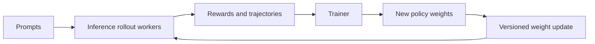
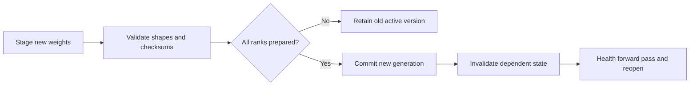

# 19. Inference for Reinforcement Learning

In online reinforcement learning for language models, inference does not serve
an end user. It generates experience for a trainer.

The policy model produces one or more responses for each prompt. A reward or
verifier scores them. The trainer updates the policy, and the new weights return
to the inference workers for another round. The loop can repeat thousands of
times, and every part of the serving system built so far in this book assumed
the opposite of its defining property: weights that never change.

```text
prompts -> rollout generation -> reward -> training update
   ^                                      |
   +----------- new policy weights -------+
```

This workload changes the engine's lifecycle. Model weights are no longer
immutable for the duration of the service. Caches derived from them, graphs
compiled for them, and KV state produced by them all acquire version
dependencies that a text service never had to express.

## Visual map

**Online reinforcement learning couples serving and training through versions.**



**A multi-rank update prepares everywhere before it commits anywhere.**



| Coupled resource | Inference symptom | Training consequence | Control |
| --- | --- | --- | --- |
| accelerator memory | KV competes with optimizer or weights | smaller training batch | sleep and explicit ownership |
| policy version | mixed or stale rollouts | biased update | version on every artifact |
| rollout queue | unbounded generation | policy lag | lag and byte admission limits |
| numerical path | log-probability mismatch | unstable ratios | reproducible token metadata |

## Rollouts arrive in groups and waves

Training algorithms often request several completions for the same prompt.
Their shared prefix creates a strong cache opportunity — and it is the one
kind of reuse this book has described that arrives *pre-packaged*: a group of
8 samples shares the entire prompt prefill, so the first sample's prefill pays
once and seven more ride the cached prefix. Chapter 15's prefix machinery does
the rest. Output lengths can be highly variable, especially for reasoning
tasks. A group may not be ready for training until enough valid samples finish.

Rollout traffic also has a failure-domain property worth exploiting: a lost
trajectory loses only its own compute, never a user's request. That makes
rollout workers good candidates for preemptible or bid-priced capacity — with
one caveat. Losing a worker mid-rollout wastes its in-flight decode *and* its
share of the group prefill unless trajectories checkpoint; whether spot
capacity wins depends on reclaim frequency against the 171-second straggler
arithmetic below, which is a measurable trade, not a slogan.

The scheduling consequence is brutal arithmetic. Take a group of 8 samples
sharing one prompt: seven finish at 200 output tokens, one reasoning chain runs
to 4,000. At the Atlas decode step of 45 ms, the straggler needs
3,800 × 45 ms ≈ 171 s more; for nearly three minutes, seven batch slots hold
finished trajectories that training cannot use. The longest rollout holds up a
synchronous batch while most workers become idle — not occasionally, but
structurally, because reasoning-task length distributions are heavy-tailed by
design.

Partial-rollout protocols exist for exactly this. The orchestrator can cancel,
pause, or accept a subset according to the algorithm — some trainers learn
fine from 7-of-8 groups, others require the complete set, and the serving
layer must not decide on their behalf. The inference engine must report which
policy version and sampling configuration produced every trajectory either way.

Scheduler fairness also changes. Advancing a nearly complete prompt group may
unblock the trainer sooner than serving equal tokens across all groups —
shortest-remaining-group-first, in effect. The right policy depends on the
training algorithm's data dependencies, which is why the queue's ordering key
should be group identity, not request arrival.

### Bounding the loop with Little's law

The rollout queue needs admission control like any queue in Part III, but the
binding constraint is new: the trainer consumes batches at a rate the serving
system does not control. Suppose rollouts complete one training batch every
60 s while the trainer needs 90 s per update. The mismatch accumulates — after
three rounds, completed-but-untrained work represents two extra batches, and
policy lag has grown by exactly that much because every waiting batch was
generated under an older version. Appendix A's `Q = λW` reads directly: steady
queue size equals the completion surplus times the update period, so the fix
is to throttle generation λ down to the trainer's drain rate — pause admission
of new groups once queued work exceeds roughly one batch, rather than letting
finished trajectories pile up under ever-staler versions. The bound should be
expressed in both bytes (memory) and versions (staleness), because either can
be the binding constraint on a given round: a byte cap protects memory, a lag
cap protects the algorithm's assumptions, and G's guidance is explicit that
the serving layer must stop admission before trajectories grow unbounded while
never inventing the staleness rule itself.

## Colocate or disaggregate?

Training and inference can share GPUs in alternating phases. Colocation avoids
dedicated idle pools and can transfer weights locally. It also requires careful
memory handoff, and the arithmetic explains why. The Atlas policy's weights are
140 GB; the trainer's optimizer state at the usual 12 bytes per parameter of
mixed-precision Adam (fp32 master, momentum, variance) adds roughly 840 GB
across the cluster. No phase transition fits both live at once on the same
silicon — colocated operation *requires* one side to vacate first, which is
what sleep modes implement.

A disaggregated design gives training and rollout separate pools. Both can work
concurrently, but weights must cross the network and rollout data can become
stale — the policy keeps answering with version 41 while the trainer finishes
version 42. Separation also frees each pool to be the *right shape*: the
trainer wants dense compute with no KV machinery and can use different SKUs or
reliability classes than the rollout fleet, and the rollout fleet can scale to
the algorithm's sample appetite without touching trainer state at all. The
staleness budget, meanwhile, is a property of the algorithm — on-policy
objective gradients tolerate little lag, while RLHF variants with KL anchors
often train fine on mildly old policies — so the disaggregation decision is
really a joint choice with the algorithm designer about which currency
(bubble time, staleness, or network bytes) the project spends least on.

The [AReaL paper](https://arxiv.org/abs/2505.24298) studies a fully asynchronous
system where rollout workers continue generating while training workers update
the model. Its result is not permission to ignore staleness; the system and
algorithm explicitly manage it.

### The handoff timeline

Colocation's cost is the bubble around every update, so price it stage by
stage — declared assumptions throughout, since these numbers are deployment-
specific. Pause admission, then let in-flight decodes drain: up to L_out steps
at 45 ms, say 400 tokens ≈ 18 s for the unluckiest request. Sleep level 2
snapshots weights to host: moving 140 GB over a declared ~50 GB/s host link
costs roughly 3 s (and the trainer cannot start until it completes). The
trainer then runs — assume five minutes per round on the freed devices. Wake
restores or replaces weights: if the *new* policy arrives by transfer rather
than snapshot restore, 140 GB across NVLink-class links is ideal-case
`140 ÷ 450 GB/s ≈ 0.3 s`, with protocol overhead making single-digit seconds
realistic. Invalidate KV and graphs, run one health forward pass, reopen.
Total overhead lands near 30–60 s against a 300-s training step: a duty-cycle
tax of ten to twenty percent, paid every round. That tax is exactly what the
disaggregated design buys back at the price of network weight transfer and
staleness management — there is no configuration without this bill somewhere,
only different line items.

## Sleeping is memory coordination

An inference engine can temporarily release or offload weights and KV state so
a colocated trainer can use the device. Waking restores the required resources
without rebuilding the whole process and distributed environment.

Different sleep levels may retain weights in host memory, discard KV state, or
release both. The order matters during an update. Freeing KV memory before
receiving new weights can reduce peak usage. The engine should not resume
scheduling until weights and cache allocations are ready.

vLLM's official [sleep-mode documentation](https://docs.vllm.ai/en/stable/features/sleep_mode/)
(release-dependent) describes releasing model and KV memory and selectively
waking resources for RL workflows. In the pinned source the mechanism lives in
[`gpu_worker.py`](https://github.com/vllm-project/vllm/blob/5cecfc01375052698823fc401e31518fb32a981e/vllm/v1/worker/gpu_worker.py),
and it is worth reading as memory *coordination* rather than an allocator trick:

- `sleep(level)` takes a level: level 2 first snapshots every model buffer to
  host memory — `{name: buffer.cpu().clone() for name, buffer in model.named_buffers()}`
  — then calls `suspend(level)` on the sleep backend. Level 1 suspends without
  the CPU copy, trading wake fidelity for speed.
- The suspend is *verified*, not assumed: the worker records
  `free_bytes_before_sleep`, and after releasing, polls memory info until
  `freed_bytes >= 0`, asserting otherwise that "Memory usage increased after
  sleeping." A sleep that silently leaked would hand the trainer a device
  that OOMs mid-step — the check converts that from a mystery into a failure
  at the right place.
- `wake_up(tags)` restores selectively: the `"weights"` tag replays the saved
  buffers back into the live model, the `"kv_cache"` tag calls
  `post_kv_cache_wake_up()`. A trainer that only needs the KV pool back can
  ask for it without paying weight restoration.
- The draft model gets its own snapshot set (`_sleep_saved_draft_buffers`) —
  a speculative-decoding deployment sleeps and wakes both models as one unit,
  which is the kind of coupled resource a naive "free the big tensor" view
  misses entirely.

SGLang exposes comparable sleep, wake, and weight-update controls through its
engine and scheduler paths. The design point to carry forward is that sleep
levels are an API surface between two systems with different memory owners:
the trainer negotiates for capacity the way Chapter 12's scheduler negotiates
for KV blocks — explicit acquire, verified release, tagged restore.

The level choice itself prices cleanly with the handoff-timeline numbers.
Level 1 wakes by reloading weights from storage — inside Chapter 16's declared
multi-minute cold-start envelope. Level 2 pays the ~3 s host snapshot up front
and wakes by copying the same 140 GB back over the host link — seconds, not
minutes. For an RL loop that sleeps and wakes every round, level 2's snapshot
is repaid the first time wake-up happens; level 1 exists for the rarer case
where the device changes hands once and the snapshot traffic would compete
with the very trainer it is making room for.

## Weight update is a versioned transaction

A safe update has a beginning, a data phase, and a commit point.

1. Stop admitting model steps that would overlap the change.
2. Establish the transfer group and expected parameter metadata.
3. Move or refit every shard.
4. Verify completion across ranks.
5. invalidate state derived from old weights;
6. publish the new policy version and resume.

If one rank receives only part of the update, the model is not a slightly stale
version—it is a corrupt mixture. The protocol must fail closed and recover all
ranks to one version.

The new weights invalidate KV and encoder state produced by the old policy.
They may also invalidate compiled artifacts if shapes or modules changed.
Weight-only updates with an identical architecture can retain some graph
structures, but the service should prove rather than assume compatibility.

Current vLLM documentation describes a four-phase pluggable
[weight-transfer protocol](https://docs.vllm.ai/en/stable/training/weight_transfer/)
(release-dependent). SGLang's updater lives in
[`weight_updater.py`](https://github.com/sgl-project/sglang/blob/e161bd1265a0082478b7f1c09f224a52d315dc71/python/sglang/srt/model_executor/model_runner_components/weight_updater.py)
with disk, distributed, tensor, and IPC entry points. The abstract steps map
onto concrete entry points in both codebases:

| Transaction step | vLLM mechanism | SGLang mechanism |
| --- | --- | --- |
| establish group / open session | `start_weight_update` session | `init_weights_update_group` |
| move shards | engine `update_weights` chunks | disk / distributed / tensor / IPC updaters |
| declare expected tensors | `WeightSource.metadata()` | names + dtypes + shapes lists |
| verify across ranks | unmatched-call refusals, reset on error | bucket broadcast, discard-on-failure |
| guard silent corruption | — (session edges) | derived-weight and IPC-cache rejections |

The interesting difference is where each system spends its effort: vLLM makes
the *edges* impossible to skip, while SGLang makes the *silent failure modes*
impossible to enter. A production integration wants both properties, and
neither codebase pretends the other half is unnecessary — the guards exist
because sessions cannot check for cached weight splits, and sessions exist
because guards cannot order a multi-chunk transfer.

### Fail-closed in the pinned sources

Both codebases enforce the transaction's edges, in complementary ways. vLLM's
worker wraps the data phase in an explicit session: `update_weights` refuses to
run unless `start_weight_update` opened one ("start_weight_update must be
called before update_weights"), and on any exception it deactivates the session
and calls `reset_weight_update_target()` — the transfer aborts *and* forgets its
destination, so a retry cannot append to a half-written model. `finish_weight_update`
symmetrically refuses an unmatched call. On the trainer side,
[`weight_transfer/base.py`](https://github.com/vllm-project/vllm/blob/5cecfc01375052698823fc401e31518fb32a981e/vllm/distributed/weight_transfer/base.py)
defines weights as a `WeightSource` with two channels: `metadata()` declares
`(name, wire dtype, full shape)` "without transferring", and iteration yields
materialized pairs — where the docstring carries the participation rule one
more time: "Materializing is typically a collective (FSDP `full_tensor()`), so
every trainer rank must iterate the same source in the same order in lockstep,
or ranks deadlock. Under pipeline parallelism a rank may not own a parameter at
all — iterating still drives the collective and the yielded tensor is only
meaningful on the sender." Even *reading* the weight list is a collective.

SGLang's contribution is the guard list — rejections for states where an
in-place update would be *silently* wrong. The derived-weight check refuses
online updates while a fused-GEMM optimization "caches the fp32 weight split;
in-place loader writes are invisible to it, so an update would silently keep
serving the old weights" — and the comment notes the check is
"startup-determined and rank-uniform, so an update never proceeds on some
workers while rejected on others," rank-uniformity being what keeps the
rejection itself from creating the mixed state it guards against. The IPC
weight-cache check refuses while weights are shared with a daemon: "param.data
is the daemon's master copy shared with every co-attached engine, so an
in-place update would silently corrupt them all." And when a bucketed
distributed update *does* fail mid-flight, the error text says what the
transaction means: "The full weights of the ModelRunner are partially updated.
Please discard the whole weights." Not "retry the failed bucket" — discard,
because a partially updated model is not a model.

## On-policy does not mean one global pause

Strictly synchronous rollout keeps every sample tied to one policy version, but
creates bubbles between generation and training. Fully asynchronous rollout
keeps hardware busy and trains on older policies.

Several middle grounds exist, and they differ precisely in what staleness they
introduce versus what idle time they tolerate:

| Policy | Bubble cost | Staleness | Version bookkeeping |
| --- | --- | --- | --- |
| fully synchronous | full drain between phases | none | one version at a time |
| group-complete streaming | partial — finished groups leave early | none for trained groups | one version, staggered arrivals |
| bounded active versions | near zero | ≤ k versions | per-group version tags, k-way caches |
| frontier-first scheduling | near zero | mixed | priority by remaining tokens |

The system can allow a bounded number of active policy versions or prioritize
frontier groups that will complete the next training batch. Each row moves a
cost between the bubble column and the staleness column; the algorithm decides
which currency it can afford.

The algorithm determines which staleness is legal. The serving system must make
version and group boundaries observable enough to enforce it — which is the
coupled-resources table's "version on every artifact" row turned into
concrete signals: a policy-version stamp on every trajectory, a remaining-token
gauge per group, and a lag histogram of trained-versus-generated versions.
Frontier-first scheduling adds a subtlety worth naming: prioritizing groups by
remaining tokens requires *estimating* remaining tokens, and the 171-second
reasoning straggler from this chapter's opening is exactly the case where the
estimate is worst — the same heavy tails that create the bubble also blind the
priority queue. Treat the estimate as another telemetry number with a staleness
budget, not as ground truth.

## Numerical agreement matters more in training

The trainer may recompute token log probabilities and compare them with values
reported during rollout. Different kernels, precisions, templates, or batch
shapes can create mismatches. Importance ratios can amplify small differences,
and the amplification is multiplicative in a computable way: the per-token
ratio is `exp(logp_new − logp_old)`, so a logprob mismatch of ε appears once
per token, and over a response of T tokens the sequence-level ratio carries the
sum. Assume a BF16-scale logprob disagreement of 0.004 per token on a
1,000-token response: the sequence ratio is off by `exp(4) ≈ 55×` before any
clipping. PPO-style clipping exists to survive exactly this, but a clipping
mechanism that fires constantly is not training — it is discarding most
gradients while appearing to run.

Record token IDs, masks, positions, model version, sampling state, and log
probabilities with clear semantics. Decide whether the trainer uses inference
engine values or recomputes them. The decision is a contract, not a preference:
if the trainer recomputes, it must reproduce the inference engine's *kernel
choices* closely enough that ratios stay in range; if it consumes engine
values, those values become part of the dataset format and must survive
serialization exactly. Either way, the metadata recorded with every trajectory
is what makes mismatches diagnosable later rather than mysterious forever.

Test long responses (where accumulated drift shows), padding boundaries
(where masks decide whether pad positions contaminate sums), structured
outputs (where grammar-constrained tokens may take different code paths), and
MoE routing — Chapter 13's expert-choice instability is a numerical-agreement
hazard here too, since a different dispatch order changes the computed
logprob of the same tokens.

Batch-invariant or deterministic modes help debugging, but may cost throughput.
Use them to isolate differences even if the final production configuration is
less strict — run one round in deterministic mode beside production, diff the
logprobs, and you have a map of exactly which kernels disagree before it
matters.

## Worked example: prepare, then commit

Rollouts use policy version 41 while the trainer produces version 42 in inactive
buffers. Every inference rank validates tensor shapes and checksums, then
reports `prepared(42)`. Only after all ranks prepare does the coordinator commit
generation 42. Ranks swap buffers, invalidate version-dependent caches and
graphs, run a health forward pass, and reopen admission.

Note what the validation step buys before anything moves: shape checks catch
transposed or sharded-view tensors that would otherwise load silently into the
wrong slots, and checksums catch truncated transfers that a byte-count
comparison would accept. Both run against G's manifest — "a manifest of
tensors, shapes, dtypes, and checksums" — produced in staging storage, so
validation is local to each rank and the coordinator sees only the boolean.

Walk the failure case, because it is the design's whole point. Rank 3 fails
mid-copy. No commit is published — the coordinator's all-prepared gate never
opens. Prepared ranks keep version 41 active and discard or retry their
inactive buffers; the failed rank recovers into whichever state the protocol
defines (re-transfer into its inactive buffer, or full rejoin). At no point did
any tensor-parallel group contain mixed versions, because mixing is prevented
at commit, not detected after: the active version changed for all ranks at one
atomic instant or for none. This is a distributed transaction because a
tensor-parallel group with mixed weights is not a valid model — not a slower
one, not a slightly stale one, a *nonexistent* one.

The commit's aftermath is the invalidation cascade from the colocated-memory
discussion in reverse: KV entries produced under 41 are now wrong for scoring
under 42, compiled graphs may survive (identical architecture) or may not
(changed modules), and the health forward pass exists to prove the group
actually generates before admission reopens. Only then do rollouts resume,
stamped `policy_version = 42`.

## Practice: fail one update safely

Trace rollout admission, reward, training, pause, staged transfer, prepare,
commit, invalidation, health check, and wake. Attach the policy version to every
trajectory, cache entry, graph, and message.

Fail rank 3 during transfer and show why no mixed group resumes. Then delay the
trainer and define queue-byte and policy-lag admission bounds. Compare with
[Appendix G](../appendices/g-worked-solutions.md#19-policy-update-transaction).

Inference inside training is still a serving system, but the customer is an
algorithm with stronger version and reproducibility requirements. Chapter 20
examines another long-lived customer: the interactive session.
