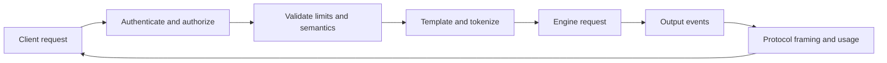
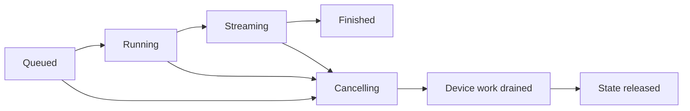
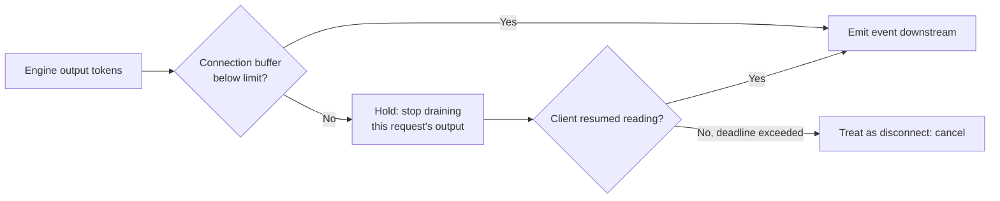

# 21. APIs as Correctness Boundaries

An engine can generate the right token and still return the wrong response.

Perhaps a chat template inserted the wrong role marker, so a fine-tuned model
receives a conversation shape it never saw during training and answers as
something else. A streamed tool call arrived out of order, so a client executed
arguments meant for a different call. Usage counted cached input twice,
doubling someone's bill. A network retry produced two side effects — two
charges, two emails — because the second attempt was not distinguished from
the first. These failures live above the model, but they are part of inference
correctness: users experience them as the system being wrong, not as an API
layer having opinions.

The API is the boundary where a changing engine promises stable behavior to
its callers. Everything behind it may be rewritten every week; the boundary may
not move without a version.

## Visual map

**The API translates a public contract into engine work and back again.**

**A streamed request remains a state machine after the connection changes.**

| Contract surface | Must specify | Dangerous ambiguity |
| --- | --- | --- |
| tokenization | model, template, truncation | same text becomes different tokens |
| streaming | event order and finish semantics | partial output mistaken for completion |
| cancellation | terminal event and cleanup | disconnected work keeps capacity |
| retries | request and tool idempotency | duplicated external action |
| structured output | schema and refusal behavior | syntactically valid but unsafe action |

## An endpoint is more than a URL

A production server may expose chat, text completion, embedding, scoring,
classification, reranking, image, audio, or real-time endpoints. Each endpoint
defines accepted inputs, defaults, limits, output fields, streaming events, and
error behavior — and each of those definitions is load-bearing. A default
maximum output length changes what "the model said" means; a silent truncation
changes it again.

Protocol compatibility should be stated at that level. Two servers can both
accept a familiar chat request while differing on unsupported parameters
(ignored? rejected? echoed?), tool-call deltas, usage events, whether
stop-token text appears in the returned content, or error codes. Test the
semantics your client uses instead of relying on a compatibility label —
Chapter 22's benchmark discipline applies to conformance just as much as to
speed.

Version behavior that affects output. A new parser or chat template can change
responses as materially as new weights, which is why Chapter 17 treated
processor version as execution identity and this chapter treats template and
parser revisions as part of the served artifact's name.

Errors deserve the same specification effort as successes. A useful taxonomy
separates at least four classes with distinct client obligations: malformed
request (fix the request), limit exceeded (shed load or raise quota — see the
limit pricing below), capacity unavailable (retry with backoff, ideally
elsewhere per Chapter 16's routing), and internal failure (retry only if
idempotent). Collapsing them into one 500-with-a-string forces every client to
reimplement the classification, badly and independently.

## Tokenization is part of the contract

Chat messages must become the token sequence expected by the model. The chat
template controls role markers, separators, tool definitions, and generation
prompts. Tokenizer files define how text and special tokens map to IDs.

If a client sends token IDs directly, the service needs a rule for whether it
trusts them, adds special tokens, or verifies context length — each choice
produces a different model input from the same bytes, and only one of them is
what the caller intended. If the server returns log probabilities, callers
need to know which tokenization produced them; a logprob over *your* retoken-
ization of *my* text is a number attached to nothing.

Record the tokenizer, template, and processor revisions with the model. A
weight-only model name does not fully identify the served behavior — two
deployments of identical weights can disagree on every response through the
template alone.

Stop conditions are contract too, and they hide a tokenization decision.
A *stop string* is matched against decoded text, so its meaning changes when
the tokenizer merges or splits characters differently across revisions; a
*stop token ID* pins the exact vocabulary entry but stops matching if the
template rewrites the surrounding text. The API should say which form is
authoritative, whether matched stop text is included in or excluded from the
returned content, and how `max_tokens` truncation reports itself distinctly
from a clean stop — Chapter 22's benchmark harness depends on that
distinction, since a length-truncated run is not a completed sample.

## Streaming is a state machine

A stream is not a series of unrelated JSON objects. It has a beginning, ordered
deltas, optional tool or reasoning channels, a finish reason, usage, and a
terminal event.

The server should define whether usage appears only at the end, whether a tool
call's name can stream separately from its arguments, and how partial UTF-8 or
token boundaries are handled — a multi-byte character split across chunks must
reassemble identically regardless of where the network cut. Clients should
tolerate network fragmentation without reordering semantic events: fragmentation
changes *chunking*, never meaning.

Once a terminal event is emitted, no later content belongs to that attempt. If
the worker finishes after the client disconnects, the server still needs to
release request and parser state — the connection ending does not end the
state machine, which is why the second diagram runs past `cancelling` to
drained device work and released state.

Backpressure belongs inside this machine rather than beside it:

A slow consumer holds only itself. The hold must never block the shared path
from engine to other connections — G's worked rule — and a held stream that
never resumes is a leak with a deadline, so the hold converts to cancellation
when its deadline expires.

### Terminal events and late arrivals

Event order is part of the machine. A conventional ordering: content and tool
deltas while running, then `finish_reason`, then usage, then nothing. Each
clause excludes something specific. Usage-last lets a client bill only from
terminal frames without scanning deltas. Finish-reason-before-usage lets a
client decide *whether* the usage matters (a length-truncated answer bills
differently than a complete one). Nothing-after-terminal means a client can
treat the terminal event as permission to free its buffers.

The last clause needs enforcement, not convention. Suppose the client
disconnects at *t* and the worker finishes its in-flight model step at
*t* + 40 ms, emitting the final chunk to a connection that no longer exists.
The correct behavior is to drop the chunk at the connection writer, and the
mechanism is the generation fence from Chapter 20, narrowed to one request:
every output event carries its attempt's generation; the terminal event closes
that generation; any later event bearing it is stale and discarded. Without
the fence, a client that retried after the disconnect receives interleaved
fragments of two attempts. The `r-17` conflict rule prevents two *live*
writers; the fence handles the zombie writer that outlives its connection.

Mid-stream failures need a decision, because different failures deserve
different shapes:

| Failure | Surface as | Why this shape |
| --- | --- | --- |
| schema fails to compile, pre-first-token | immediate error, no stream | nothing was promised yet; a stream would be theater |
| grammar reaches dead end mid-stream (`is_terminated`, aborted) | normal terminal event with explanatory finish code | the model stopped legally; the constraint was honored |
| worker crashes mid-stream | error event, then close; partial output marked invalid | client must not mistake truncation for completion |
| slow consumer past hold deadline | cancellation per the diagram above | capacity protection, not a protocol violation |

The second row is easy to get wrong. A grammar that terminates early did not
fail — refusing to emit invalid JSON *is* the feature working. Collapsing it
into an exception-shaped close teaches clients to retry requests whose
constraint genuinely admits no continuation, burning capacity on a request
that can only fail again.

## Structured output moves validation into decode

JSON Schema, regular expressions, and grammars restrict which tokens are legal
at each step. They can prevent malformed output instead of validating and
retrying after generation — trading one guaranteed pass for a speculative pass
plus repair, usually a good trade at Chapter 5's prices.

The API must distinguish a schema that cannot be compiled from a generation
that reaches no valid continuation. It should report which subset of a standard
is supported. Grammar compilation can be cached, but the cache key must include
the backend and grammar version — two backends compile the same JSON Schema
into different token machines, and a cache hit across them silently serves one
product's grammar under another's name.

Tool and reasoning parsers interpret model-specific token conventions. They are
streaming parsers because a complete object may arrive over many tokens. Parser
state belongs to one request and must be updated in the same order as output
tokens.

At the pinned snapshots, vLLM's protocol and parser implementations span
[`entrypoints/openai`](https://github.com/vllm-project/vllm/tree/5cecfc01375052698823fc401e31518fb32a981e/vllm/entrypoints/openai)
and
[`vllm/parser`](https://github.com/vllm-project/vllm/tree/5cecfc01375052698823fc401e31518fb32a981e/vllm/parser)
— the latter holding per-model tool and reasoning parsers plus their metrics.
SGLang implements compatible endpoints and parser paths under
[`srt/entrypoints/openai`](https://github.com/sgl-project/sglang/tree/e161bd1265a0082478b7f1c09f224a52d315dc71/python/sglang/srt/entrypoints/openai)
and its constrained-decoding package.

These are fast-moving interfaces. Pin behavior with protocol tests.

### Which constraint, and what happens when it cannot exist

Choosing a grammar backend is itself API behavior, and SGLang's selection path
in
[`create_grammar_backend`](https://github.com/sgl-project/sglang/blob/e161bd1265a0082478b7f1c09f224a52d315dc71/python/sglang/srt/constrained/base_grammar_backend.py)
encodes a posture worth copying. Selection order: a registered custom backend
wins; otherwise a named backend — `xgrammar`, `outlines`, `llguidance`, or
`none`. Then the interesting part: if XGrammar cannot initialize for this
tokenizer (`TokenizerNotSupportedError`), behavior splits on a flag. With
`enable_strict_thinking`, it raises — the error says strict thinking
"requires a grammar backend with token filtering support" and "Cannot fall
back to `grammar_backend='none'`". Without it, the server logs a warning and
falls back to `none`, where structured outputs "will not be available."

The same missing capability produces two different outcomes, and both are
correct, because the question is whether any caller's contract depends on the
constraint. Strict thinking means token filtering applies *inside* reasoning
spans; silently dropping it changes emitted behavior for callers who opted in,
so it fails closed at startup — the same philosophy as Chapter 19's guard
list, where an unsafe combination refuses to boot rather than misbehaving
later. Optional schema support degrades with a log line instead, because no
request promised it. The API-layer translation: report which constraints a
deployment enforces in its self-description, and refuse to start when a
load-bearing one is absent.

One more piece of machinery earns mention. Batched mask fills want a
preallocated vocab-sized mask tensor, and `register_vocab_mask_buffer`
validates any re-registration against the existing buffer's shape, dtype, and
device — a mismatch raises rather than quietly swapping the tensor every
sampler reads from. Like Chapter 19's weight-cache guards, it is a
startup-determined, rank-uniform check: either every rank agrees on the
buffer or the process fails loudly, never a mixture.

### Inside a grammar backend

SGLang's constrained-decoding base class —
[`base_grammar_backend.py`](https://github.com/sgl-project/sglang/blob/e161bd1265a0082478b7f1c09f224a52d315dc71/python/sglang/srt/constrained/base_grammar_backend.py)
at the pinned SHA — shows how much machinery hides under "restrict which tokens
are legal." The per-request object is a `BaseGrammarObject` whose lifecycle is
three calls the sampler makes: `accept_token(token)` after each emitted token
advances the machine, `rollback(k)` rewinds it when verification rejects a
suffix — the same rollback Chapter 11's speculative decoding forces on the
*model state*, here applied to the grammar state in lockstep — and
`is_terminated()` when no legal continuation remains. Mask mechanics are
deliberately batch-aware: `fill_vocab_mask_batched` fills "listed rows, leaving
unlisted rows untouched," so constrained and unconstrained requests coexist in
one step's mask tensor, and a `GrammarMask` carries "any one of the batch's"
grammars as "a handle, not per-request state."

Compilation never blocks the way a naive implementation would.
`get_cached_or_future_value` checks a `(type, string)`-keyed cache and returns
a per-request `copy()` on hit; on miss it submits compilation to a thread pool
and returns a *Future* — the request proceeds toward decode while the schema
compiles elsewhere, waiting only where the mask must exist. Every compiled
object carries `GrammarStats`: `compilation_time`, `ebnf_size`,
`is_cache_hit`, even `num_timeout` and `is_grammar_aborted`, which is the
observability needed to answer "did schemas make this slower?" without a
profiler. And the compile-failure distinction this chapter demands exists as a
type: an uncompilable schema becomes `InvalidGrammarObject`, "carrying the
original error message," while unsupported subsets degrade through
`_not_supported` with a logged skip — the API surfaces *why* there is no
grammar instead of inventing a dead-end mid-generation.

## Cancellation, deadlines, and retries

A client deadline should propagate through the router and engine. Work that
cannot produce a useful result before the deadline should stop consuming
capacity — Chapter 16's admission veto applied continuously rather than once.
The server may distinguish client cancellation from its own overload or
internal timeout because callers respond differently: a cancelled request
should not be retried by infrastructure, an overloaded one maybe should.

### Where the deadline actually binds

Walk a first-byte deadline of 300 ms through Atlas's frozen cost model. At
admission the predicted path is: 150 ms queued (declared assumption for this
walk), then `prefill_ms(2000) = 20 + 70 = 90 ms`, then one decode step of
45 ms before the first byte — 285 ms, under the deadline by 15 ms. Now the
queue runs long and the same request faces 180 ms of waiting: first byte at
315 ms. The prediction error lives entirely in the queue term; prefill and
decode costs are stable, which is why Chapter 16 scored placements as queue
plus known costs.

Two designs handle the drift. Admit-anyway-then-cancel: the server accepts,
starts prefill at 180 ms, and the client gives up at 300 — the system burned
120 ms of prefill plus up to one 45 ms step of finished work and delivered
nothing. Continuous veto: when the predicted first byte exceeds the
remaining budget, the request is rejected *before* prefill begins and never
occupies KV. The veto converts a guaranteed disappointment into an immediate,
cheap, actionable error — and because the queue term dominates the error, the
veto should be re-evaluated whenever the queue estimate moves, not only once
at admission.

Cancellation granularity follows from engine structure rather than API
preference. A cancel arriving mid-model-step cannot un-commit the step; the
bound is one engine step of wasted work (Chapter 5's step structure, the same
bound Chapter 20 accepted for interruption). Promising "instant" cancellation
in the API would be promising something the executor cannot deliver — the
contract should say "stops within one engine step," which is testable.

Retries are safe only when the operation is idempotent or carries a stable
request ID. Text generation without side effects can usually be attempted
again, although the sampled output may differ. A tool-executing endpoint may
have already charged a card or sent a message.

Separate generation from external action. Give tool executions their own
idempotency keys and authorization checks. Never treat model output as trusted
instructions merely because it matches a schema — validity is syntax, and
Chapter 23's security discussion owns what validity does not cover.

The duplicate-ID contract deserves its exact terms, since it is the kind of
clause teams discover they need only after double-charging a customer. For the
worked example's `r-17`: Atlas *rejects a second live attempt* with a conflict
status — two engines running one request ID simultaneously is always a bug,
never a retry strategy. After completion, an idempotent request may return its
recorded terminal result for a retention window, which converts a transport
retry after success from duplicate work into a cache read. Tool execution uses
a separate idempotency key because regenerating text and repeating an external
action are not equivalent operations: the first is safe to redo, the second is
the whole reason the contract exists.

## Authentication and resource limits

Authentication identifies the caller. Authorization decides which models,
adapters, tools, and data it may use. Quotas and rate limits protect shared
capacity.

Token limits alone are insufficient for multimodal inputs or expensive
sampling modes — a 128-token limit means nothing to a 40,000-patch image.
Limit decoded media, number of candidates, grammar complexity, tool
definitions, output length, and concurrent sessions. Apply limits before
allocating model state where possible: rejecting an oversized request before
it owns KV blocks costs nothing, evicting it after costs everyone.

### Pricing a limit check

The claim "reject early" has an arithmetic spine. Atlas KV state costs
320 KiB per token (Appendix A). A request with an 8,000-token input allowed
4,096 output tokens owns up to about `12096 × 320 KiB ≈ 3.7 GiB` of KV at
peak. On a card whose weights consume 35 GiB under tensor parallelism of four
(140 GB sharded) plus activation headroom, suppose roughly 30 GiB remains for
KV: eight peak-size sequences fill it. A per-key concurrency limit of eight is
not bureaucracy; it is the difference between serving eight well-shaped
streams and letting the ninth trigger eviction machinery that degrades *all*
streams — Chapter 6's preemption, arriving through an API misuse.

And the two failure orders price differently. Rejecting before allocation
costs microseconds of validation. Admitting then evicting burns the victim's
prefill — at 0.035 ms per token, an 8,000-token prefill is 280 ms of finished
GPU work discarded — *and* taxes whoever shared its batch with the eviction
step, *and* still owes the caller an answer. Limits checked at the boundary
are cheap precisely because they run where nothing expensive exists yet.

This is also why limits belong in error semantics, not just enforcement: the
rejection should say which limit fired (`concurrency`, `context_length`,
`media_bytes`) so clients can shed load intelligently instead of retrying a
request that will never fit.

Avoid exposing administrative engine APIs—weight updates, sleep, arbitrary
collective calls, cache control, or profiling—on the public inference network.
They can change model behavior or deny service. Chapter 19 made weight updates
transactions; making them internet-reachable undoes that care with one routing
mistake. Separate credentials and network boundaries are appropriate.

## Worked example: disconnect is a state transition

A slow client fills its bounded output buffer. Per the backpressure diagram,
the server pauses that stream's output drain without blocking the shared
output path; other requests continue streaming. When the connection closes,
the request enters `cancelling`; future model steps stop, in-flight output is
ignored, and KV references eventually return to the baseline count. Each clause
is testable: steps-stop has a bound of one engine step, ignored-output is the
generation fence doing its job, and the KV count returning to baseline is the
assertion that no reference leaked.

Give the pause a timeline with declared numbers. The buffer fills at
*t* = 0 and the drain holds; the engine, mid-step, finishes the current model
step at *t* = 45 ms and does not schedule further output for this request.
At *t* = 120 ms the client's socket dies. The request moves to `cancelling`;
its generation counter bumps so any event emitted by the finishing worker is
stale at the writer. At *t* = 165 ms the last in-flight step completes and the
request's KV references release — total wasted work from disconnect onward:
one engine step, 45 ms, exactly the promised bound. A conformance test asserts
each transition: buffer-full must pause within one poll interval, cancel must
stop scheduling by the next engine step, and KV must return to baseline within
a bounded drain window rather than "eventually."

Duplicate request ID `r-17` also needs a contract. Atlas rejects a second live
attempt with conflict status; a completed idempotent request may return its
recorded terminal result for a retention window; tool execution uses a
separate idempotency key because repeating generation and repeating an external
action are different operations. G's conformance framing then closes the loop:
run the suite against old and new engine revisions and classify every
difference as intended API change, allowed numerical variation, or regression —
"both returned HTTP 200" is not conformance.

## Practice: build a semantic conformance suite

Pin a tokenizer and chat template, then test streamed and non-streamed results,
stop conditions, log probabilities, usage, schemas, tool calls, errors, and
cancellation. Add a slow consumer, mid-generation disconnect, duplicate live
ID, and retry after completion.

Assert semantic output, event ordering, bounded backpressure, and eventual GPU
state release. Classify engine-version differences instead of checking only
HTTP status. The worked contract is in
[Appendix G](../appendices/g-worked-solutions.md#21-protocol-conformance).

The suite lets the engine change internally without moving the correctness
boundary. Chapter 22 applies the same discipline to performance claims.
