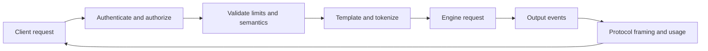
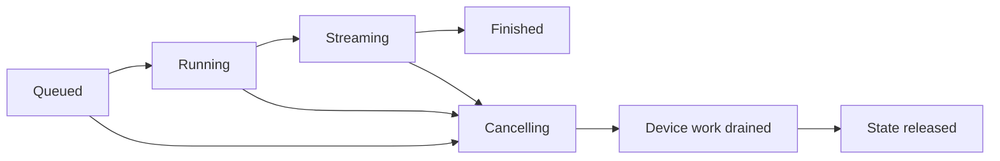

# 21. APIs as Correctness Boundaries

An engine can generate the right token and still return the wrong response.

Perhaps a chat template inserted the wrong role marker. A streamed tool call
arrived out of order. Usage counted cached input twice. A retry produced two
side effects. These failures live above the model, but they are part of
inference correctness.

The API is the boundary where a changing engine promises stable behavior to
its callers.

## Visual map

**The API translates a public contract into engine work and back again.**

**A streamed request remains a state machine after the connection changes.**

| Contract surface | Must specify | Dangerous ambiguity |
| --- | --- | --- |
| tokenization | model, template, truncation | same text becomes different tokens |
| streaming | event order and finish semantics | partial output mistaken for completion |
| cancellation | terminal event and cleanup | disconnected work keeps capacity |
| retries | request and tool idempotency | duplicated external action |
| structured output | schema and refusal behavior | syntactically valid but unsafe action |

## An endpoint is more than a URL

A production server may expose chat, text completion, embedding, scoring,
classification, reranking, image, audio, or real-time endpoints. Each endpoint
defines accepted inputs, defaults, limits, output fields, streaming events, and
error behavior.

Protocol compatibility should be stated at that level. Two servers can both
accept a familiar chat request while differing on unsupported parameters,
tool-call deltas, usage events, stop-token inclusion, or error codes. Test the
semantics your client uses instead of relying on a compatibility label.

Version behavior that affects output. A new parser or chat template can change
responses as materially as new weights.

## Tokenization is part of the contract

Chat messages must become the token sequence expected by the model. The chat
template controls role markers, separators, tool definitions, and generation
prompts. Tokenizer files define how text and special tokens map to IDs.

If a client sends token IDs directly, the service needs a rule for whether it
trusts them, adds special tokens, or verifies context length. If the server
returns log probabilities, callers need to know which tokenization produced
them.

Record the tokenizer, template, and processor revisions with the model. A
weight-only model name does not fully identify the served behavior.

## Streaming is a state machine

A stream is not a series of unrelated JSON objects. It has a beginning, ordered
deltas, optional tool or reasoning channels, a finish reason, usage, and a
terminal event.

The server should define whether usage appears only at the end, whether a tool
call's name can stream separately from its arguments, and how partial UTF-8 or
token boundaries are handled. Clients should tolerate network fragmentation
without reordering semantic events.

Once a terminal event is emitted, no later content belongs to that attempt. If
the worker finishes after the client disconnects, the server still needs to
release request and parser state.

## Structured output moves validation into decode

JSON Schema, regular expressions, and grammars restrict which tokens are legal
at each step. They can prevent malformed output instead of validating and
retrying after generation.

The API must distinguish a schema that cannot be compiled from a generation
that reaches no valid continuation. It should report which subset of a standard
is supported. Grammar compilation can be cached, but the cache key must include
the backend and grammar version.

Tool and reasoning parsers interpret model-specific token conventions. They are
streaming parsers because a complete object may arrive over many tokens. Parser
state belongs to one request and must be updated in the same order as output
tokens.

At the pinned snapshots, vLLM's protocol and parser implementations span
[`entrypoints/openai`](https://github.com/vllm-project/vllm/tree/5cecfc01375052698823fc401e31518fb32a981e/vllm/entrypoints/openai)
and
[`vllm/parser`](https://github.com/vllm-project/vllm/tree/5cecfc01375052698823fc401e31518fb32a981e/vllm/parser).
SGLang implements compatible endpoints and parser paths under
[`srt/entrypoints/openai`](https://github.com/sgl-project/sglang/tree/e161bd1265a0082478b7f1c09f224a52d315dc71/python/sglang/srt/entrypoints/openai)
and its constrained-decoding package.

These are fast-moving interfaces. Pin behavior with protocol tests.

## Cancellation, deadlines, and retries

A client deadline should propagate through the router and engine. Work that
cannot produce a useful result before the deadline should stop consuming
capacity. The server may distinguish client cancellation from its own overload
or internal timeout because callers respond differently.

Retries are safe only when the operation is idempotent or carries a stable
request ID. Text generation without side effects can usually be attempted
again, although the sampled output may differ. A tool-executing endpoint may
have already charged a card or sent a message.

Separate generation from external action. Give tool executions their own
idempotency keys and authorization checks. Never treat model output as trusted
instructions merely because it matches a schema.

## Authentication and resource limits

Authentication identifies the caller. Authorization decides which models,
adapters, tools, and data it may use. Quotas and rate limits protect shared
capacity.

Token limits alone are insufficient for multimodal inputs or expensive
sampling modes. Limit decoded media, number of candidates, grammar complexity,
tool definitions, output length, and concurrent sessions. Apply limits before
allocating model state where possible.

Avoid exposing administrative engine APIs—weight updates, sleep, arbitrary
collective calls, cache control, or profiling—on the public inference network.
They can change model behavior or deny service. Separate credentials and
network boundaries are appropriate.

## Worked example: disconnect is a state transition

A slow client fills its bounded output buffer. The server pauses or cancels
that stream without blocking the shared output path. When the connection
closes, the request enters `cancelling`; future model steps stop, in-flight
output is ignored, and KV references eventually return to the baseline count.

Duplicate request ID `r-17` also needs a contract. Atlas rejects a second live
attempt. A completed idempotent request may return its recorded terminal result
for a retention window. Tool execution uses a separate idempotency key because
regenerating text and repeating an external action are different operations.

## Practice: build a semantic conformance suite

Pin a tokenizer and chat template, then test streamed and non-streamed results,
stop conditions, log probabilities, usage, schemas, tool calls, errors, and
cancellation. Add a slow consumer, mid-generation disconnect, duplicate live
ID, and retry after completion.

Assert semantic output, event ordering, bounded backpressure, and eventual GPU
state release. Classify engine-version differences instead of checking only
HTTP status. The worked contract is in
[Appendix G](../appendices/g-worked-solutions.md#21-protocol-conformance).

The suite lets the engine change internally without moving the correctness
boundary. Chapter 22 applies the same discipline to performance claims.
