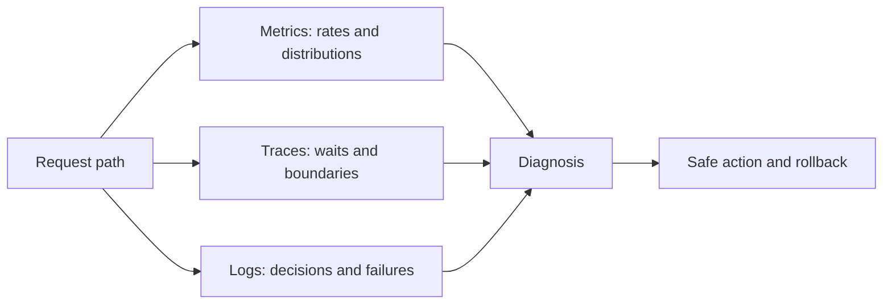
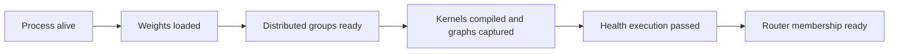

# 23. Observability, Reliability, and Operations

At 14:07, time to first token rises while GPU utilization falls. The model
workers report no errors. Is the cause a tokenizer backlog, a failed graph
capture, a cache-transfer timeout, a network partition, or an empty decode
pool?

Observability is the ability to answer that question from the system's outputs.
It begins with a model of the request path, not a large dashboard.

## Visual map

**Operations needs signals from the request path and its resource owners.**

**Readiness progresses through model-specific startup stages.**

| Symptom | First split | Evidence | Unsafe shortcut |
| --- | --- | --- | --- |
| high TTFT, low GPU use | ingress versus engine wait | queue ages and traces | add accelerators blindly |
| normal TTFT, high ITL | decode versus output path | step and stream gaps | tune prefill only |
| memory pressure | live versus reusable state | blocks, references, eviction | restart without leak check |
| one slow rank | compute versus communication | per-rank timeline | average utilization |

## Metrics show shape; traces show path

Metrics summarize behavior over time. Useful families include arrival and
completion rates, queue age, TTFT and ITL histograms, scheduled tokens, active
sequences, memory pressure, cache matches, transferred bytes, graph dispatch,
preemption, and errors.

Logs record discrete decisions and failures. They should include request or
operation identity, component, state transition, version, and reason without
leaking prompt content or secrets.

Distributed traces follow one request across the router, preprocessing, engine,
stages, transfers, and output stream. A trace should distinguish waiting from
execution. The [OpenTelemetry semantic conventions](https://opentelemetry.io/docs/concepts/semantic-conventions/)
provide common naming principles for traces, metrics, logs, and resources,
including HTTP and RPC operations.

Use stable low-cardinality dimensions for metrics. Model, route, status, and
SLO class are often useful. Request ID, prompt hash, and tenant IDs belong in
traces or controlled logs; placing them in metric labels can overwhelm the
monitoring system and create privacy risk.

## Observe the scheduler and state

GPU utilization alone cannot explain an inference engine. Record the waiting
and running request counts, oldest queue age, step token composition, prefill
chunks, decode batch size, admission rejection, and preemption.

For memory, record free and reserved blocks, allocation failure, fragmentation
or tail waste, live versus reusable state, and deferred release. For distributed
caches, include lookups, matched tokens, transfer duration, cancellation,
write-back, and stale location failures.

For MoE, record tokens per expert and per rank, dispatch and combine duration,
stragglers, and placement generation. For disaggregation, expose every stage
queue and transfer boundary. These metrics translate the architecture into
operational evidence.

## Readiness is a sequence of states

A process can be alive before it is ready. Model download, weight load,
distributed initialization, kernel compilation, graph capture, cache
registration, and router membership may all need to finish before traffic is
safe.

Liveness asks whether the process should be restarted. Readiness asks whether it
should receive new work. A worker draining old requests is live and not ready
for new ones. A worker blocked in a failed collective may have a running process
and be unable to make progress.

Health checks should test the dependency appropriate to their purpose. An HTTP
ping to the frontend does not prove the model group can execute. A full model
request can be too expensive for a frequent liveness probe.

## Treat the serving image as a measured artifact

“Same model” does not mean same service. A deployment is the combination of
weights, tokenizer, model code, engine revision, kernel libraries, accelerator
runtime, driver, configuration, and compiled artifacts. Pin and record that
combination as one release identity.

Build containers from reproducible inputs and keep model artifacts outside the
mutable container layer when their size or access policy demands it. Verify
checksums before a worker becomes ready. Do not download unpinned executable
model code during startup. Produce a software bill of materials and scan both
the base image and Python or native dependencies, while recognizing that a
clean vulnerability scan does not prove model safety.

Startup time is operational capacity. Measure image pull, model fetch, weight
load, distributed initialization, compilation, graph capture, and warm-up
individually. If a worker takes twelve minutes to become ready, an autoscaler
cannot rescue a two-minute traffic spike. Warm pools, local artifact caches, or
forecast scaling may be required.

Promote the same immutable artifact through staging and production. Environment
configuration may change endpoints and capacity, but rebuilding between stages
removes much of the evidence gathered by the canary. Store the release identity
on every trace so an output or latency regression can be tied back to the exact
execution environment.

## Overload should fail deliberately

When queues exceed the service's ability to recover within the SLO, reject or
shed work before the deployment collapses. Preserve capacity for health,
cancellation, and high-priority traffic.

Graceful modes may reduce maximum output, disable expensive optional features,
route to a smaller model, lower media quality, or pause background work. Each
mode needs a product and correctness contract.

An error budget connects reliability targets to change velocity. Track failures
caused by overload separately from model validation, dependency failure, and
internal bugs. They need different remedies.

## Test failures on purpose

Kill one worker in a tensor-parallel group. Partition a cache from its metadata
service. Delay a KV transfer. Exhaust host memory. Return a late completion
after cancellation. Corrupt a downloaded model artifact in a staging
environment.

For every test, observe detection time, user impact, cleanup, retry behavior,
and recovery. A failover that restores traffic while leaking blocks will cause
a second incident later.

Disaggregated systems deserve coupled tests. If the decode pool fails while
prefill remains healthy, admission should stop before completed KV state piles
up. If the remote cache fails, the service may degrade to recomputation rather
than becoming unavailable.

## Deploy without mixing incompatible state

A rolling deployment needs a model and engine compatibility boundary. Drain
requests before replacing workers that own nonmigratable state. Keep cache and
artifact namespaces separate across versions. Do not send a live session to a
new tokenizer or weight version without an explicit migration.

Canary traffic should represent the shapes and features most likely to expose
problems: long context, structured output, multimodal input, adapters, and
distributed modes. Compare output correctness and goodput, not only error rate.

Rollback must remain possible after caches, schemas, or control-plane metadata
change. Test it before the incident.

## Write runbooks around hypotheses

A useful runbook starts from a symptom and branches on evidence.

For high TTFT with low GPU utilization, check ingress and tokenizer queues,
prefill admission, cache-transfer waits, graph warm-up, and worker readiness. For
high ITL with normal TTFT, inspect mixed prefill chunks, decode batch size,
collective stragglers, output processing, and session transport.

Each step should name the metric or trace, expected range, safe action, and
rollback. Avoid instructions that say “restart the service” without identifying
which state will be lost.

## Worked example: high TTFT, low GPU use

p95 TTFT rises from 480 ms to 1.4 seconds while GPU utilization falls from 72
to 38 percent. The combination argues against “add more GPU compute” as the
first response. Check ingress and tokenizer queue age, then engine admission
reasons, remote-cache waits, graph compilation or fallback, and worker
readiness. Each branch needs a confirming signal and reversible action.

If delayed KV transfers are the cause, bound the wait and choose conditional
recomputation or rejection. Restarting workers first may destroy state and the
evidence while leaving the dependency failure untouched.

## Practice: write and test the runbook

Build a dashboard for the Chapter 14 pipeline and inject 500 ms into KV
transfers. Write the high-TTFT/low-utilization runbook with expected metric
ranges, safe actions, and rollback at every branch.

Measure detection, user impact, cancellation cleanup, recomputation, leaked
blocks, and recovery. Give the runbook to an engineer who did not build the
system. The worked branch structure is in
[Appendix G](../appendices/g-worked-solutions.md#23-operations-runbook).

The final chapter brings the technical choices together with cost, security,
and organizational ownership.
