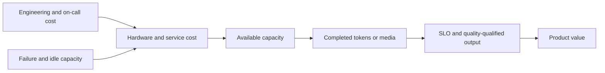
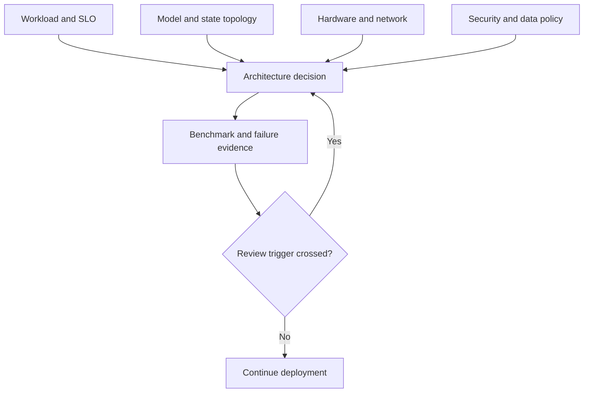

# 24. Economics, Security, and Architecture Decisions

The fastest configuration is not always the one a team should deploy. It may
require scarce hardware, duplicate too many weights, expose administrative
interfaces, or cost more per useful answer. Architecture is the process of
making those constraints explicit.

This chapter closes the book by joining its threads into decisions. Chapters
5 through 20 built mechanisms; Chapter 22 made their claims testable and
Chapter 23 made their failures diagnosable. Economics and security are not
additional subjects bolted on at the end — they are the same discipline
applied to two new resource axes: money, where the limiting quantity is
qualifying work per dollar rather than tokens per second, and trust, where
the limiting quantity is what an adversary can reach through the request path
rather than what the scheduler can fit in memory.

## Visual map

**Technical efficiency becomes product economics only after qualification.**



**The architecture decision joins workload, placement, and trust boundaries.**



| Decision lens | Unit or boundary | Hidden cost to include |
| --- | --- | --- |
| Economics | qualifying requests or sessions | idle, failed, and retried work |
| Capacity | SLO-sustaining arrival rate | startup and recovery headroom |
| Security | data and administrative trust zone | caches, logs, and model code |
| Sourcing | managed, self-hosted, or hybrid | engineering, exit, and on-call cost |
| Review | explicit changed assumption | migration and rollback effort |

## Choose an economic unit that reflects value

Cost per GPU-hour is an input, not an outcome. Cost per request ignores sequence
length. Cost per output token ignores quality, retries, and latency failures.

A stronger unit is cost per qualifying request or cost per good output token.
It includes only work that meets the quality and service contract introduced in
Chapter 2.

```text
unit cost = total serving cost / qualifying work
```

Total cost includes accelerators, CPUs, host memory, storage, network transfer,
reserved but idle capacity, software and operations, and failed or repeated
work. For owned hardware, include depreciation, power, cooling, support, and
the cost of capacity that cannot be reassigned.

A denominator this powerful invites gaming, so pin what counts as qualifying.
If the quality gate is loosened, latency failures vanish and unit cost
"improves" with no engineering at all; Chapter 22's rule — define the
evaluation before seeing the result — applies at the finance boundary too.
The qualifying-work definition belongs in the ADR next to the SLOs it
derives from, changed by the same review process, so that a cost improvement
claim is always a claim *at a fixed contract*.

Compare steady and bursty workloads. A design with excellent saturated
efficiency may be expensive at the product's normal utilization.

### Pricing Atlas per qualifying request

Walk the formula with declared numbers in Atlas's own units. Assume an
eight-accelerator node costs $30 per hour all-in — depreciation, power,
cooling, network, and the fraction of host and control-plane cost attributed
to it. At its operating point below the goodput knee, suppose the node
sustains 5 qualifying requests per second under Atlas's TTFT and ITL gates.
Unit cost is `30 / (5 × 3600) ≈ $0.0017` per qualifying request — about a
sixth of a cent. Now the product runs at 40 percent utilization, as consumer
traffic does: the node still costs $30, but delivers `5 × 0.4 = 2`
qualifying requests per second on average, so realized unit cost rises to
about `$0.0042` — two and a half times the saturated figure without any
engineering change. This is the gap the denominator hides: procurement decks
quote saturated efficiency, finance pays utilization-weighted cost, and the
difference is why burst handling (Chapter 16's admission, Chapter 23's warm
pools) is an economic mechanism, not an operational nicety.

The same walk exposes what optimization is *worth*. A scheduling change that
lifts qualifying throughput 18 percent cuts saturated unit cost by roughly
15 percent (`1/1.18`) — but if it also adds a replication tier whose cost is
10 percent of the node budget, the net is near zero. Every performance claim
from Chapter 22 converts to this currency before it competes for engineering
time; that conversion, not the benchmark, is what a roadmap meeting needs.

### TCO worked example: self-hosted versus managed API

Walk the comparison with concrete numbers to see where the breakeven
lives. These are illustrative; substitute your actual costs.

```text
Self-hosted (8× H100 node, reserved instance):
  Hardware:          $30/hr ($21,600/month)
  Engineering:       ~$5,000/month (fractional SRE, on-call)
  Networking/misc:   ~$1,500/month
  Total:             ~$28,100/month

  Qualifying throughput at 60% utilization: 3 req/s average
  Monthly qualifying requests: 3 × 3600 × 24 × 30 ≈ 7.78M
  Cost per qualifying request: $28,100 / 7.78M ≈ $0.0036

Managed API (priced per million tokens):
  Assume $3 per million input tokens, $15 per million output tokens
  Average request: 1,000 input + 200 output tokens
  Per-request cost: (1000 × $3 + 200 × $15) / 1M = $0.006

  Monthly cost at 7.78M requests: $46,680
```

At this volume and utilization, self-hosted costs roughly 60% of the
managed API. But the picture reverses at low utilization:

```text
Self-hosted at 15% utilization (nights, weekends):
  Same $28,100/month, 1.94M qualifying requests
  Cost per qualifying request: $28,100 / 1.94M ≈ $0.0145

Managed API at same volume:
  1.94M × $0.006 = $11,640/month
```

The crossover depends on sustained utilization, engineering cost, and
burst headroom. Most teams start managed, switch when utilization
consistently exceeds 40–50%, and keep a managed overflow route for bursts
that exceed self-hosted capacity. Chapter 16's admission control makes the
routing decision explicit rather than implicit.

## Utilization can hide stranded resources

An MoE deployment may show high network use and low expert compute. A
disaggregated service may have a full decode pool and idle prefill GPUs. A model
can consume nearly all HBM while leaving arithmetic units underused.

Report utilization by resource and stage. The limiting resource determines
capacity; the others may be stranded. Independent scaling helps only when pool
sizes can track the workload without adding excessive transfer or warm-up cost.

Disaggregation makes stranding concrete because Chapter 17's stage table
prices each pool separately: if prefill completes in a burst around each
arrival wave while decode drains steadily, the prefill pool's honest
utilization is its *busy fraction*, not its peak — sizing it for the peak buys
idle accelerators most of the day, and sizing it for the average converts the
difference into queue age at arrivals. The same logic that set Chapter 20's
playback buffers applies to pool sizing: buffers absorb variance you predicted,
not variance you didn't.

Power limits can change kernel clocks and throughput. Energy per useful output
captures a dimension that device-hour pricing may hide. If carbon-aware
scheduling is a requirement, deadlines and data locality constrain when and
where offline work can move.

### Energy per qualifying request

Energy is unit-cost arithmetic with power substituted for rent. Assume the
Atlas node draws 6 kW under serving load. At 5 qualifying requests per
second, each qualifying request is responsible for `6 kW / 5 = 1.2 kJ ≈
0.33 Wh`; at 40 percent utilization the same node spreads over 2 qualifying
requests per second, so energy per request rises to about `0.83 Wh` — the
utilization tax from the cost walk again, now in thermodynamics. Two
consequences follow. First, energy per useful output is the honest carbon
metric: a configuration that finishes requests faster but qualifies fewer of
them can *increase* energy per useful output while decreasing energy per
token. Second, power interacts with benchmarks — sustained load raises
temperature, clocks throttle, and the tenth repetition runs slower than the
first, which is why Chapter 22 randomizes experiment order and treats
thermal state as a slow variable. A benchmark run that ignores its own power
curve produces a number for hardware that stops existing after ninety
seconds.

## Multi-tenancy needs isolation at every layer

Tenants share queues, model weights, memory allocators, caches, network links,
and sometimes adapters. Quotas should cover concurrent requests, token work,
media processing, cache occupancy, and expensive features—not only request
rate. The Chapter 21 limit-pricing arithmetic is the template: a quota that
counts requests treats a 500-token summarization and a 12,000-token analysis
with media as equals, which they are not — token-work quotas approximate the
real scarce quantities, KV blocks and engine-step time.

Memory must be cleared or safely overwritten before reuse across trust
boundaries. Cache lookup needs namespaces and authorization. Metrics and logs
must not expose prompts, token IDs, or identifying hashes. Timing can also leak
whether another tenant has warmed a prefix.

Noisy-neighbor controls need a defined unit. Equal requests are not fair when
one tenant submits 100-token prompts and another submits 100,000-token
prompts: under request-count quotas, ten equal requests let the second tenant
consume roughly a thousand times the KV blocks (`100,000 × 320 KiB` against
`100 × 320 KiB` per request) and orders of magnitude more engine-step time.
Token-work quotas collapse that asymmetry by construction, and estimated-time
quotas — predicted cost from Chapter 16's scoring, charged before admission
and reconciled after — handle modalities where token counts understate real
work, like decoded media or expensive sampling modes. No unit is final;
the requirement is that the unit track something the shared infrastructure
actually competes for.

### What one tenant's warm prefix tells another

Cross-tenant cache hits are a correctness question disguised as an
optimization. Suppose tenants A and B both submit prompts sharing a 4,000-token
document prefix. Without namespaces, B's request hits A's warmed blocks and
skips roughly 68 ms of fetch plus the matching prefill share — and the *timing
delta itself* discloses information: B can probe whether some document has
been served recently by measuring whether its TTFT drops. That is a real
channel even when no bytes ever cross tenants, and it is why Atlas defaults
tenant cache namespaces to isolated: the shared-document case must opt in
through an explicit sharing policy, carrying authorization with it.

Isolation has a price, and quoting it keeps the default honest. With
namespaces, B recomputes the prefix — at Chapter 16's recompute price about
240 ms of engine work for 4,000 tokens — so aggregate compute rises in
proportion to how much cross-tenant overlap existed. Measure that overlap
before assuming it matters; teams that enable sharing "for efficiency"
without measuring routinely discover the overlap was a handful of system
prompts, which can be handled with a public, non-secret shared namespace
instead of weakening tenant boundaries everywhere.

## The model server executes untrusted inputs

Prompts can attempt to manipulate application behavior. Media can exploit
parsers. Structured schemas can consume compiler resources. Tool output can
contain instructions aimed at the model. Generated code or tool calls can
affect external systems if the application grants authority.

Each row deserves its own containment, because they fail differently. Media
parsers run native code on attacker-controlled bytes — Chapter 17's decode-
before-admit pipeline means hostile images execute *inside* your service
boundary, so parser choice, sandboxing, and decoded-media limits (Chapter
21's) carry security weight beyond latency. Grammar complexity is the schema
analogue of a decompression bomb: Chapter 21 priced compilation off the hot
path precisely so a pathological schema costs a Future, not an engine step —
but unbounded grammar size still consumes memory and compile threads, so
complexity limits belong in the quota list. Tool output round-trips through
the model as new input, closing a loop where an external page can instruct
the model as fluently as its user can.

Treat model output as untrusted data. Validate it at the action boundary, apply
least privilege, require confirmation for high-impact actions, and use
idempotency for retries — Chapter 21's separate tool-execution idempotency key
is here because a replayed model response must not become a repeated wire
transfer. Prompt-based defenses do not replace access control.

The [OWASP Top 10 for LLM Applications](https://genai.owasp.org/llm-top-10/)
provides a maintained taxonomy that includes prompt injection, sensitive
information disclosure, supply-chain risk, improper output handling, excessive
agency, and resource consumption. The
[NIST Generative AI Profile](https://www.nist.gov/itl/ai-risk-management-framework)
places these technical risks within a broader process for governing,
measuring, and managing AI risk.

## Protect the inference supply chain

Model repositories can include executable custom code, serialized objects,
tokenizers, templates, and native kernels. Engine plugins and JIT compilation
expand the trusted computing base.

Pin model and container digests. Verify signatures or checksums. Prefer safe
serialization formats. Review custom model code before enabling it. Build
kernels and images in controlled environments, scan dependencies, and retain a
software bill of materials. Chapter 23's release identity is the runtime half
of this: pinning is only useful if the deployment *refuses* unpinned inputs,
which is what checksum-before-ready enforces.

The contract surfaces from Chapter 21 belong in the trusted base too.
Tokenizers, chat templates, tool parsers, and grammar backends are executable
artifacts that shape every response; a tampered template can redirect a
conversation as effectively as tampered weights, and neither the benchmark
suite nor the conformance suite catches it unless both are re-run when those
artifacts change — which is exactly why Chapter 17 folded processor version
into execution identity and why release identity pins all of them together.
Adapter artifacts get the same treatment as model code: they are weights
contributed by someone, loaded into shared memory beside the base model, so
they inherit the review, pinning, and scanning requirements rather than
slipping in through a side door.

Separate public inference credentials from management APIs that load models,
update weights, inspect memory, run profilers, or execute collective RPCs. These
capabilities can alter outputs, extract information, or deny service — Chapter
19 made weight updates transactional, and Chapter 21 refused to route them
through the public network; supply-chain hygiene is the same boundary viewed
from the build side. The drill list from Chapter 23 belongs here as well: a
staging exercise that swaps a signed artifact for an unsigned one should end
in a readiness refusal, not a warning in a log nobody reads.

## Retention applies to derived state

A deletion policy that removes prompts but leaves KV blocks, encoder features,
logs, traces, or benchmark samples is incomplete. Derived state can preserve
information about the original input.

Map every data class through the request lifecycle:

| Data class | Derived from | Outlives the request as |
| --- | --- | --- |
| KV blocks | prompt and generated tokens | reusable state until eviction or deletion |
| encoder features | media input | cached embeddings keyed by content hash |
| traces and spans | whole request path | diagnosis records with timing and metadata |
| logs | decisions and failures | operation history, hopefully prompt-free |
| benchmark samples | recorded traffic | evaluation fixtures with long lifetimes |

Define retention, encryption, region, access, and deletion for each tier. Ensure backups and distributed caches honor the same model. A cache's performance value does not override a user's deletion right or contractual boundary — which is why Chapter 16's cache-version bumping and namespace machinery matter beyond routing: deletion across a distributed cache is an invalidation sweep with an audit trail, not an `rm`. The sweep has to reach every replica the block migrated to — Chapter 14's transfer machinery moves KV state between nodes precisely so it survives, and survival is the problem here — plus encoder-feature caches keyed by content hash, where deleting the *key mapping* must also age out the stored features. Backups restore old state wholesale, so their retention model bounds every tier's effective deletion date: a cache that honors deletion instantly but sits on a filesystem backed up for ninety days has a ninety-day deletion policy whether anyone chose it or not.

## Managed service, self-hosted, or hybrid

A managed API transfers responsibility for engine operation and capacity while
limiting control over weights, placement, and low-level optimization.
Self-hosting provides control and creates responsibility for security,
reliability, upgrades, and hardware supply — including everything Chapter 23
demanded: staged readiness, drill-tested failure modes, and release discipline.

Compare options using the same service contract. Include engineering and
on-call cost, time to support new models, compliance, portability, failure
independence, and exit cost. A lower accelerator rate can be more expensive if
the team cannot keep the deployment reliable. Exit cost deserves explicit
pricing because it is paid exactly when leverage is worst: migrating off a
provider under deadline pressure means re-validating templates, parsers, and
conformance suites (Chapter 21's) against a new engine while production runs.
Teams that priced exit discovered the conformance suite *is* the exit plan —
portable tests convert migration from a rewrite into a rerun.

Hybrid designs may use managed capacity for bursts or selected models. The
subtle requirement is semantic: an overflow route that silently changes
tokenizer, template, or sampling behavior produces different answers for the
same request depending on load — Chapter 22 would call that a confounded
experiment running in production. Route by request class with a pinned
contract per class, and measure both routes' quality gates separately.

The sourcing comparison compresses into one table once the hidden costs are
named:

| Dimension | Managed API | Self-hosted | Hybrid |
| --- | --- | --- | --- |
| Marginal cost shape | per-token, elastic | fixed capacity, utilization-taxed | fixed floor, elastic ceiling |
| Weight and placement control | provider's | full | split by route |
| New-model latency | provider's roadmap | your integration queue | whichever route has it |
| Failure domain | provider-wide incidents | your ops alone | partially independent |
| Exit cost | conformance re-run + migration | hardware refresh cycle | per-route |

Read the marginal-cost row against the Atlas walk: the managed API's elastic
pricing is exactly the utilization tax removed — you pay per qualifying work
rather than per idle hour — which is why it fits bursts, and why routing
*baseline* traffic there can cost multiples of a well-utilized self-hosted
node even at similar list rates.

## Write the architecture decision

An architecture decision record for an inference service should contain:

- workload distributions and growth assumptions;
- quality, latency, availability, and cost targets;
- model stages and persistent state;
- hardware and network topology;
- parallel, scheduling, cache, and routing plans;
- overload, failure, deployment, and rollback behavior;
- security boundaries and data retention;
- benchmark evidence and rejected alternatives;
- assumptions that trigger a future review.

The rejected alternatives matter. They show which constraints led to the
decision and prevent a future team from repeating the same investigation
without new evidence. Write them with their *conditions*, not just their
conclusions: "TP8 rejected because wider collectives hurt interactive decode
at our batch sizes" tells a future reader the rejection binds below some
batch size — new evidence about batch mix reopens it, which is exactly what
the review triggers formalize.

Someone must own the triggers. A review trigger that no dashboard watches and
no calendar checks is prose, not governance — so the ADR names, for each
trigger, the metric that measures it (already emitted per Chapter 23), the
threshold, and the review cadence or event that forces a look. Quarterly
review plus event-driven review on trigger crossing is a common pairing; the
specific choice matters less than the property that reopening the decision
never depends on someone remembering the document exists.

## Worked example: a decision with triggers

Atlas begins with self-managed four-way tensor-parallel replicas, continuous
batching, local prefix caching, and hybrid queue-plus-locality routing. Prefill
and decode remain colocated until measured long-prompt interference repays the
KV transfer boundary — Chapter 17 priced the swap: 35 ms of transfer against
roughly 80 ms of recovered queue time for matched long prompts, so the trigger
is a *measured* interference population, not a fashion. A managed API is an
explicit overflow route, not an invisible retry.

TP8 is rejected because wider layer-frequency collectives hurt the interactive
regime. Unconditional disaggregation is rejected because short prompts do not
repay transfer. Tenant caches default to isolated, and model artifacts,
administrative controls, and public generation use separate security
boundaries.

The review triggers make the decision falsifiable, each naming its threshold:
if context length doubles from 8,000 tokens, the Chapter 21 peak-sequence
arithmetic doubles too — roughly 7.4 GiB of KV per request — and KV capacity
or lower-precision KV becomes the binding constraint, reopening parallelism
and cache-precision choices. If prefix reuse falls below the level where
routing's locality benefit beats its queueing cost, hybrid routing reverts to
plain admission. If bursts grow shorter than worker startup — Chapter 23's
twelve-minute readiness against sub-minute spikes — warm pools stop being an
optimization and become the design. And if the TTFT objective tightens enough
that colocated interference breaches it at any acceptable density,
disaggregation stops being conditional.

Two closing properties make this record operational rather than decorative.
Its benchmark evidence is a Chapter 22 card — claim, workload hash, error
accounting — so the architecture's justification can be re-tested when
conditions move instead of argued from memory. And its managed-API overflow
route carries a pinned contract per request class with both routes' quality
gates measured separately, so the hybrid's economics stay honest: overflow
that quietly degrades output would otherwise book savings in the cost ledger
while spending quality nobody was counting. Each trigger names the metric that
fires it, so the architecture reviews itself from dashboards that already
exist.

## Practice: write the capstone ADR

Produce the Atlas architecture record using the workload and dense model from
Chapters 2–4. Include topology, scheduling, caching, routing, overload,
deployment, rollback, data retention, benchmark evidence, and rejected plans.

Change traffic, context, prefix reuse, hardware price, and SLO one at a time.
For each, name the threshold that triggers review rather than merely stating
that cost changes. The worked ADR is in
[Appendix G](../appendices/g-worked-solutions.md#24-architecture-decision).

A sound architecture is not the answer to one benchmark. It is a decision whose
assumptions and failure modes are visible.

That completes the main text. The appendices provide notation, reference
tables, reproducibility templates, deployment patterns, terminology, and the
source ledger behind this edition.
